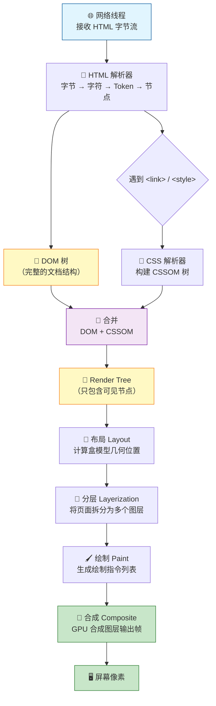

# 渲染流程

> "从输入 URL 到页面展示"这个经典面试题的后半段，我今天从渲染管线的角度跟你聊透。

## 一句话总结

**浏览器渲染流程是从 HTML 到像素的完整管线：解析 HTML 构建 DOM 树，解析 CSS 构建 CSSOM 树，合并为 Render Tree，经过布局（Layout）计算每个节点的几何位置，再经过绘制（Paint）生成绘制指令，最后由合成器（Compositor）将图层合成为屏幕上的像素帧。**

---

## 核心机制

面试官问"浏览器怎么渲染页面"，你按这 7 个阶段讲，逻辑清晰、层次分明。

### 1. 构建 DOM 树

浏览器从网络线程拿到 HTML 字节流后，交给渲染引擎（Blink/WebKit）的主线程。过程是：**字节 → 字符 → Token → 节点 → DOM 树**。HTML 解析器本质上是一个状态机，对标签不敏感——你写错标签它也尽量补全。这就是为什么 `<p>hello` 也能正常渲染，浏览器会自动闭合未闭合的标签。

解析过程中遇到 **CSS 不会阻塞 DOM 构建**，但遇到 **没有 async/defer 的 `<script>` 会阻塞 DOM 构建**——浏览器必须暂停 HTML 解析，先执行完 JS，因为 JS 可能调用 `document.write()` 改变 DOM。

### 2. 构建 CSSOM 树

CSS 解析从样式表（外部 CSS、`<style>` 标签、内联样式）中提取规则，构建 CSSOM（CSS Object Model）。关键点有两个：

- **CSS 解析是级联的**：浏览器需要计算每条规则的特异性（specificity），决定最终生效的样式。`.header .title`（0-0-2-0）优先级高于 `.title`（0-0-1-0）。
- **CSSOM 构建是阻塞渲染的**：浏览器必须等所有 CSS 下载并解析完才开始渲染，否则会出现"无样式内容闪烁"（FOUC）。这就是 **CSS 要放 `<head>` 里**的根本原因——让浏览器尽早下载和解析 CSS。

### 3. 合并 Render Tree

DOM 树 + CSSOM 树 → **Render Tree（渲染树）**。渲染树只包含**可见节点**：

- `display: none` 的元素不出现在渲染树中——它不占空间，不参与布局
- `visibility: hidden` 的元素**仍然在渲染树中**——它占空间，只是不可见
- `<head>` 标签、`<meta>` 标签等不可见元素也不在渲染树中

### 4. 布局（Layout/Reflow）

从渲染树的根节点开始，逐个计算每个节点的**盒模型几何信息**：宽度、高度、位置（相对于视口）。这是一个**自顶向下**的递归过程：

- 父节点的宽度影响子节点的宽度（百分比宽度/高度）
- 流式布局中，后面的元素位置依赖前面的元素
- `position: absolute/fixed` 的元素脱离文档流，独立计算位置

布局阶段产生的是 **Layout Tree**，每个节点都附带精确的像素位置和尺寸。

### 5. 分层（Layerization）

浏览器根据一定规则将页面拆分为多个**图层**：

- 根文档始终是一个图层
- `will-change: transform` 的元素提升为独立图层
- `transform: translateZ(0)` 或任何 3D transform
- `<video>`、`<canvas>` 元素
- `position: fixed` 在某些情况下
- `overflow: scroll` 的元素

分层的意义在于：**独立图层的变化只触发合成，不需要重新布局和绘制整个页面**——这就是为什么动画用 `transform` + `opacity` 性能最好。

### 6. 绘制（Paint）

对每个图层生成**绘制指令列表**（Paint Records）。绘制指令就像是"先在(x,y)画一个矩形背景色为蓝色，再在(x+10,y+10)画一段文字"——它是一个操作序列。

Chrome 的 DevTools Performance 面板中可以看到 Paint 阶段的耗时。如果这一阶段耗时过长，通常是因为大面积重绘或使用了高成本的 CSS 属性（如 `box-shadow`、`filter`）。

### 7. 合成（Composite）

合成器线程（独立于主线程）接收各个图层的位图，将它们按正确的顺序合成一帧，通过 GPU 输出到屏幕。**合成是唯一不涉及主线程的阶段**，所以 `transform` 动画即使主线程被 JS 阻塞，页面仍然可以流畅滚动（前提是这个动画只涉及合成属性）。

---

## 渲染管线流程图



---

## 深度拓展

### 追问1：为什么 CSS 放 `<head>`、JS 放 `<body>` 底部？

**CSS 放 `<head>`**：CSSOM 构建是**阻塞渲染**的。如果 CSS 放在 `<body>` 底部，浏览器会先用默认样式渲染页面（用户看到 FOUC），等 CSS 下载解析后再重新渲染——体验极差。放在 `<head>` 中让浏览器尽早拿到 CSS，尽早构建 CSSOM，尽早渲染。

**JS 放 `<body>` 底部**：普通 `<script>`（不带 async/defer）会**阻塞 HTML 解析**。因为 JS 可能会 `document.write()`，浏览器无法预判，必须停下 HTML 解析，下载并执行 JS。放在底部保证 DOM 已经构建完毕，JS 能拿到完整 DOM，同时首屏内容更快显示。

### 追问2：async vs defer vs 普通 script 的执行时机

| 属性 | 下载时机 | 执行时机 | 是否阻塞 DOM 解析 |
|------|---------|---------|------------------|
| **无属性** | 遇到标签立即下载 | 下载完立即执行 | **阻塞**：暂停 HTML 解析 |
| **async** | 遇到标签立即下载（异步） | 下载完立即执行 | **阻塞**：执行时暂停 HTML 解析 |
| **defer** | 遇到标签立即下载（异步） | **DOMContentLoaded 之前**按顺序执行 | **不阻塞**：HTML 解析完才执行 |

**面试金句**：`defer` 是"下载不阻塞、执行等 DOM"，`async` 是"下载不阻塞、谁先到谁先执行"。多个 `defer` 严格按声明顺序执行，多个 `async` 不保证顺序。

### 追问3：preload / prefetch / dns-prefetch 资源提示

- **`<link rel="preload">`**：告诉浏览器"这个资源**当前页面现在就**需要"，最高优先级加载。适合首屏关键资源（字体文件、首屏 CSS）。
- **`<link rel="prefetch">`**：告诉浏览器"**下一个**页面可能需要这个资源"，浏览器空闲时才加载。适合下一个路由的 JS chunk。
- **`<link rel="dns-prefetch">`**：提前对第三方域名做 DNS 解析，节省后续请求的 DNS 查询时间。
- **`<link rel="preconnect">`**：比 dns-prefetch 更进一步，同时完成 DNS + TCP + TLS 握手。

---

## 项目实战

**场景：Vue3 + Element Plus 后台管理系统，首屏加载 4 秒，需要优化到 2 秒以内。**

### 1. 减少关键渲染路径深度

首屏的"关键渲染路径"指的是从 HTML 到首屏像素的必经节点。优化手段：

- 首屏 CSS 内联到 HTML（消除额外 CSS 请求）
- 非首屏 CSS 用 `media="print"` 延迟加载（`onload="this.media='all'"`）
- 路由懒加载：`const Dashboard = () => import('@/views/dashboard/index.vue')`，首屏只加载当前路由组件

### 2. 骨架屏减少 CLS

用户在加载中看到白屏会焦虑。我们给表格页面加**骨架屏**：

```
<template v-if="loading">
  <el-skeleton :rows="10" animated />
</template>
<template v-else>
  <el-table :data="list" />
</template>
```

骨架屏提前占据内容区域，渲染完成后替换为真实内容，避免**布局偏移（CLS）**——Google 对 CLS 的评分直接影响 SEO。

### 3. 动态 import 懒加载

路由配置中用 `() => import()` 实现 code splitting，Vite 自动将每个路由组件拆分为独立 chunk。首屏只需要加载当前路由对应的 JS，其他路由的代码在用户点击时才按需加载。

---

## 易错点

- **"`display: none` 的元素在 Render Tree 中"**：不在。`display: none` 完全不占空间，不出现在渲染树中。但 `visibility: hidden` **在**渲染树中，它占布局空间只是不可见。
- **"DOM 树构建完就开始渲染"**：不对。DOM 树和 CSSOM 树必须同时就绪才能合并为 Render Tree。CSS 阻塞渲染。
- **"所有 CSS 属性变化都触发回流"**：不对，见 [reflow-repaint](./reflow-repaint) 中 CSS Triggers 的分类。`transform`、`opacity` 只触发合成，不触发回流重绘。

---

## 面试信号表

| 面试官问 | 下一问大概率是 |
|----------|-------------|
| "浏览器渲染流程是怎样的" | 追问合成（composite）为什么要单独一层 |
| "CSS 放 head 和放 body 底部有什么区别" | 追问 FOUC 的原理和防御 |
| "display:none 的元素在渲染树的哪个阶段被排除" | 追问 visibility:hidden 和 display:none 的渲染差异 |
| "为什么 JS 会阻塞渲染" | 追问 async/defer 怎么绕过阻塞 |

## 相关阅读

- [MDN: How browsers work](https://developer.mozilla.org/en-US/docs/Web/Performance/How_browsers_work)
- [Google: Critical rendering path](https://web.dev/articles/critical-rendering-path)
- [reflow-repaint](./reflow-repaint) —— 回流与重绘的触发条件和优化策略
- [cache](./cache) —— 浏览器缓存如何影响渲染阶段的资源获取
- [性能优化/critical-rendering-path](../性能优化/critical-rendering-path) —— 关键渲染路径的阻塞关系与首屏优化视角
- [性能优化/first-screen](../性能优化/first-screen) —— 首屏加载优化的完整方案

---

## 更新记录

- 2026-07-05：完成完整内容，补充渲染管线 Mermaid 图、项目实战案例（Phase 2）
