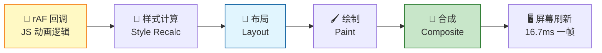

# requestAnimationFrame

> "为什么你的 JS 动画一卡一卡的？因为你用 setTimeout 而不是 requestAnimationFrame。"这是前端动画面试的第一道送分题——可我见过太多候选人写不出两者的真正区别。

## 一句话总结

**`requestAnimationFrame`（rAF）是浏览器内置的动画帧回调 API，它在浏览器每一帧渲染之前执行回调，自动匹配显示器刷新率（通常 60Hz = 16.7ms/帧），保证动画逻辑和屏幕刷新严格同步，从根本上避免了 `setTimeout`/`setInterval` 做动画时必然会出现的掉帧、跳帧和多余绘制问题。**

---

## 核心机制

### rAF vs setTimeout：为什么 rAF 才是做动画的正确选择

| 维度 | setTimeout / setInterval | requestAnimationFrame |
|------|--------------------------|----------------------|
| **执行时机** | 由 JS 事件循环决定，不关心渲染帧 | **每一帧渲染之前**，与屏幕刷新同步 |
| **帧率控制** | 手动指定间隔（如 16ms），但实际不准 | **自动匹配显示器刷新率**（60Hz→16.7ms，120Hz→8.3ms） |
| **后台标签页** | 继续执行（频率降低） | **自动暂停**，切回前台恢复——省电、省 CPU |
| **帧丢失** | 经常丢帧：JS 执行阻塞了渲染时机 | **不丢帧**：浏览器保证在最优时机执行 |
| **累积偏移** | 有：每帧微小的延迟会不断累积 | 无：每次都是"从现在开始的下一个渲染帧" |
| **回调参数** | 无（闭包手动传） | 自动传入 `DOMHighResTimeStamp`（高精度时间戳） |

**核心差异一句话**：`setTimeout(fn, 16)` 告诉浏览器"大约 16ms 后执行 fn"，但 fn 真正执行时可能刚好错过了渲染窗口，导致这一帧没有更新、下一帧又没有新数据——用户看到的就是"卡顿"。`requestAnimationFrame(fn)` 告诉浏览器"你下次渲染前叫我"，浏览器会把 fn 安排在最优时间点执行——保证每一帧都有且仅有一次更新。

### 浏览器的帧生命周期

理解 rAF 的执行时机，需要先理解浏览器一帧的完整生命周期：



rAF 回调在每帧的**最开头**执行——在浏览器重新计算样式、布局和绘制之前。这意味着：

- 你在 rAF 中修改了元素的 `transform` → 浏览器在**同一帧内**完成样式计算 → 布局 → 合成，用户看到的是流畅的动画。
- 你在 `setTimeout` 中修改了 `transform` → 可能这一帧已经渲染完了，修改要等到下一帧才生效 → 白白浪费了一帧 → 60fps 变成 30fps。

### 基本用法

```javascript
let animationId;

function animate(timestamp) {
  // timestamp: DOMHighResTimeStamp，页面打开起经过的毫秒数（高精度）
  // 在这里更新动画状态
  element.style.transform = `translateX(${Math.sin(timestamp / 1000) * 100}px)`;

  // 请求下一帧
  animationId = requestAnimationFrame(animate);
}

// 启动动画
animationId = requestAnimationFrame(animate);

// 停止动画
cancelAnimationFrame(animationId);
```

**关键点**：
- `requestAnimationFrame(callback)` 返回一个 `long` 类型的 id，用于取消。
- 回调只执行一次——如果要持续动画，必须在回调里再次调用 `requestAnimationFrame`。
- `timestamp` 参数是 `performance.now()` 类型的高精度时间戳，比 `Date.now()` 更适合做动画计时。

---

## 深度拓展

### 追问1：rAF 和 requestIdleCallback 的区别

| 维度 | requestAnimationFrame | requestIdleCallback |
|------|----------------------|---------------------|
| **优先级** | 高：每帧必须执行 | 低：浏览器空闲时才执行 |
| **执行时机** | 每帧渲染前 | 一帧渲染完成后，如果还有剩余时间 |
| **时间预算** | 无：但你应该在 16ms 内完成 | 有 `deadline.timeRemaining()` 方法 |
| **适用场景** | 动画、视觉更新 | 非紧急任务（日志上报、数据预取、分析统计） |
| **保证执行** | 保证（只要页面可见） | 不保证：浏览器忙可能一直不执行 |

**记忆**：rAF 是"帧前必达"，rIC 是"有空再说"。当你的页面在 120Hz 屏幕上运行时，rAF 间隔是 8.3ms，而 rIC 的 `timeRemaining()` 会告诉你这 8.3ms 里还剩多少时间可以干活。

### 追问2：如何用 rAF 做节流（Throttle）？

rAF 本身就是一个天然的"60fps 节流器"——无论事件触发多频繁，rAF 只会在下一帧渲染前执行一次。对于 `scroll`、`resize`、`mousemove` 等高频事件，这是最好的节流方案：

```javascript
let ticking = false;

window.addEventListener('scroll', () => {
  if (!ticking) {
    requestAnimationFrame(() => {
      // scroll 相关的 DOM 更新放在这里
      updateStickyHeader();
      updateProgressBar();
      ticking = false;
    });
    ticking = true;
  }
});
```

**为什么比 `throttle(fn, 16)` 更好**：因为 `throttle` 用 `setTimeout` 或 `Date.now()` 计时，和渲染帧不同步；而 rAF 保证每次 DOM 更新都在渲染前完成，不会有"更新了但没渲染"的浪费。

### 追问3：多个 rAF 回调的执行顺序

多次调用 `requestAnimationFrame` 添加的回调，会按照**添加顺序**在同一帧内连续执行。它们共享这帧开始到渲染之间的时间预算。如果一个回调耗时太长，会挤压后续回调和浏览器渲染的时间——所以每个 rAF 回调应该尽可能轻量。

```javascript
// 执行顺序：A → B → C
requestAnimationFrame(() => console.log('A'));
requestAnimationFrame(() => console.log('B'));
requestAnimationFrame(() => console.log('C'));
// 如果 A 耗时 10ms，B+C 只剩 6.7ms，会丢帧
```

---

## 项目实战

### 1. 数字递增动画（Dashboard 常用）

后台首页的 KPI 数字从 0 滚动到目标值，是 rAF 最经典的实战场景：

```javascript
function countUp(el, target, duration = 1000) {
  const start = performance.now();
  const from = 0;

  function update(now) {
    const elapsed = now - start;
    const progress = Math.min(elapsed / duration, 1);  // 0 → 1
    // easeOutCubic 缓动
    const eased = 1 - Math.pow(1 - progress, 3);
    const current = Math.floor(from + (target - from) * eased);

    el.textContent = current.toLocaleString();

    if (progress < 1) {
      requestAnimationFrame(update);
    }
  }

  requestAnimationFrame(update);
}

// 使用
countUp(document.getElementById('revenue'), 1288888, 1500);
```

### 2. 自定义无缝轮播

手写一个用 rAF 驱动的轮播组件，比 `setInterval` 方案丝滑很多：

```javascript
class Carousel {
  constructor(container, { speed = 1 } = {}) {
    this.container = container;
    this.speed = speed;
    this.position = 0;
    this.animationId = null;
  }

  start() {
    let lastTime = 0;
    const tick = (now) => {
      if (lastTime) {
        const delta = (now - lastTime) / 1000;  // 秒
        this.position += this.speed * delta * 100; // px/s
        this.container.style.transform = `translateX(${-this.position % this.totalWidth}px)`;
      }
      lastTime = now;
      this.animationId = requestAnimationFrame(tick);
    };
    this.animationId = requestAnimationFrame(tick);
  }

  stop() {
    cancelAnimationFrame(this.animationId);
  }
}
```

第二个特征：使用 `delta`（时间差）而不是固定步长——无论帧率是 30fps 还是 120fps，动画的实际速度（px/s）保持一致。这是专业动画引擎（GSAP、Framer Motion）的标准做法。

### 3. 滚动视差效果

```javascript
window.addEventListener('scroll', () => {
  requestAnimationFrame(() => {
    const scrolled = window.pageYOffset;
    document.querySelector('.parallax-bg').style.transform =
      `translateY(${scrolled * 0.5}px)`;
  });
});
```

### 4. 游戏主循环

任何 Canvas 游戏都需要一个稳定的渲染循环。rAF 是最好的选择——在后台标签页自动暂停，切回来自动恢复，省电且生命周期管理简单：

```javascript
function gameLoop(timestamp) {
  updateGameState(timestamp);
  renderToCanvas();
  requestAnimationFrame(gameLoop);
}
requestAnimationFrame(gameLoop);
```

---

## 易错点

- **"rAF 一定每秒执行 60 次"**：不一定。在 120Hz 屏幕上每秒执行 120 次，在 30Hz 的省电模式下可能只有 30 次。**不要硬编码 16.7ms**，始终用 `timestamp` 参数计算实际的时间差。
- **"rAF 回调中做耗时操作没关系"**：有关系。rAF 阻塞的是整个渲染管线——你在回调里花了 20ms，这个帧就必然掉帧（60Hz 下每帧只有 16.7ms）。rAF 回调应该保持轻量，耗时操作交给 Web Worker。
- **"在 rAF 里触发回流也没关系"**：有关系。如果 rAF 回调中修改了触发布局的属性（如 `width`、`height`），浏览器必须在同一帧内完成 Layout → Paint → Composite，如果页面复杂，布局可能耗时几十毫秒，直接导致掉帧。**动画只改 `transform` 和 `opacity`**。
- **"用 setTimeout 模拟 rAF 一样可以实现流畅动画"**：不行。`setTimeout` 不感知渲染帧，无法与屏幕刷新同步。而且 `setTimeout` 有 4ms 的最小间隔限制（嵌套超过 5 层后），再加上事件循环中的其他任务延迟，实际间隔远大于 16ms。

---

## 面试信号表

| 面试官问 | 下一问大概率是 |
|----------|-------------|
| "rAF 和 setTimeout 做动画有什么区别" | 追问 rAF 在每帧的哪个阶段执行 |
| "requestIdleCallback 是什么" | 追问和 rAF 的执行时机差异——空闲 vs 渲染前 |
| "rAF 在后台标签页还会执行吗" | 追问为什么切后台时动画自动暂停 |
| "为什么不用 setInterval 做动画" | 追问累积延迟和掉帧的原因 |

## 相关阅读

- [MDN: requestAnimationFrame](https://developer.mozilla.org/en-US/docs/Web/API/Window/requestAnimationFrame)
- [MDN: requestIdleCallback](https://developer.mozilla.org/en-US/docs/Web/API/Window/requestIdleCallback)
- [Google: Optimize JavaScript execution](https://web.dev/articles/optimize-javascript-execution)
- [render-process](./render-process.md) —— 浏览器渲染管线中的帧生命周期
- [reflow-repaint](./reflow-repaint.md) —— 理解动画属性选择对性能的影响
- [性能优化](../性能优化/) —— 前端动画性能优化的完整方案

---

## 更新记录

- 2026-07-06：完成完整内容，补充帧生命周期 Mermaid 图、rAF vs setTimeout 对比、数字递增/轮播/游戏循环实战案例
