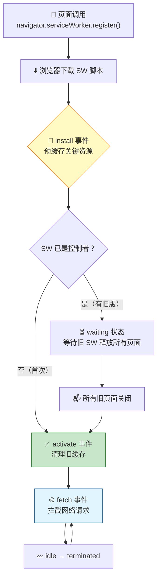

# Service Worker

> "你的页面在离线状态下能不能打开？"这个问题的答案就是 Service Worker。它像是一个运行在浏览器后端的"网络代理"，在页面和服务器之间拦截所有请求，决定走缓存还是走网络。

## 一句话总结

**Service Worker 是运行在浏览器后台的独立 JavaScript 脚本，与页面生命周期解耦，可以拦截同域下所有网络请求（fetch 事件），实现离线缓存、消息推送和后台同步。它是 PWA 的核心技术栈，需要 HTTPS 环境并通过 `navigator.serviceWorker.register()` 注册。**

---

## 核心机制

### 生命周期：install → waiting → activate → fetch → terminate

Service Worker 的生命周期由浏览器管理，不是由页面控制：

1. **注册（Registration）**：页面调用 `navigator.serviceWorker.register('/sw.js')`，浏览器下载并解析 SW 脚本。
2. **安装（Install）**：SW 第一次被注册时触发 `install` 事件——这是**预缓存**的最佳时机。你可以在此时打开 Cache Storage，把关键静态资源（HTML、CSS、JS、Logo）缓存起来。
3. **等待（Waiting）**：如果已有旧版 SW 在运行，新版 SW 会进入 waiting 状态。旧 SW 控制着当前打开的页面，直到所有页面关闭，新版才会激活。
4. **激活（Activate）**：触发 `activate` 事件——这是**清理旧缓存**的最佳时机。删除上一版本遗留的、不再需要的缓存条目。
5. **空闲/终止（Idle / Terminate）**：SW 在无事件处理时进入空闲状态，浏览器可随时终止它以释放内存。当有 fetch 或 push 事件时，浏览器会自动唤醒它。



### install 事件：预缓存关键资源

```javascript
const CACHE_NAME = 'my-app-v1';
const PRECACHE_URLS = ['/', '/index.html', '/styles/main.css', '/scripts/app.js'];

self.addEventListener('install', (event) => {
  event.waitUntil(
    caches.open(CACHE_NAME).then((cache) => {
      return cache.addAll(PRECACHE_URLS);
    })
  );
  // 可选：跳过 waiting，直接激活
  self.skipWaiting();
});
```

`event.waitUntil()` 告诉浏览器："安装还没完成，等我 Promise resolve 了再说"——如果预缓存失败，SW 安装就失败，不会进入激活。

### activate 事件：清理旧版本缓存

```javascript
self.addEventListener('activate', (event) => {
  const currentCaches = [CACHE_NAME];
  event.waitUntil(
    caches.keys().then((cacheNames) => {
      return Promise.all(
        cacheNames
          .filter((name) => !currentCaches.includes(name))
          .map((name) => caches.delete(name))
      );
    })
  );
  // 立即接管所有页面
  self.clients.claim();
});
```

### fetch 事件：三种缓存策略

这是 Service Worker 最核心的能力——拦截所有网络请求，自行决定如何响应。

```javascript
self.addEventListener('fetch', (event) => {
  const { request } = event;
  const url = new URL(request.url);

  // 策略1：Cache First（适合不变的静态资源）
  // → 缓存里有直接用，没有才走网络（适合 logo、字体、CSS chunk）
  if (PRECACHE_URLS.includes(url.pathname)) {
    event.respondWith(
      caches.match(request).then((cached) => cached || fetch(request))
    );
    return;
  }

  // 策略2：Network First（适合 API 数据）
  // → 先走网络拿最新数据，网络失败才用缓存兜底
  if (url.pathname.startsWith('/api/')) {
    event.respondWith(
      fetch(request)
        .then((response) => {
          const cloned = response.clone();
          caches.open('api-cache-v1').then((cache) => cache.put(request, cloned));
          return response;
        })
        .catch(() => caches.match(request))
    );
    return;
  }

  // 策略3：Stale While Revalidate（适合不那么关键的资源）
  // → 立即返回缓存（快），同时后台更新缓存（新）
  event.respondWith(
    caches.match(request).then((cached) => {
      const fetched = fetch(request).then((response) => {
        const cloned = response.clone();
        caches.open('dynamic-v1').then((cache) => cache.put(request, cloned));
        return response;
      });
      return cached || fetched;   // 缓存优先返回，若无缓存则等网络
    })
  );
});
```

| 策略 | 原理 | 适合场景 | 用户感知 |
|------|------|---------|---------|
| **Cache First** | 缓存命中即返回，否则走网络 | 不变的静态资源（字体、Logo） | 最快，可能拿到旧数据 |
| **Network First** | 先走网络，失败用缓存兜底 | API 数据（需要最新） | 在线时最新，离线时不报错 |
| **Stale While Revalidate** | 立即返回缓存，后台更新缓存 | 文章内容、用户头像 | 快且最终一致 |

### skipWaiting() + clients.claim()：快速激活

默认情况下，新版 SW 会等所有旧页面关闭才激活。调用这两个方法可以跳过等待：

- **`self.skipWaiting()`**：在 install 事件中调用，让 SW 不等待旧版释放，直接进入 activate。
- **`self.clients.claim()`**：在 activate 事件中调用，让 SW 立即接管所有已打开的页面（而不是等到页面刷新）。

**注意**：不要无脑加这两句。如果新版 SW 的缓存逻辑和当前页面的运行逻辑不兼容，直接接管会导致页面出现"一半新缓存、一半旧代码"的风险。只在你有充分测试、或者只是做缓存策略调整（不涉及代码逻辑）时才使用。

---

## 深度拓展

### 追问1：Service Worker 能做哪些事？

面试中最常见的问题。回答时结构化地列出 4 大能力：

1. **离线缓存**：拦截 fetch，按既定策略返回缓存或网络资源。App Shell 模式下，即使网络断开，用户也能看到完整的 UI 框架。
2. **消息推送（Push Notification）**：通过 Push API + Notification API，即使页面关闭、浏览器后台运行，也能收到服务器推送的通知（用户感知）。
3. **后台同步（Background Sync）**：用户在离线状态下提交表单 → SW 记录操作 → 恢复网络后自动发送。使用 `self.addEventListener('sync', ...)`。
4. **请求代理与改造**：SW 可以对请求做透明拦截——读取缓存、修改请求头、重定向到不同的 API 端点、甚至返回自定义的 Response。

### 追问2：Service Worker 必须 HTTPS 吗？

**是的，生产环境下必须是 HTTPS。** 因为 SW 拥有拦截同域所有请求的能力——如果 HTTP 明文传输中被中间人篡改 SW 脚本，攻击者可以注入恶意缓存或窃取请求数据。

**唯一例外是 `localhost`**：为了方便本地开发，浏览器允许 `localhost` 环境下使用 Service Worker 而不需要 HTTPS。

### 追问3：Service Worker vs Web Worker 的区别

详见 [Web Worker](./web-worker.md) 中的对比表。快速回顾：

- **Web Worker**：计算密集型任务，页面关闭即终止，不能拦截网络请求。
- **Service Worker**：网络代理 + 推送 + 后台同步，独立于页面生命周期，能拦截所有 fetch 事件。

**记忆口诀**：Web Worker 是"计算后援"，Service Worker 是"网络中间人"。

### 追问4：Service Worker 的缓存和 HTTP 缓存有什么区别？

| 维度 | Service Worker Cache | HTTP 缓存 |
|------|---------------------|-----------|
| **控制权** | JS 完全控制（颗粒度到单个请求） | 浏览器根据响应头自动决策 |
| **存储位置** | Cache Storage API | HTTP Disk/Memory Cache |
| **离线能力** | 可以（完全由 SW 判断） | 取决于缓存是否过期和网络状况 |
| **动态策略** | 可以根据 URL、请求类型动态切换 | 静态（由响应头决定） |
| **更新机制** | 开发者代码控制 | 由 max-age / ETag 控制 |

---

## 项目实战

### 1. 后台管理系统的离线兜底页

```javascript
// sw.js
const OFFLINE_PAGE = '/offline.html';

self.addEventListener('fetch', (event) => {
  if (event.request.mode === 'navigate') {
    // 页面导航：网络优先，失败回退到离线页
    event.respondWith(
      fetch(event.request).catch(() => caches.match(OFFLINE_PAGE))
    );
  }
});
```

当管理员在网络断开时访问系统，看到的不再是浏览器的默认错误页，而是一个美观的"当前网络不可用，请检查连接"的离线提示页——品牌形象 + 用户体验双赢。

### 2. PWA 的 App Shell 架构

App Shell 是将应用的"壳"（导航栏、侧边栏、底部 Tab）和"内容"（动态数据）分离的架构。Shell 在 SW install 时预缓存，每次打开应用时从缓存秒出，然后异步拉取最新内容渲染到 shell 的占位区域。

```javascript
const SHELL_FILES = ['/index.html', '/css/shell.css', '/js/shell.js', '/logo.png'];

self.addEventListener('install', (e) => {
  e.waitUntil(
    caches.open('shell-v1').then((cache) => cache.addAll(SHELL_FILES))
  );
});

// 对 shell 资源做 Cache First，API 做 Network First
```

---

## 易错点

- **"Service Worker 可以访问 DOM"**：不能。SW 运行在独立的 Worker 上下文中，完全无法访问 `window`、`document` 和 DOM API。它只能通过 `postMessage` 与页面通信。
- **"注册 Service Worker 后立刻生效"**：不会。首次访问时，SW 在 install → activate 后才能控制页面，这个过程在页面加载之后才完成，所以**首次访问是不受 SW 控制的**（除非调用 `clients.claim()`）。
- **"SW 脚本的 scope 由文件路径决定"**：SW 默认 scope 是脚本所在目录。`/js/sw.js` 只能拦截 `/js/` 下的请求。通常把 SW 放在根目录（`/sw.js`）让它可以控制整个域。
- **"SW 的 Cache Storage 是无限容量的"**：不是。浏览器对每个源的 Cache Storage 通常有配额限制（Chrome 约为可用磁盘空间的 60%，各浏览器不同）。超出配额时 `cache.put()` 可能失败。
- **"SW 中不需要处理缓存版本冲突"**：需要。如果没有在 activate 事件中清理旧缓存，用户的 Cache Storage 会不断膨胀，且可能返回过时内容。**缓存版本管理是 SW 的必修课**。

---

## 面试信号表

| 面试官问 | 下一问大概率是 |
|----------|-------------|
| "Service Worker 的生命周期" | 追问 install→waiting→activate→fetch 每步做什么 |
| "SW 怎么实现离线缓存" | 追问 Cache First / Network First 策略的取舍 |
| "SW 更新了旧 SW 还在运行怎么办" | 追问 skipWaiting + clients.claim 的时机 |
| "SW 为什么只能 HTTPS" | 追问中间人攻击的风险和浏览器强制策略 |

## 相关阅读

- [MDN: Service Worker API](https://developer.mozilla.org/en-US/docs/Web/API/Service_Worker_API)
- [Google: The Service Worker Lifecycle](https://web.dev/articles/service-worker-lifecycle)
- [Google: Offline Cookbook](https://web.dev/articles/offline-cookbook)
- [web-worker](./web-worker.md) —— Web Worker 和 Service Worker 的详细对比
- [cache](./cache) —— HTTP 缓存和 SW 缓存的配合策略
- [storage](./storage) —— Cache Storage 与 IndexedDB、LocalStorage 的选择

---

## 更新记录

- 2026-07-06：完成完整内容，补充生命周期 Mermaid 图、三种缓存策略对比、项目实战案例
