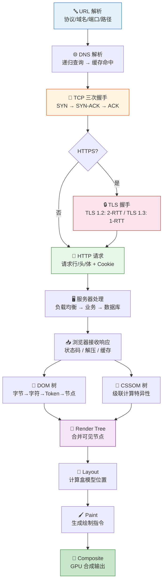

# 输入 URL 到页面展示

> 这道题几乎每场面试都会问，面试官关心的不是你背流水账，而是你能否在 15 个阶段中挑出关键节点，讲清楚"为什么这样设计"。

## 一句话总结

**从输入 URL 到页面展示是一个跨越网络、操作系统、浏览器内核、渲染引擎的完整链路：URL 解析后先查 DNS 获取 IP，经过 TCP 三次握手 + TLS 握手建立安全连接，发送 HTTP 请求并接收响应，浏览器解析 HTML/CSS/JS，经过 DOM/CSSOM → Render Tree → Layout → Paint → Composite 最终将像素呈现在屏幕上。**

---

## 核心机制

面试时建议按以下 15 个阶段讲述，但每个阶段只说 1-2 句核心点 + 1 个面试官可能追问的细节，控制在 3-5 分钟内讲完。不要平均用力——DNS、TCP、TLS、渲染管线是重点展开的环节。

### 1. URL 解析

浏览器判断输入是**搜索关键词**还是 **URL**。如果是 URL，解析出协议（https）、域名（example.com）、端口（默认 443）、路径（/path）、查询参数（?q=1）、锚点（#section）。**追问点**：浏览器如何判断是搜索还是 URL？——检查是否包含合法协议头，否则按搜索引擎配置拼接搜索 URL。

### 2. DNS 解析

域名 → IP 地址的映射过程，涉及**多级缓存**：

- 浏览器 DNS 缓存（chrome://net-internals/#dns）
- 操作系统 hosts 文件
- 路由器缓存
- ISP DNS 服务器
- **递归查询**：ISP 服务器从根域名服务器 → 顶级域（.com）→ 权威 DNS，逐级查询

**关键追问**：递归 vs 迭代查询的区别——递归是"你帮我去查"，迭代是"我告诉你下一步去找谁"。本地 DNS 对 ISP 是递归，ISP 对根/顶级/权威是迭代。

### 3. TCP 连接（三次握手）

拿到 IP 后，浏览器通过 `connect()` 系统调用发起 TCP 连接：

1. 客户端 → 服务器：**SYN**（seq=x，我要连你）
2. 服务器 → 客户端：**SYN-ACK**（seq=y, ack=x+1，我收到了，你连吧）
3. 客户端 → 服务器：**ACK**（ack=y+1，好，开始传数据）

**关键追问**：为什么是三次握手而不是两次？——两次握手无法防止**历史连接**：如果第一个 SYN 延迟到达，服务器回 SYN-ACK 就建立连接，但客户端已经不要这个连接了，造成服务器资源浪费。三次握手让客户端确认后才建立连接。

### 4. TLS 握手（如果是 HTTPS）

TCP 连接建立后，HTTPS 还需要 TLS 握手：

**TLS 1.2**：需要 **2-RTT**（4 次单向通信）
1. ClientHello（支持的加密套件 + 随机数1）
2. ServerHello（选定加密套件 + 证书 + 随机数2）
3. Client Key Exchange（预主密钥，用证书公钥加密）
4. 双方各自用三个随机数生成会话密钥 → Finished

**TLS 1.3**：仅需 **1-RTT**，且支持 0-RTT 恢复（对已访问过的站点）

**关键追问**：TLS 1.2 vs 1.3 的核心区别——1.3 去掉了不安全的加密算法（RSA 密钥交换），强制前向安全性（ECDHE），握手从 2-RTT 缩减到 1-RTT。

### 5. HTTP 请求

连接建立后，浏览器发送 HTTP 请求报文（请求行 + 请求头 + 请求体）。关键细节：

- 检查 HTTP 缓存（强缓存命中则直接返回，不走网络）
- Cookie 自动携带（同源、匹配 path、Secure/HttpOnly 约束）
- `Accept-Encoding: gzip, br` 声明支持的压缩格式

### 6. 服务器处理

请求经过反向代理/负载均衡（Nginx），转发到后端应用服务器，应用查询数据库/缓存，组装响应数据后返回。涉及 CDN 边缘节点、微服务调用链等。

### 7. 浏览器接收响应

浏览器读取响应状态码（200/301/304/404），处理重定向，根据 `Content-Encoding` 解压（gzip/brotli），根据 `Cache-Control` 写入缓存。

### 8-9. 构建 DOM 树 + CSSOM 树

HTML 解析器：字节 → 字符 → Token → 节点 → DOM 树。**预加载扫描器**（Preload Scanner）在 HTML 解析过程中提前发现 `<link>`、``、`<script>` 等资源，发起预加载请求——这是浏览器性能优化的底层机制。

CSS 解析生成 CSSOM 树。**CSS 阻塞渲染**——浏览器必须等所有 CSS 就绪才开始 Render Tree 构建。

### 10. 合成 Render Tree

DOM + CSSOM → Render Tree。`display: none` 的元素**不出现在渲染树**中，`visibility: hidden` 的元素**仍然存在**。

### 11-13. Layout → Paint → Composite

- **Layout**（回流）：计算每个节点的几何位置和大小
- **Paint**（重绘）：生成绘制指令列表
- **Composite**（合成）：合成器线程将图层合成为屏幕像素

详见 [渲染流程](./render-process.md)。

### 14. JS 执行

`<script>` 的执行时机决定阻塞行为：普通 script 阻塞 HTML 解析；async 下载完立即执行（不保证顺序）；defer 在 DOMContentLoaded 前按序执行。

### 15. 资源加载

图片、CSS、JS、字体等资源由预加载扫描器提前发现，按优先级（Highest/High/Medium/Low）排队加载。HTTP/2 多路复用允许同一连接上并发多个请求。

---

## 完整流程图

---

## 深度拓展

### 追问1：DNS 递归 vs 迭代查询

- **递归查询**：客户端 → 本地 DNS，"你替我去查到底"。本地 DNS 承担全部解析工作，返回最终 IP。
- **迭代查询**：本地 DNS → 根域名服务器，".com 的 NS 是谁？"→ 本地 DNS → .com 顶级域，"example.com 的 NS 是谁？"→ 本地 DNS → 权威服务器，"IP 是多少？"。每一步本地 DNS 自己发起下一跳。

实际场景中，用户到本地 DNS 是递归，本地 DNS 到各级域名服务器是迭代。

### 追问2：三次握手为什么不是两次？

核心原因是**防止已失效的连接请求到达服务器后错误建立连接**。如果 SYN 报文在网络中滞留，客户端超时放弃后重新发起新的 SYN，旧的 SYN 此时到达服务器，服务器回 SYN-ACK 就建立了无用的连接。三次握手中，客户端的第三次 ACK 确认了"我确实要这个连接"，避免无效连接。

### 追问3：TLS 1.2 vs 1.3 握手差异

| 维度 | TLS 1.2 | TLS 1.3 |
|------|---------|---------|
| 握手 RTT | 2-RTT | 1-RTT（0-RTT 恢复） |
| 密钥交换算法 | RSA / DHE | 仅 ECDHE（前向安全） |
| 支持的加密套件 | 30+ | 5 个（精简） |
| 证书加密 | 明文传输 | 握手过程加密 |
| SNI 加密 | 明文 | ESNI/ECH |

### 追问4：reflow 和 repaint 的区别

- **Reflow（回流）**：修改几何属性（宽高、位置、display），触发 Layout → Paint → Composite 全流程
- **Repaint（重绘）**：修改外观属性（颜色、背景、阴影），跳过 Layout，触发 Paint → Composite
- **仅 Composite**：修改 `transform`、`opacity`，跳过 Layout 和 Paint，只在合成器线程处理

详见 [重绘 / 回流](./reflow-repaint.md)。

---

## 项目实战

**场景：首屏加载 6 秒，排查后发现 DNS + TCP + TLS 占用了 3 秒。如何优化？**

1. **DNS 预解析**：`<link rel="dns-prefetch" href="//api.example.com">` 提前解析第三方域名
2. **Preconnect**：`<link rel="preconnect" href="//api.example.com">` 同时完成 DNS + TCP + TLS
3. **升级到 TLS 1.3**：减少一次 RTT，从 2-RTT 降到 1-RTT
4. **HTTP/2 多路复用**：避免多个 TCP 连接的开销，同一域名共享一条连接
5. **关键资源 preload**：`<link rel="preload" href="/font.woff2" as="font" crossorigin>` 优先加载字体

---

## 易错点

- **"DNS 查询一定是 UDP"**：不准确。DNS 默认 UDP（53 端口），但响应超过 512 字节或区域传输时走 TCP。
- **"三次握手后才发 HTTP 请求"**：对于 HTTPS，三次握手后还要 TLS 握手，共 4-5 个 RTT 才发出第一个 HTTP 请求。
- **"页面渲染在 HTML 下载完才开始"**：不对。浏览器**流式解析**HTML，边下载边解析，不等整个 HTML 下载完。
- **"defer 脚本在 DOMContentLoaded 之后执行"**：defer 在 **DOMContentLoaded 之前**执行——读到 DOM 解析完成后、DOMContentLoaded 事件触发前。

---

## 面试信号表

| 面试官问 | 下一问大概率是 |
|----------|-------------|
| "从输入 URL 到页面展示发生了什么" | 追问 DNS 递归和迭代查询的过程 |
| "哪一步最耗时，怎么优化" | 追问 DNS→prefetch、TCP→preconnect、渲染→减少回流 |
| "DOMContentLoaded 和 load 触发时机" | 追问 defer 脚本在哪个之前执行完 |
| "TCP 为什么是三次握手" | 追问确认双方收发能力的必要性 |

## 相关阅读

- [渲染流程](./render-process.md) —— Layout / Paint / Composite 的详细拆解
- [浏览器缓存](./cache.md) —— 强缓存和协商缓存如何影响资源加载
- [HTTP / HTTPS](../网络/http-https.md) —— HTTP 各版本差异和 HTTPS 原理
- [DNS / CDN](../网络/dns-cdn.md) —— DNS 解析原理和 CDN 加速机制
- [TCP](../网络/tcp.md) —— TCP 三次握手、四次挥手、拥塞控制
- [重绘 / 回流](./reflow-repaint.md) —— reflow 和 repaint 触发条件

---

## 更新记录

- 2026-07-06：完成完整内容，覆盖 15 个阶段和 4 个深度追问（Phase 2）
