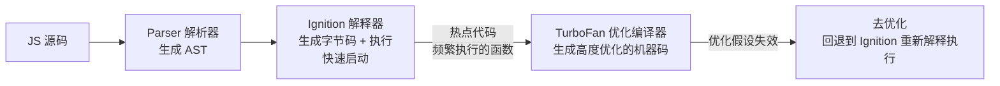

# V8 引擎与 JIT 编译

> &#11088;&#11088;&#11088;&#11088;｜难度：高级｜项目：&#9733;&#9733;

## 一句话总结

**V8 用 Ignition（解释器）快速启动 + TurboFan（优化编译器）编译热点代码 = JIT（Just-In-Time）编译。JS 跑得快不快，取决于是否触发了 V8 的优化假设——隐藏类（Hidden Classes）稳定 + 函数参数类型一致 = 快；隐藏类变化 + 参数多态 = 慢。**

## 核心机制

### V8 的编译管线



```
V8 的四个核心组件：

1. Parser（解析器）：JS 源码 → AST（抽象语法树）
   - 惰性解析（Lazy Parsing）：只解析立即执行的代码
   - 非立即执行的函数只做预解析（Pre-Parser），跳过函数体

2. Ignition（解释器）：AST → 字节码 + 解释执行
   - 2017 年取代了旧的 Full-codegen
   - 比编译成机器码更快启动（字节码体积小）
   - 所有代码先走 Ignition 执行

3. TurboFan（优化编译器）：热点字节码 → 高度优化的机器码
   - 基于反馈的优化（Feedback-Driven Optimization）
   - Ignition 执行时收集类型信息 → TurboFan 基于类型做激进优化
   - 如果优化假设不成立 → 去优化（Deoptimization）

4. Sparkplug（基线编译器）：字节码 → 简单的机器码
   - 2021 年新增，介于 Ignition 和 TurboFan 之间
   - 快速编译，不做深度优化
   - 目标：比 Ignition 快，比 TurboFan 编译快
```

### 隐藏类（Hidden Classes / Map）

**V8 对"同一个构造函数创建的多个对象"共享隐藏类，这类似于传统编译型语言中的静态类型——属性在对象内存中的偏移量是固定的。**

```javascript
// ✅ 好：相同的初始化顺序 → 共享同一个隐藏类
function Point(x, y) {
  this.x = x    // 隐藏类 HC0（无属性）
  this.y = y    // 隐藏类 HC1（有 x）
}               // 隐藏类 HC2（有 x, y）
const p1 = new Point(1, 2)
const p2 = new Point(3, 4)
// p1 和 p2 共享同一个隐藏类 → 属性访问极快

// ❌ 坏：不同的初始化顺序 → 不同的隐藏类
const p3 = {}
p3.x = 1   // HC0 → HC1
p3.y = 2   // HC1 → HC2

const p4 = {}
p4.y = 3   // HC0 → HC3  ← 和上面不同！先加 y
p4.x = 4   // HC3 → HC4  ← 最终隐藏类和 p3 不同

// ❌ 坏：动态删除属性 → 隐藏类切换
const p5 = new Point(1, 2)
delete p5.x  // 隐藏类从 HC2 切换到新的"字典模式"→ 属性访问变慢

// ⚠️ 实际影响：在 V8 中，p3 和 p4 的属性访问性能不同，
//    即使它们最终拥有完全相同的属性！
```

```
隐藏类规则的实战意义：

✅ 构造函数中一次性初始化所有属性（包括 undefined 的）
✅ 以相同的顺序初始化属性
✅ 不要 delete 对象的属性（设为 null/undefined 代替）
✅ 不要动态添加属性（如果需要，在构造函数中预置为 undefined）
```

### 内联缓存（Inline Cache）

**V8 记住"上一次这个函数调用的参数类型"，下次调用时如果类型相同就跳过类型检查，直接执行优化路径。**

```javascript
function getLength(obj) {
  return obj.length
}

// 设想这个函数被多次调用：

// 第 1 次：getLength('hello')  → obj 是 String
//   V8 记录：这个位置的对象是 String 类型
//   String 的 .length 在偏移量 12 处
//   生成优化代码："读 this + 12 偏移量"

// 第 2 次：getLength('world')  → obj 还是 String
//   命中内联缓存！跳过类型检查，直接读偏移量 12 → 极快
//   这叫 "单态"（Monomorphic）—— 一个调用位置只有一种类型

// 第 3 次：getLength([1,2,3])  → obj 是 Array
//   类型变了！缓存里有 String 的类型信息，但这次是 Array
//   → 更新缓存：这个位置可能有 String 或 Array
//   叫 "多态"（Polymorphic）—— 最多缓存 4 种不同类型

// 第 4 次：getLength({length:10}) → obj 是普通对象
//   又是一种新类型 → 继续扩展缓存

// 第 5 次：getLength(null) → obj 是 null（或 5+ 种不同类型）
//   → 超过缓存上限 → "超态"（Megamorphic）
//   → 不再尝试缓存 → 每次都要做完整的类型检查 → 慢
```

```
内联缓存的实战意义：
✅ 保持函数参数类型一致 —— 让缓存保持在单态/多态
✅ 不要用同一个函数处理多种完全不同类型的参数
❌ 如果一个函数有时传 Number、有时传 String、有时传 Object、
   有时传 null —— 这会导致 Megamorphic，每次调用都慢
```

### 去优化（Deoptimization）的触发条件

```javascript
// 场景：TurboFan 基于观察到的类型做了激进假设
function add(a, b) {
  return a + b
}

// V8 观察到前面 100 次调用都是：add(int, int) → 编译为整数加法
add(1, 2)   // 快！用整数加法

// 突然来了一次 add('hello', 'world')
// → 字符串拼接！整数加法的假设失效了！
// → 触发去优化：丢弃当前的优化机器码，回退到 Ignition
// → 等这个函数再次变热时，TurboFan 会重新编译
//    （这次会基于"有时 int，有时 string"的更广泛的类型反馈）
```

## 深度拓展

### V8 的发展历史（面试加分项）

```
2008：V8 发布，Full-codegen（基线编译器）+ Crankshaft（优化编译器）
2015：TurboFan 取代 Crankshaft
2017：Ignition 取代 Full-codegen —— V8 进入 "解释器 + 编译器" 时代
2021：Sparkplug 加入 —— "解释器 + 基线编译器 + 优化编译器" 三层
2023+：Maglev 编译器（Chrome 114+）—— 介于 Sparkplug 和 TurboFan 之间
```

### 实战性能建议

```javascript
// 1. 保持对象形状一致
class User {
  constructor(name, age, email) {
    this.name = name
    this.age = age
    this.email = email || ''  // ✅ 即使为空也初始化，隐藏类一致
  }
}

// 2. 避免多态
function process(items) {
  // ✅ 如果 items 始终是 Array，内联缓存最优
  return items.map(item => item * 2)
}
// ❌ 不要时而传 Array 时而传 Set 时而传 Map

// 3. 避免在热点循环中 try-catch
for (let i = 0; i < 1000000; i++) {
  try { riskyOperation(i) } catch (e) { /* ... */ }
}
// ✅ try-catch 放在循环外面
try {
  for (let i = 0; i < 1000000; i++) riskyOperation(i)
} catch (e) { }

// 4. 避免在热点代码中操作 arguments 对象
function bad() {
  arguments[0]  // arguments 不是真正的数组，操作会触发去优化
}
// ✅ 用 rest 参数代替
function good(...args) {
  args[0]  // rest 是真正的数组
}
```

## 项目实战

### 后台管理系统中的 V8 优化

1. **大数据表格排序**：保持排序函数的返回值类型一致（始终返回 Number），避免 TurboFan 去优化
2. **ECharts dataset 数据源**：不要在 `dataset.source` 中混合字符串和数字——保持每列的类型一致
3. **虚拟列表中的对象复用**：对象池模式中，复用的对象要保持形状（属性顺序和存在性）一致

## 易错点

1. **`delete obj.property` 的巨大性能代价** —— 不只是移除值，而是改变了对象隐藏类 → 从"快速模式"切换到"字典模式" → 所有属性访问变慢
2. **`try-catch` 和 `with` 会阻止 V8 优化** —— `with` 改变了作用域查找，V8 无法做变量偏移量优化。永远不要用 `with`
3. **`for-in` 循环比 `Object.keys` 慢** —— `for-in` 遍历原型链，且 V8 对它的优化不如 `for-of`/`for` 循环
4. **热路径不要用 `eval` / `new Function`** —— 它们会让 V8 放弃所有已做的优化，重新开始编译

## 面试信号表

| 面试官问 | 下一问大概率是 |
|----------|-------------|
| "V8 是怎么执行 JS 的" | 追问 Ignition 和 TurboFan 的分工 |
| "为什么 `delete` 会慢" | 追问隐藏类和字典模式的切换 |
| "什么是 JIT" | 追问去优化的触发条件和代价 |
| "什么代码会让 JS 变慢" | 追问对象形状不一致和多态的影响 |

## 相关阅读

- [垃圾回收 GC](./gc.md)
- [渲染流程](./render-process.md)
- [Event Loop](../JavaScript/event-loop.md)

## 更新记录

- 2026-07-10：新建（V8 编译管线 + Ignition/TurboFan/Sparkplug + 隐藏类 + 内联缓存 + 去优化 + V8 历史 + 性能建议）
