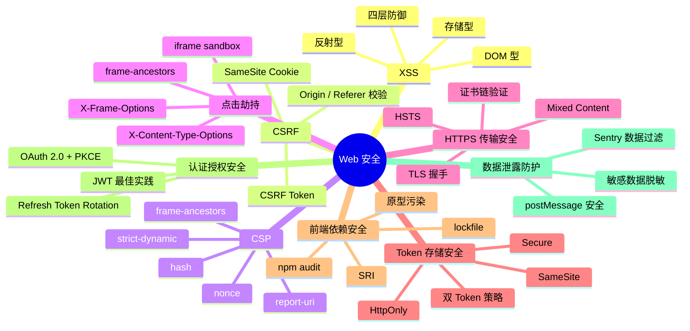
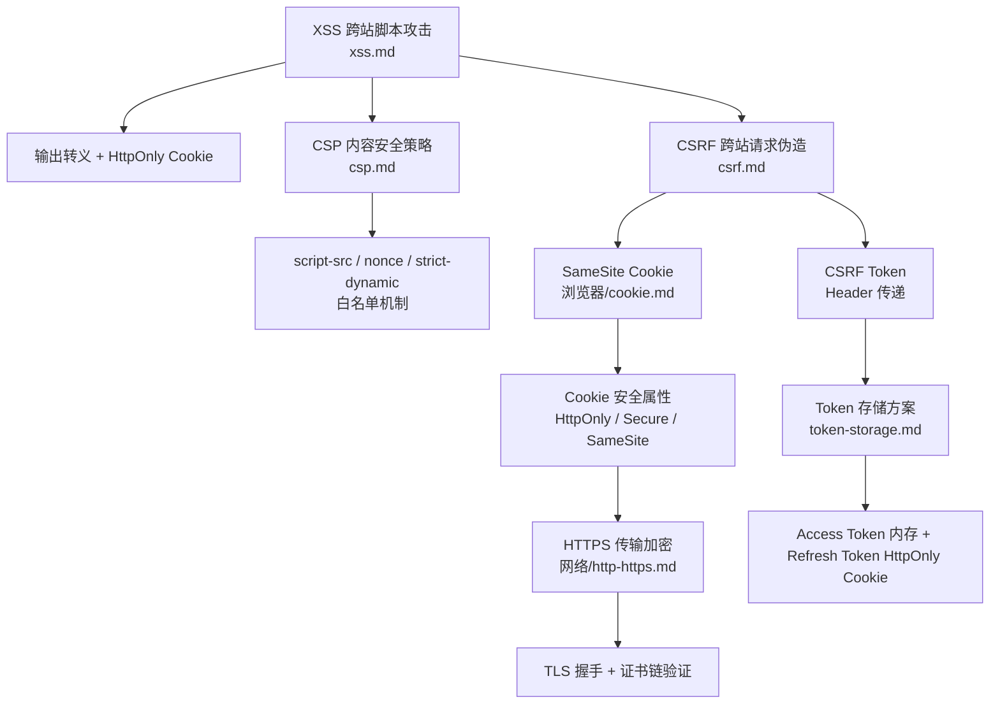

# 安全 知识地图

## 推荐学习顺序

1. ⭐⭐⭐⭐⭐ [XSS](./xss.md) —— 跨站脚本攻击的三种类型和四层防御
2. ⭐⭐⭐⭐⭐ [CSRF](./csrf.md) —— 跨站请求伪造的原理和 SameSite 防御
3. ⭐⭐⭐⭐ [CSP 内容安全策略](./csp.md) —— 白名单机制 + nonce/hash + 违规报告
4. ⭐⭐⭐⭐⭐ [Token 存储安全](./token-storage.md) —— HttpOnly / Secure / SameSite + 双 Token 策略
5. ⭐⭐⭐⭐ [点击劫持与 iframe 安全](./clickjacking.md) —— X-Frame-Options / frame-ancestors / sandbox
6. ⭐⭐⭐⭐ [HTTPS 与传输安全](./https-security.md) —— HSTS / 证书链 / Mixed Content / TLS 握手
7. ⭐⭐⭐ [前端依赖安全](./supply-chain-security.md) —— SRI / npm audit / 原型污染
8. ⭐⭐⭐ [认证/授权安全](./auth-security.md) —— JWT 最佳实践 / OAuth 2.0 + PKCE / Refresh Token Rotation
9. ⭐⭐⭐ [数据泄露防护/postMessage 安全](./data-leak-postmessage.md) —— 敏感数据脱敏 / Sentry 数据过滤 / postMessage 安全

## 知识点索引

| 知识点 | 频率 | 难度 | 状态 |
|--------|------|------|------|
| [XSS](./xss.md) | ⭐⭐⭐⭐⭐ | 中级 | reviewed |
| [CSRF](./csrf.md) | ⭐⭐⭐⭐⭐ | 中级 | reviewed |
| [CSP 内容安全策略](./csp.md) | ⭐⭐⭐⭐ | 中级 | reviewed |
| [Token 存储安全](./token-storage.md) | ⭐⭐⭐⭐⭐ | 中级 | reviewed |
| [点击劫持 / iframe 安全](./clickjacking.md) | ⭐⭐⭐⭐ | 中级 | reviewed |
| [HTTPS 与传输安全](./https-security.md) | ⭐⭐⭐⭐ | 中级 | reviewed |
| [前端依赖安全](./supply-chain-security.md) | ⭐⭐⭐ | 中级 | reviewed |
| [认证/授权安全](./auth-security.md) | ⭐⭐⭐ | 中高级 | filled |
| [数据泄露/postMessage](./data-leak-postmessage.md) | ⭐⭐⭐ | 中级 | filled |

## 相关模块

- [同源策略](../same-origin-policy.md) —— 浏览器安全模型的基础，跨域和 iframe 隔离的根源
- [Cookie 深度解析](../cookie.md) —— HttpOnly / Secure / SameSite 的完整机制
- [HTTP / HTTPS](../../网络/http-https.md) —— 网络层的 HTTPS 协议详解
- [面试题库：安全](../../面试题库/安全.md) —— 8 道安全高频真题

## 跨模块连线——Web 安全防护体系

> **面试怎么用**：XSS → CSP → CSRF → Cookie SameSite → HTTPS → Token 存储，安全相关的所有知识点是一条链。面试官只要问其中任何一个，你都可以沿着链把整个安全体系讲出来。

参见：[XSS](./xss.md) · [CSRF](./csrf.md) · [CSP](./csp.md) · [Cookie](../cookie.md) · [HTTPS](../../网络/http-https.md) · [Token 存储](./token-storage.md)

---

## 更新记录

- 2026-07-11：重写——扩展 mindmap 从 4 节点到 7 模块，+3 新知识文件（clickjacking / https-security / supply-chain-security）
- 2026-07-05：初始创建
