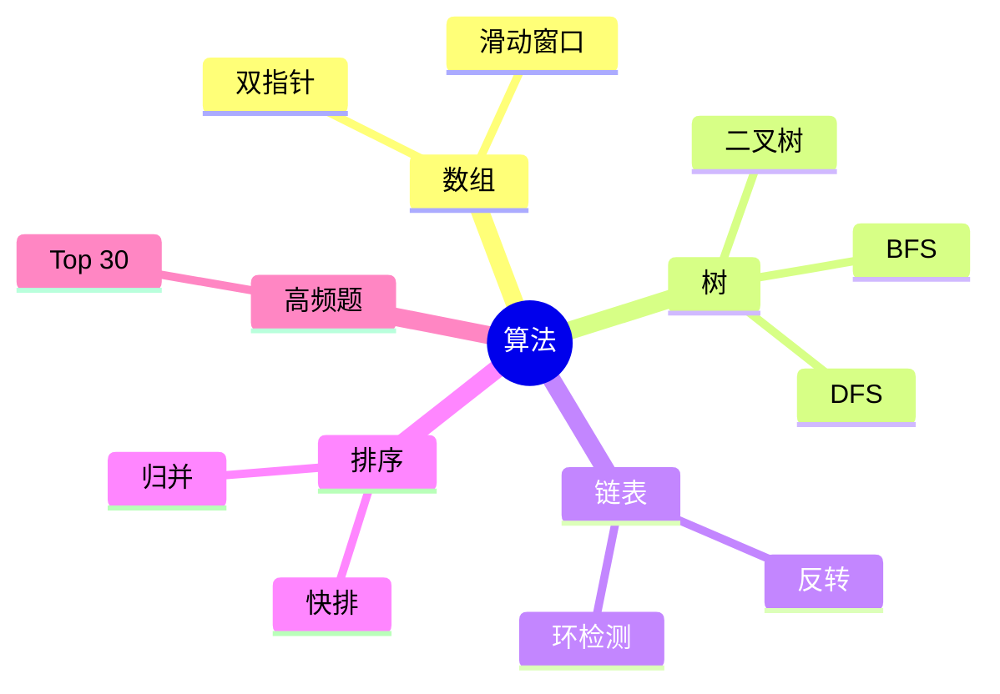

# 算法 知识地图

## 推荐学习顺序

1. ⭐⭐⭐⭐⭐ [数组](./array.md)
2. ⭐⭐⭐⭐⭐ [高频题](./common-questions.md)
3. ⭐⭐⭐⭐   [树](./tree.md)
4. ⭐⭐⭐⭐   [链表](./linked-list.md)
5. ⭐⭐⭐     [排序](./sort.md)

## 知识点索引

| 知识点 | 频率 | 难度 | 手写 | 状态 |
|--------|------|------|------|------|
| [数组](./array.md) | ⭐⭐⭐⭐⭐ | 中级 | — | draft |
| [树](./tree.md) | ⭐⭐⭐⭐ | 高级 | — | draft |
| [链表](./linked-list.md) | ⭐⭐⭐⭐ | 中级 | — | draft |
| [排序](./sort.md) | ⭐⭐⭐ | 中级 | — | draft |
| [高频题](./common-questions.md) | ⭐⭐⭐⭐⭐ | 中级 | — | draft |
