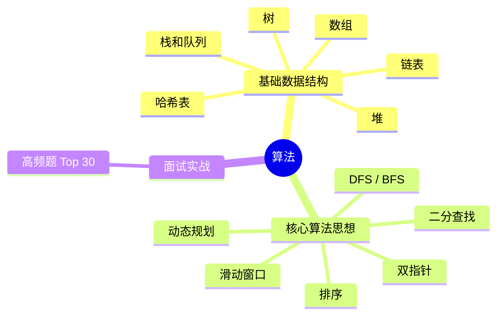

# 算法 知识地图

## 推荐学习顺序

### 一、基础数据结构

1. ⭐⭐⭐⭐⭐ [数组](./array.md)
2. ⭐⭐⭐⭐⭐ [哈希表](./hash.md)
3. ⭐⭐⭐⭐   [栈和队列](./stack-queue.md)
4. ⭐⭐⭐⭐   [堆](./heap.md)
5. ⭐⭐⭐⭐   [链表](./linked-list.md)
6. ⭐⭐⭐⭐   [树](./tree.md)

### 二、核心算法思想

7. ⭐⭐⭐⭐⭐ [双指针](./two-pointers.md) — 很多算法的基础
8. ⭐⭐⭐     [排序](./sort.md) — 二分查找的前置（需要有序数组）
9. ⭐⭐⭐⭐   [二分查找](./binary-search.md) — 依赖排序
10. ⭐⭐⭐⭐⭐ [滑动窗口](./sliding-window.md) — 双指针的变体
11. ⭐⭐⭐⭐   [DFS / BFS](./dfs-bfs.md) — 图/树遍历
12. ⭐⭐⭐⭐   [动态规划](./dynamic-programming.md) — 进阶思想
13. ⭐⭐⭐⭐   [回溯算法](./backtracking.md) — 全排列/组合/N皇后

### 三、面试实战

14. ⭐⭐⭐⭐⭐ [高频题](./common-questions.md)

## 知识点索引

| 知识点 | 频率 | 难度 | 手写 | 状态 |
|--------|------|------|------|------|
| [数组](./array.md) | ⭐⭐⭐⭐⭐ | 中级 | — | draft |
| [哈希表](./hash.md) | ⭐⭐⭐⭐⭐ | 中级 | — | filled |
| [栈和队列](./stack-queue.md) | ⭐⭐⭐⭐ | 初级 | — | filled |
| [堆](./heap.md) | ⭐⭐⭐⭐ | 高级 | ✅ 小顶堆 | draft |
| [双指针](./two-pointers.md) | ⭐⭐⭐⭐⭐ | 中级 | — | filled |
| [滑动窗口](./sliding-window.md) | ⭐⭐⭐⭐⭐ | 中级 | — | filled |
| [链表](./linked-list.md) | ⭐⭐⭐⭐ | 中级 | — | draft |
| [树](./tree.md) | ⭐⭐⭐⭐ | 高级 | — | draft |
| [DFS / BFS](./dfs-bfs.md) | ⭐⭐⭐⭐ | 高级 | — | filled |
| [二分查找](./binary-search.md) | ⭐⭐⭐⭐ | 中级 | — | filled |
| [动态规划](./dynamic-programming.md) | ⭐⭐⭐⭐ | 高级 | — | filled |
| [排序](./sort.md) | ⭐⭐⭐ | 中级 | — | drafted |
| [高频题](./common-questions.md) | ⭐⭐⭐⭐⭐ | 中级 | — | draft |

## 更新记录

- 2026-07-12：学习顺序三组分类（基础数据结构/核心算法思想/面试实战），链表+树归入数据结构
- 2026-07-11：学习顺序编号去重（修复 #5 出现三次的 bug）；mindmap 三组缩并（数据结构/算法思想/实战）；去重 双指针/滑动窗口 的 mindmap 重复节点
- 2026-07-05：初始创建
