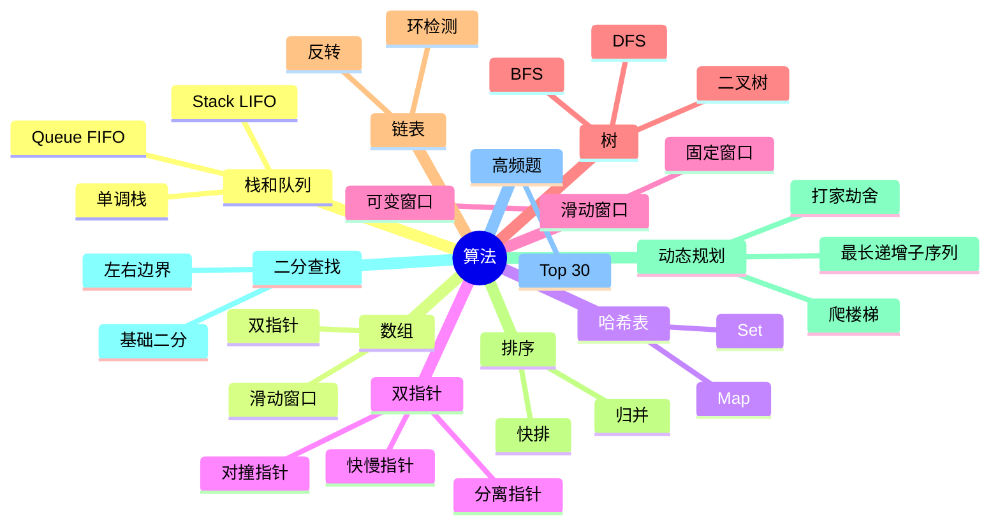

# 算法 知识地图

## 推荐学习顺序

1. ⭐⭐⭐⭐⭐ [数组](./array.md)
2. ⭐⭐⭐⭐⭐ [哈希表](./hash.md)
3. ⭐⭐⭐⭐   [栈和队列](./stack-queue.md)
4. ⭐⭐⭐⭐⭐ [双指针](./two-pointers.md)
5. ⭐⭐⭐⭐⭐ [滑动窗口](./sliding-window.md)
6. ⭐⭐⭐⭐⭐ [高频题](./common-questions.md)
7. ⭐⭐⭐⭐   [树](./tree.md)
8. ⭐⭐⭐⭐   [链表](./linked-list.md)
9. ⭐⭐⭐⭐   [DFS / BFS](./dfs-bfs.md)
10. ⭐⭐⭐⭐   [动态规划](./dynamic-programming.md)
11. ⭐⭐⭐⭐   [二分查找](./binary-search.md)
12. ⭐⭐⭐     [排序](./sort.md)

## 知识点索引

| 知识点 | 频率 | 难度 | 手写 | 状态 |
|--------|------|------|------|------|
| [数组](./array.md) | ⭐⭐⭐⭐⭐ | 中级 | — | draft |
| [哈希表](./hash.md) | ⭐⭐⭐⭐⭐ | 中级 | — | filled |
| [栈和队列](./stack-queue.md) | ⭐⭐⭐⭐ | 初级 | — | filled |
| [双指针](./two-pointers.md) | ⭐⭐⭐⭐⭐ | 中级 | — | filled |
| [滑动窗口](./sliding-window.md) | ⭐⭐⭐⭐⭐ | 中级 | — | filled |
| [树](./tree.md) | ⭐⭐⭐⭐ | 高级 | — | draft |
| [链表](./linked-list.md) | ⭐⭐⭐⭐ | 中级 | — | draft |
| [排序](./sort.md) | ⭐⭐⭐ | 中级 | — | drafted |
| [DFS / BFS](./dfs-bfs.md) | ⭐⭐⭐⭐ | 高级 | — | filled |
| [动态规划](./dynamic-programming.md) | ⭐⭐⭐⭐ | 高级 | — | filled |
| [二分查找](./binary-search.md) | ⭐⭐⭐⭐ | 中级 | — | filled |
| [高频题](./common-questions.md) | ⭐⭐⭐⭐⭐ | 中级 | — | draft |
