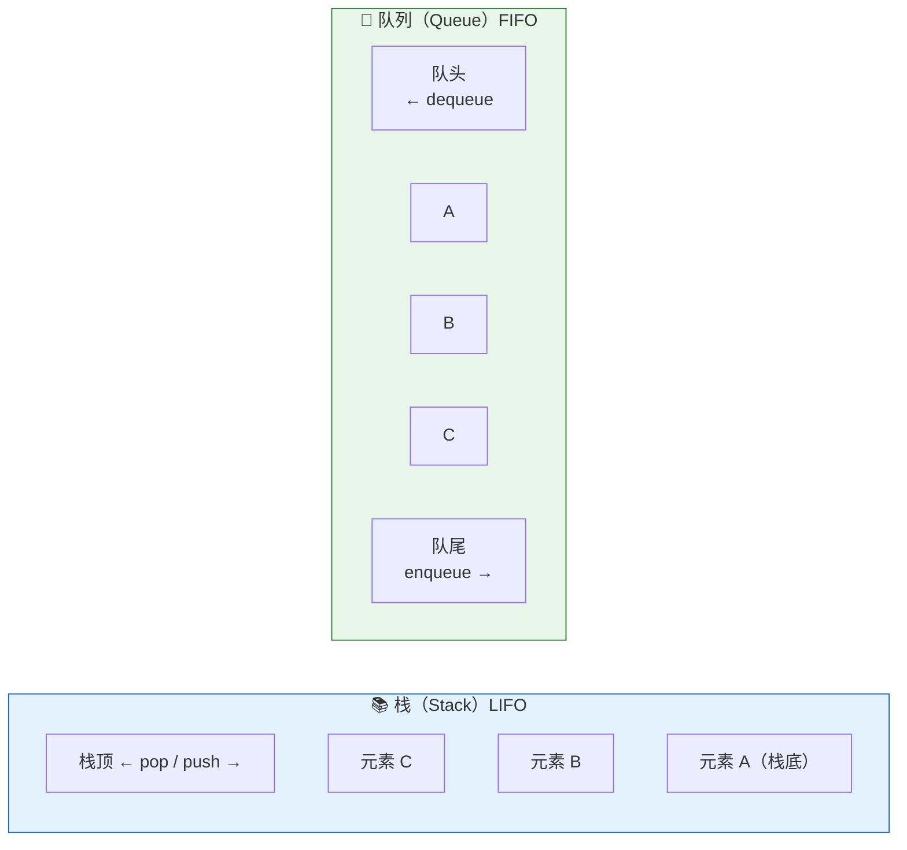

# 栈和队列

> 栈和队列看似简单，但它们是 JS 引擎运行机制的基石——调用栈决定了函数执行顺序，任务队列决定了异步回调的调度。

## 一句话总结

**栈是 LIFO（后进先出）的线性结构，对应 JS 的函数调用栈和括号匹配等场景；队列是 FIFO（先进先出）的线性结构，对应 JS 的任务队列和 BFS 等场景。栈的经典题是有效括号匹配和单调栈，队列的经典题是用两个栈实现队列。**

---

## 核心机制

### 栈（Stack）

栈只允许在**一端**（栈顶）进行插入和删除操作。JS 没有内置的 Stack 类型，用数组模拟：

```js
const stack = []
stack.push(1)    // 入栈，栈顶现在为 1
stack.push(2)    // 入栈，栈顶现在为 2
stack.pop()      // 出栈，返回 2（后进先出）
stack[stack.length - 1]  // 查看栈顶元素（peek），不弹出
```

也可以用 `unshift` + `shift` 模拟栈（操作数组头部），但时间复杂度为 O(n)，不如 push/pop 的 O(1)。

**核心操作复杂度**：push O(1)、pop O(1)、peek O(1)、search O(n)。

### 队列（Queue）

队列只允许在**一端**（队尾）插入，在**另一端**（队头）删除。JS 用数组模拟：

```js
const queue = []
queue.push(1)    // 入队，现在队列为 [1]
queue.push(2)    // 入队，现在队列为 [2, 1] ← 看这里
queue.shift()    // 出队，返回 1（先进先出）
queue[0]         // 查看队头元素
```

但 `shift()` 时间复杂度是 O(n)（需要移动所有剩余元素），大量操作时性能差。工程实践中通常用**双指针模拟循环队列**，或用链表实现队列将出队复杂度降到 O(1)。

### JS 中的调用栈（Call Stack）

JS 引擎用**调用栈**管理函数执行上下文：

```js
function a() { b() }
function b() { c() }
function c() { throw new Error('boom') }
a()
// 调用栈：全局 → a() → b() → c()（最后压入的最先弹出）
// Error 的 stack trace 正是调用栈的快照
```

- 函数**调用**：创建执行上下文，压入调用栈
- 函数**返回**：弹出当前执行上下文，回到上一层
- **栈溢出（Stack Overflow）**：递归过深，调用栈超过引擎限制（通常 ~10000 帧），报 `Maximum call stack size exceeded`

### JS 中的任务队列

JS 是单线程 + 事件循环模型，异步回调通过**任务队列**调度：

- **宏任务队列（Macro Task Queue）**：`setTimeout`、`setInterval`、I/O、UI 渲染。每次事件循环取**一个**宏任务执行
- **微任务队列（Micro Task Queue）**：`Promise.then/catch/finally`、`MutationObserver`、`queueMicrotask`。每次宏任务执行完，清空**整个**微任务队列

面试时一定要说清楚：**微任务队列是一个"插队"机制**——在下一个宏任务之前，微任务全部执行完。这就是为什么 `Promise.then` 比 `setTimeout(fn, 0)` 先执行。

---

## 栈和队列结构图



---

## 深度拓展

### 追问1：经典题——有效括号匹配（LeetCode 20）

判断 `()[]{}` 是否有效：左括号入栈，右括号与栈顶匹配。时间复杂度 O(n)，空间复杂度 O(n)。

```js
function isValid(s) {
  const stack = []
  const map = { ')': '(', ']': '[', '}': '{' }
  for (const ch of s) {
    if (!map[ch]) {
      stack.push(ch)           // 左括号入栈
    } else if (stack.pop() !== map[ch]) {
      return false             // 右括号不匹配栈顶
    }
  }
  return stack.length === 0    // 栈为空则全部匹配
}
```

面试官可能追问："为什么要用栈？"——因为括号匹配是**就近配对**的，最近的左括号最先被闭合右括号匹配，这是典型的 LIFO 场景。

### 追问2：经典题——用两个栈实现队列（LeetCode 232）

核心思路：**一个栈负责入队（inStack），一个栈负责出队（outStack）**。出队时，如果 outStack 为空，把 inStack 的全部元素倒入 outStack，顺序反转后刚好实现 FIFO。

```js
class MyQueue {
  constructor() {
    this.inStack = []
    this.outStack = []
  }
  push(x) { this.inStack.push(x) }
  pop() {
    if (!this.outStack.length) {
      while (this.inStack.length) {
        this.outStack.push(this.inStack.pop())
      }
    }
    return this.outStack.pop()
  }
  peek() {
    const val = this.pop()
    this.outStack.push(val)
    return val
  }
  empty() {
    return !this.inStack.length && !this.outStack.length
  }
}
```

**均摊时间复杂度 O(1)**：每个元素只入栈两次、出栈两次，n 次操作的总复杂度为 O(n)。

### 追问3：单调栈（Monotonic Stack）

单调栈是栈的进阶玩法——维护栈内元素**单调递增或递减**。经典应用：

- **下一个更大元素**（LeetCode 496）：遍历数组，维护一个单调递减栈。遇到比栈顶大的元素时，弹出栈顶并记录结果
- **柱状图中最大的矩形**（LeetCode 84）：维护单调递增栈，弹出时计算以弹出高度为高的矩形面积

```js
// 模板：找下一个更大元素
function nextGreaterElement(nums) {
  const res = new Array(nums.length).fill(-1)
  const stack = []  // 存下标，维护单调递减
  for (let i = 0; i < nums.length; i++) {
    while (stack.length && nums[i] > nums[stack[stack.length - 1]]) {
      const idx = stack.pop()
      res[idx] = nums[i]
    }
    stack.push(i)
  }
  return res
}
```

### 追问4：优先级队列

普通队列是 FIFO，但有时我们需要"优先级高的先出"。这就是**优先级队列**（Priority Queue），通常用**堆**（Heap）实现。JS 没有内置，但 LeetCode 提供了 `PriorityQueue`。现实场景：React 的 Scheduler 用优先级队列决定任务的执行顺序（用户交互 > 数据更新 > 低优先级更新）。

---

## 项目实战

**场景：实现浏览器的"前进/后退"功能**

这正是**双栈模型**的经典应用：一个栈 `backStack` 存后退历史，一个栈 `forwardStack` 存前进历史。访问新页面时 push 到 backStack 并清空 forwardStack。

```js
class BrowserHistory {
  constructor() {
    this.backStack = []     // 后退历史
    this.forwardStack = []  // 前进历史
  }
  visit(url) {
    this.backStack.push(url)
    this.forwardStack = []   // 新访问清空前进历史
  }
  back() {
    if (this.backStack.length <= 1) return   // 至少留一个当前页
    this.forwardStack.push(this.backStack.pop())
  }
  forward() {
    if (!this.forwardStack.length) return
    this.backStack.push(this.forwardStack.pop())
  }
}
```

---

## 易错点

- **"shift() 出队是 O(1)"**：错误。`shift()` 需要移动所有剩余元素，时间复杂度 O(n)。频繁出队场景用双指针或链表。
- **"调用栈和任务队列是一回事"**：不是。调用栈管理同步函数调用（LIFO），任务队列管理异步回调调度（FIFO）。
- **"微任务队列 = 后进先出"**：错误。微任务队列是 FIFO 的——先注册的 Promise.then 先执行。LIFO 的是调用栈。
- **"递归一定能写成迭代"**：理论上能（任何递归都可用栈模拟），但尾递归优化（TCO）只在 Safari 等少数引擎中实现，V8 暂不支持。

---

## 相关阅读

- [数组](./array.md) —— JS 数组操作与性能分析
- [链表](./linked-list.md) —— 链式队列的实现
- [DFS / BFS](./dfs-bfs.md) —— BFS 用队列、DFS 用栈
- [事件循环](../JavaScript/event-loop.md) —— 宏任务和微任务队列的调度机制
- [闭包](../JavaScript/closure.md) —— 调用栈和闭包的关系

---

## 更新记录

- 2026-07-06：完成完整内容，覆盖栈/队列原理、经典题、单调栈、JS 调用栈和任务队列（Phase 2）
