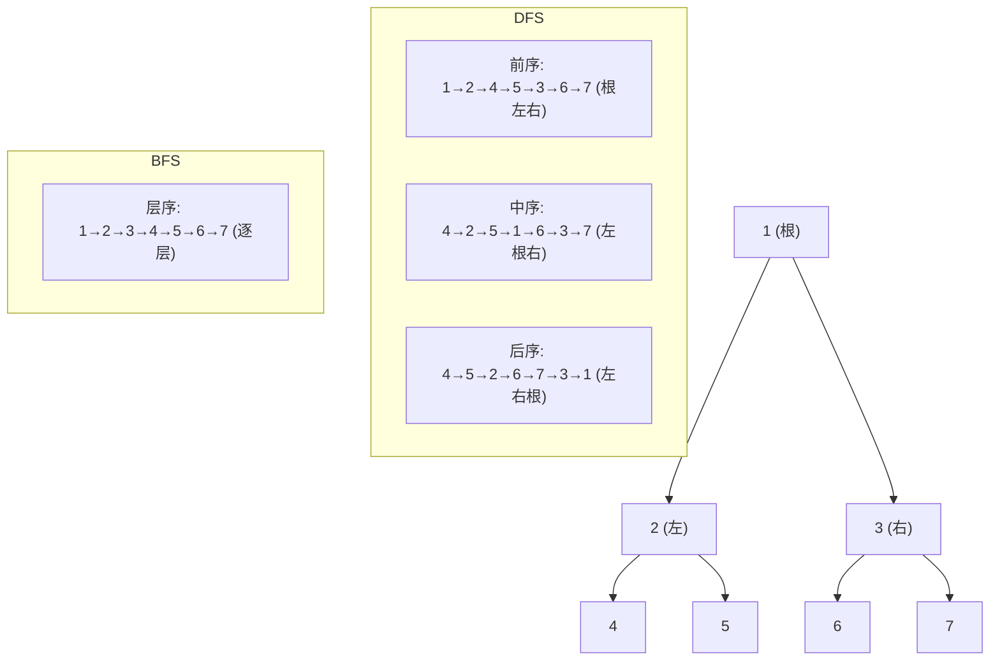

# 树

> ⭐⭐⭐⭐｜难度：高级

**树的核心是 DFS（前中后序）和 BFS（层序），二叉树是面试最高频的树结构，掌握递归遍历的"三行代码"和迭代栈模拟，基本能应对 80% 的树类问题。**

## 一句话总结

**树的核心是 DFS（前中后序）和 BFS（层序），二叉树是面试最高频的树结构。**

## 核心机制

### 二叉树遍历

二叉树有三种深度优先遍历（前序、中序、后序）和一种广度优先遍历（层序）。递归写法极其直观，但面试官通常会追问迭代写法。

```ts
class TreeNode {
  val: number
  left: TreeNode | null = null
  right: TreeNode | null = null
  constructor(val: number) { this.val = val }
}

// ---- 递归三行代码 ----
function preorder(root: TreeNode | null): number[] {
  if (!root) return []
  return [root.val, ...preorder(root.left), ...preorder(root.right)]
}

// ---- 迭代：用栈模拟递归 ----
// 前序：根左右 → 先压右再压左（栈 LIFO）
function preorderIter(root: TreeNode | null): number[] {
  const res: number[] = []
  const stack = [root]
  while (stack.length) {
    const node = stack.pop()!
    if (!node) continue
    res.push(node.val)
    stack.push(node.right!)  // 先右
    stack.push(node.left!)   // 后左 → 左先出栈
  }
  return res
}

// 中序：左根右 → 一路向左入栈，出栈时访问
function inorderIter(root: TreeNode | null): number[] {
  const res: number[] = []
  const stack: TreeNode[] = []
  let curr = root
  while (curr || stack.length) {
    while (curr) {           // 一路向左
      stack.push(curr)
      curr = curr.left
    }
    curr = stack.pop()!
    res.push(curr.val)       // 访问
    curr = curr.right        // 转向右子树
  }
  return res
}

// 后序：左右根 → 前序"根右左"再反转
function postorderIter(root: TreeNode | null): number[] {
  const res: number[] = []
  const stack = [root]
  while (stack.length) {
    const node = stack.pop()!
    if (!node) continue
    res.push(node.val)
    stack.push(node.left!)
    stack.push(node.right!)
  }
  return res.reverse()  // 精髓：前序变体再反转
}
```



### DFS 核心应用

```ts
// 1. 最大深度：1 + max(左深度, 右深度)
function maxDepth(root: TreeNode | null): number {
  if (!root) return 0
  return 1 + Math.max(maxDepth(root.left), maxDepth(root.right))
}

// 2. 路径总和：递归减目标值
function hasPathSum(root: TreeNode | null, target: number): boolean {
  if (!root) return false
  if (!root.left && !root.right) return root.val === target // 叶子节点
  const rest = target - root.val
  return hasPathSum(root.left, rest) || hasPathSum(root.right, rest)
}

// 3. 最近公共祖先（LCA）：后序遍历，左右各找到一个就返回当前节点
function lowestCommonAncestor(
  root: TreeNode | null, p: TreeNode, q: TreeNode
): TreeNode | null {
  if (!root || root === p || root === q) return root
  const left = lowestCommonAncestor(root.left, p, q)
  const right = lowestCommonAncestor(root.right, p, q)
  if (left && right) return root  // p、q 分居两侧，当前即 LCA
  return left || right             // p、q 在同侧，返回找到的那个
}
```

### BFS（层序遍历）

```ts
// 层序遍历：队列逐层处理
function levelOrder(root: TreeNode | null): number[][] {
  if (!root) return []
  const result: number[][] = []
  const queue = [root]
  while (queue.length) {
    const level: number[] = []
    const size = queue.length  // 固定当前层大小
    for (let i = 0; i < size; i++) {
      const node = queue.shift()!
      level.push(node.val)
      if (node.left) queue.push(node.left)
      if (node.right) queue.push(node.right)
    }
    result.push(level)
  }
  return result
}
```

### BST（二叉搜索树）

BST 的核心特性：**左 < 根 < 右**。中序遍历 BST 得到升序数组，查找/插入/删除都是 O(log n)（平衡时）。

```ts
// BST 验证：检查每个节点是否在合法区间内
function isValidBST(root: TreeNode | null, min = -Infinity, max = Infinity): boolean {
  if (!root) return true
  if (root.val <= min || root.val >= max) return false
  return isValidBST(root.left, min, root.val) && isValidBST(root.right, root.val, max)
}
```

## 深度拓展

### 1. 二叉树的最大深度

递归一行 `1 + Math.max(maxDepth(left), maxDepth(right))`。迭代用 BFS 层序遍历，每遍历一层 `depth++`。递归简洁但可能爆栈；迭代 O(n) 空间但更安全。

### 2. 翻转二叉树

```ts
function invertTree(root: TreeNode | null): TreeNode | null {
  if (!root) return null
  ;[root.left, root.right] = [invertTree(root.right), invertTree(root.left)]
  return root
}
```

### 3. 对称二叉树

```ts
function isSymmetric(root: TreeNode | null): boolean {
  function check(p: TreeNode | null, q: TreeNode | null): boolean {
    if (!p && !q) return true
    if (!p || !q) return false
    return p.val === q.val && check(p.left, q.right) && check(p.right, q.left)
  }
  return check(root, root)
}
```

### 4. 二叉树的最近公共祖先

后序遍历，如果左右子树各找到一个目标节点，当前节点就是 LCA。关键：递归终止条件是 `root === null || root === p || root === q`。

### 5. 路径总和 II

```ts
function pathSum(root: TreeNode | null, target: number): number[][] {
  const result: number[][] = []
  function dfs(node: TreeNode | null, path: number[], sum: number) {
    if (!node) return
    path.push(node.val)
    if (!node.left && !node.right && sum === node.val) {
      result.push([...path])
    } else {
      dfs(node.left, path, sum - node.val)
      dfs(node.right, path, sum - node.val)
    }
    path.pop()  // 回溯
  }
  dfs(root, [], target)
  return result
}
```

## 项目实战

### 1. 菜单树递归渲染

DFS 遍历后端返回的权限树，生成 `el-menu` 组件结构。关键：递归调用自身处理 children。

```ts
function buildMenuItems(menus: MenuNode[]): VNode[] {
  return menus.map((menu) => {
    if (menu.children && menu.children.length > 0) {
      return h(ElSubMenu, { index: menu.id }, {
        title: () => menu.name,
        default: () => buildMenuItems(menu.children),
      })
    }
    return h(ElMenuItem, { index: menu.id }, () => menu.name)
  })
}
```

### 2. 组织架构树组件

递归组件 + 插槽，Vue 中组件自己引用自己实现无限层级嵌套：

```vue
<!-- OrgTreeNode.vue -->
<template>
  <div class="node">
    <slot :node="data" />
    <div v-if="data.children" class="children">
      <OrgTreeNode v-for="child in data.children" :data="child" :key="child.id">
        <template #default="scope"><slot :node="scope.node" /></template>
      </OrgTreeNode>
    </div>
  </div>
</template>
```

### 3. 路由配置树扁平化

DFS 遍历嵌套路由 `routes`，将其转为一维数组，用于面包屑或权限过滤：

```ts
function flattenRoutes(routes: RouteConfig[]): RouteConfig[] {
  const result: RouteConfig[] = []
  for (const route of routes) {
    result.push(route)
    if (route.children) {
      result.push(...flattenRoutes(route.children))
    }
  }
  return result
}
```

## 易错点

1. **递归爆栈**：深度很大的链表式二叉树（每个节点只有左子节点），递归深度等于节点数，可能栈溢出。迭代或尾递归优化可规避。
2. **空节点判断**：`if (!root) return` 必须写在递归函数第一行，否则 null.left 直接报错。
3. **迭代栈顺序**：前序先压右再压左，后序先压左再压右 + 反转，记反了结果完全不对。
4. **Morris 遍历**：进阶面试可能问 Morris 遍历（O(1) 空间），利用空闲指针替代栈，面试前至少过一遍思路。
5. **BST 验证陷阱**：不能只比较 `root.left.val < root.val < root.right.val`，因为右子树的左子节点可能比根还小。必须用上下界区间验证。

## 相关阅读

- [算法 知识地图](./index.md)
- [数组](./array.md)
- [链表](./linked-list.md)
- [排序](./sort.md)
- [高频题](./common-questions.md)

## 更新记录

- 2026-07-05：Phase 2 深度填充（二叉树遍历 + DFS/BFS 应用 + BST + 5 道高频题 + 项目实战）
