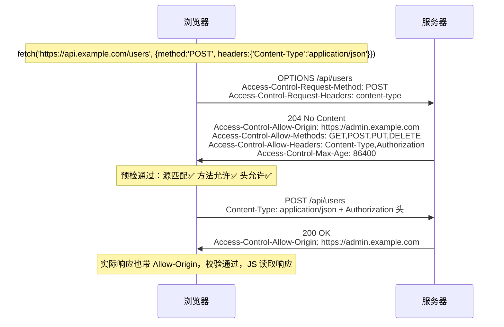

# CORS

> 频率: 5/5 | 难度: 中级 | 项目相关: 核心

## 一句话总结

CORS（跨域资源共享）是浏览器基于同源策略实现的一种安全机制——当你从前端 `http://localhost:5173` 请求后端 `http://api.example.com` 时，浏览器会根据服务器返回的 `Access-Control-Allow-Origin` 等 HTTP 头决定是否允许这个跨域请求。

## 核心机制

### 同源策略和跨域的定义

浏览器规定协议 + 域名 + 端口三者完全一致才是"同源"。`http://example.com` 和 `https://example.com` 是跨域（协议不同），`example.com` 和 `api.example.com` 也是跨域（子域名不同源）。同源策略限制了跨域 AJAX 请求、跨域读取 DOM（iframe）和跨域读取存储（localStorage/Cookie）——CORS 解决的是第一种。

### 简单请求 vs 预检请求

浏览器把跨域请求分成两类，处理方式完全不同。

**简单请求**：同时满足——方法是 GET/POST/HEAD；Content-Type 为 `text/plain`、`multipart/form-data` 或 `application/x-www-form-urlencoded`；无自定义请求头。浏览器直接发出，在响应中检查 `Access-Control-Allow-Origin`，不匹配就拦截——但**服务端确实已处理了请求**，只是浏览器不让 JS 读响应。

**预检请求（Preflight）**：不满足以上条件时（如 POST JSON、用了 `Authorization` 头、用了 PUT/DELETE），浏览器先发 `OPTIONS` 试探服务器：



### CORS 关键响应头

| 头部 | 作用 |
|------|------|
| `Access-Control-Allow-Origin` | 允许哪些源（`*` 或具体域名） |
| `Access-Control-Allow-Methods` | 允许的 HTTP 方法 |
| `Access-Control-Allow-Headers` | 允许的请求头 |
| `Access-Control-Allow-Credentials` | 是否允许携带 Cookie |
| `Access-Control-Max-Age` | 预检结果缓存时间（秒） |
| `Access-Control-Expose-Headers` | JS 能读取的响应头白名单 |

### withCredentials — 跨域携带 Cookie

默认情况下跨域请求不携带 Cookie。如果需要（如前后端不在同域但共享 Session），需要三条件缺一不可：前端 `credentials: 'include'`；后端 `Access-Control-Allow-Origin` 必须指定具体域名不能是 `*`；后端 `Access-Control-Allow-Credentials: true`。

## 深度拓展

### 为什么要有跨域限制？

核心原因：**CSRF（跨站请求伪造）和隐私泄露**。如果没有同源策略，你登录 `bank.com` 后不小心访问了恶意网站 `evil.com`，它可以用你的登录态向 `bank.com` 发起转账、用 iframe 读取你的账户余额、读取你在其他域名下的 localStorage。同源策略阻止了这一切——恶意网站的 JS 无法读取银行页面的 DOM，也无法读取跨域请求的响应。

### JSONP 的原理和为什么被淘汰

JSONP 是 CORS 出现前的主流跨域方案。原理：`<script>` 标签的 `src` 不受同源策略限制——服务端返回 `handleData({"users":...})` 而非纯 JSON，浏览器执行后 `handleData` 拿到数据。

淘汰原因：只支持 GET；把执行权限交出给第三方（XSS 风险——服务端返回恶意 JS 浏览器照样执行）；错误处理困难（只能靠超时检测）。CORS 出现后 JSONP 基本只在遗留系统里见到了。

### CORS 预检的缓存 — Access-Control-Max-Age

预检请求（OPTIONS）是额外的网络往返。`Access-Control-Max-Age` 让浏览器缓存预检结果——默认 5 秒，可设为几小时（Chrome 最大 2h，Firefox 最大 24h）。项目里设为 86400（一天）能大幅减少 OPTIONS 请求。注意 `Max-Age` 只针对同一 URL，所以端点越多预检越多——极端优化是用 BFF 层聚合端点。

### 跨域方案的完整对比

六种常见方案从优到劣：**Nginx 反向代理**（同域转发，生产首选） > **CORS**（标准方案，需后端配合） > **Vite proxy**（仅开发环境） > **WebSocket**（ws 协议不受同源限制但需检查 Origin） > **postMessage**（仅限 iframe/页签通信） > **JSONP**（历史遗留，只支持 GET 且有 XSS 风险，已淘汰）。

## 项目实战

### Vite 开发环境配置 proxy 代理

Vue3 后台管理项目本地开发时前端在 `localhost:5173`，后端在 `localhost:3000`，API 请求跨域。Vite proxy 把 `/api` 代理到后端：

```ts
// vite.config.ts
export default defineConfig({
  server: {
    port: 5173,
    proxy: {
      '/api': {
        target: 'http://localhost:3000',
        changeOrigin: true,  // 重要：修改 Host 头，否则后端 host 校验失败
        // rewrite: (path) => path.replace(/^\/api/, ''),
      },
    },
  },
})
```

原理：浏览器请求 `localhost:5173/api/users`，dev server 转发给 `localhost:3000/api/users`，响应原路返回——对浏览器来说是同源通信，不涉及跨域。

### Nginx 反向代理解决生产环境跨域

生产环境用 Nginx 反向代理让前端和 API 同域，浏览器不触发 CORS：

```nginx
server {
    listen 80;
    server_name admin.example.com;
    location / { root /app/dist; try_files $uri /index.html; }
    location /api/ {
        proxy_pass http://backend-cluster:3000/;
        # 同域转发后浏览器不会触发 CORS，无需任何 Access-Control-* 头。
        # 切忌 add_header Access-Control-Allow-Origin $http_origin 搭配
        # Allow-Credentials: true——反射任意 Origin 等于对所有网站开放凭证请求。
    }
}
```

所有请求的 Origin 和 API 域名一致，不是跨域，CORS 压根不触发。

### 后端 CORS 白名单配置

即使有 Nginx 反向代理，后端也应配置 CORS 白名单兜底。在 Express 中：

```js
const allowedOrigins = ['https://admin.example.com', 'https://admin-staging.example.com']
app.use((req, res, next) => {
  if (allowedOrigins.includes(req.headers.origin)) {
    res.setHeader('Access-Control-Allow-Origin', req.headers.origin)
    res.setHeader('Access-Control-Allow-Credentials', 'true')
  }
  if (req.method === 'OPTIONS') {
    res.setHeader('Access-Control-Allow-Methods', 'GET,POST,PUT,DELETE')
    res.setHeader('Access-Control-Allow-Headers', 'Authorization,Content-Type')
    res.setHeader('Access-Control-Max-Age', '86400')
    return res.sendStatus(204)
  }
  next()
})
```

要点：`Allow-Origin` 必须匹配白名单而不能用 `*`；OPTIONS 直接 204 返回不走业务逻辑；`Max-Age: 86400` 缓存预检一天。

### 跨域携带 Cookie 的完整配置

后台主域名 `admin.example.com`，API 在 `api.example.com`（跨子域），用 Session/Cookie 认证。需要三步对齐：

```ts
// 1. 前端 Axios
axios.defaults.withCredentials = true

// 2. 后端响应头
// Access-Control-Allow-Origin: https://admin.example.com  （具体域名，不是 *）
// Access-Control-Allow-Credentials: true

// 3. Cookie 属性
// Set-Cookie: session_id=xxx; SameSite=None; Secure; Domain=.example.com
```

第三步经常被忽略：Cookie 的 `SameSite` 默认 `Lax` 时跨域请求不会带上，必须设为 `None` 且配合 `Secure`（仅 HTTPS）。`Domain=.example.com` 使子域名间共享 Cookie。

## 易错点

- **CORS 是浏览器的限制，不是服务器的限制**：Postman/curl 不会拦截跨域响应，因为它们不是浏览器。
- **`Access-Control-Allow-Origin: *` 和 `withCredentials` 互斥**：携带 Cookie 时 Origin 不能是通配符。
- **OPTIONS 请求"凭空出现"**：Network 面板的 OPTIONS 是浏览器自动发的预检，不是你代码里的 `fetch`。
- **预检请求不带认证信息**：OPTIONS 时浏览器故意不携带 Cookie/Authorization 头。如果后端对所有请求（含 OPTIONS）要求鉴权，预检 401 导致实际请求发不出去。
- **HTML 标签 src 不受 CORS 限制**：`<script>`、``、`<link>` 可加载跨域资源，这正是 JSONP 存在的理由。

## 面试信号表

| 面试官问 | 下一问大概率是 |
|----------|-------------|
| "跨域怎么解决" | 追问 CORS 预检请求（OPTIONS）的触发条件 |
| "JSONP 和 CORS 有什么区别" | 追问 JSONP 为什么只能 GET、有什么风险 |
| "CORS 请求发出去了吗" | 追问同源策略只拦读不拦发——CSRF 的根因 |
| "withCredentials 怎么配" | 追问带凭证时 origin 为什么不能用通配符 |

## 相关阅读

- [MDN: Cross-Origin Resource Sharing (CORS)](https://developer.mozilla.org/en-US/docs/Web/HTTP/CORS)
- [MDN: Access-Control-Allow-Origin](https://developer.mozilla.org/en-US/docs/Web/HTTP/Headers/Access-Control-Allow-Origin)
- [http-https](./http-https.md) — HTTP 请求/响应的基础
- [安全/csrf](../浏览器/安全/csrf.md) — CORS 防御的核心攻击
- [安全/xss](../浏览器/安全/xss.md) — JSONP 被淘汰的安全原因

## 更新记录

- 2026-07-18：Phase 3 事实审计——移除 Nginx 示例中反射 `$http_origin` + `Allow-Credentials: true` 的反模式（同域转发本就不触发 CORS）
- 2026-07-05：完成 Phase 2 填充（reviewed）
