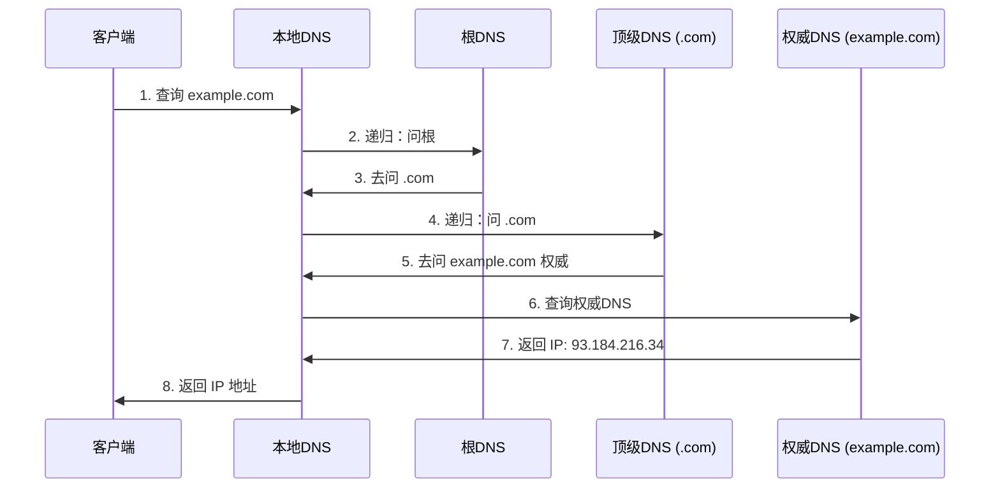

# DNS / CDN

> 频率: 4/5 | 难度: 中级 | 项目相关: 核心

## 一句话总结

DNS 就像互联网的电话本，把域名翻译成 IP 地址，查找过程是递归 + 迭代的组合；CDN 是在全球各地部署缓存节点，用户访问时 DNS 把他引导到最近的节点，从而加速内容传输、减少源站压力。



## 核心机制

### DNS 解析的完整流程

当你在浏览器里输入 `admin.example.com` 时，发生了什么：

1. **浏览器缓存**：Chrome 先看自己有没有缓存这个域名的 IP，有就直接用。缓存时间由 TTL 决定。
2. **操作系统 hosts 文件**：`/etc/hosts`（Mac/Linux）或 `C:\Windows\System32\drivers\etc\hosts`（Windows），解析到配置的 IP 就不再往下走。这也是开发时改 hosts 做本地调试的原理。
3. **本地 DNS 服务器（递归解析器）**：通常由 ISP（运营商）提供，或你手动设置的 8.8.8.8（Google）、114.114.114.114。它收到请求后开始逐级查询。
4. **根 DNS 服务器**：全球 13 组，本地 DNS 问根："`.com` 归谁管？"，根返回 `.com` 顶级域 DNS 的地址。
5. **顶级域 DNS 服务器**：本地 DNS 问 `.com`："`example.com` 归谁管？"，`.com` 返回 `example.com` 的权威 DNS 地址。
6. **权威 DNS 服务器**：本地 DNS 问权威："`admin.example.com` 的 IP 是啥？"，权威返回最终的 A 记录（IPv4）或 AAAA 记录（IPv6）。
7. **本地 DNS 缓存结果**，把 IP 返回给浏览器，浏览器发起 TCP 连接。

注意：步骤 4-6 是**迭代查询**（本地 DNS 一次次问），步骤 3 对浏览器来说是**递归查询**（浏览器只问一次本地 DNS，剩下的活本地 DNS 自己跑）。

### DNS 记录类型

| 类型 | 作用 | 示例 |
|------|------|------|
| A | 域名 -> IPv4 | `example.com -> 1.2.3.4` |
| AAAA | 域名 -> IPv6 | `example.com -> 2606:4700::` |
| CNAME | 域名 -> 另一个域名（别名） | `www.example.com -> example.com` |
| MX | 邮件服务器 | `example.com -> mail.example.com`（优先级 10） |
| TXT | 文本记录，常用于验证 | SPF、DKIM、域名所有权验证 |

面试注意：**CNAME 不能用于根域名**（apex domain），因为根域名通常还有 MX 等其他记录，CNAME 会覆盖所有记录类型。这是 RFC 的规定。

### CDN 的工作原理

核心思想一句话：**让用户从离自己最近的节点拿资源，而不是飞到源站**。

具体流程：
1. 用户访问 `cdn.example.com`，这个域名被 CNAME 到 CDN 厂商的调度域名（如 `xxx.cloudflare.net`）。
2. CDN 的 DNS 调度系统根据用户的 LDNS IP 判断地理位置，返回最近边缘节点的 IP。
3. 用户请求到达边缘节点：
   - 如果节点有缓存的资源（命中），直接返回。
   - 如果没有（未命中），节点向源站回源拉取，缓存后返回给用户。
4. 后续相同请求都被边缘节点直接处理，源站压力大幅下降。

### CDN 的预热和刷新

- **预热**：在用户请求之前，主动把资源推送到各边缘节点。新系统上线或大版本发布前做预热，避免大量用户同时回源压垮源站。
- **刷新**：当源站更新了资源需要立即生效时，手动清除 CDN 节点上的缓存。可以按 URL 逐条刷新，也可以按目录批量刷新。刷新后用户下次请求就会回源拉最新的。

## 深度拓展

### DNS over HTTPS (DoH) vs DNS over TLS (DoT) — 隐私保护

传统的 DNS 查询是**明文**的，运营商、中间网络设备随便看你在访问什么网站。DoH 和 DoT 都是把 DNS 查询加密：
- **DoH** (DNS over HTTPS)：把 DNS 请求包装成 HTTPS 请求，走 443 端口，和普通 Web 流量无法区分——审查者没法封掉 DNS 而不影响所有 HTTPS。
- **DoT** (DNS over TLS)：DNS 走 TLS，用专门的 853 端口，比较容易被识别和封锁。

主流浏览器（Chrome、Firefox）默认开启 DoH，国内有时候需要关掉，因为 DoH 绕过了运营商的 DNS，可能导致 CDN 调度不准——你本来应该被调到你所在城市的节点，结果被调到了国外的节点。

### CDN 的内容一致性

CDN 的核心矛盾：**缓存要快，但内容要新**。解决这个矛盾的几种手段：

1. **版本化 URL**：`/assets/app.a3f2b1c.js`，文件内容变了 hash 就变，对 CDN 来说是不同的 URL，直接请求新资源不需要刷新缓存。这是 Webpack/Vite 的默认策略。
2. **Hash/ETag 校验**：CDN 回源时带上 `If-None-Match`，源站告诉它"没变"，CDN 就继续用缓存。
3. **清除缓存（Purge）**：最直接但最慢，通常用于紧急修复 bug 后强制全量刷新。

### 边缘计算 — Cloudflare Workers / Edge Function

传统 CDN 只能做"缓存 + 返回"，边缘计算让你在 CDN 节点上跑代码。比如：
- **A/B 测试**：在边缘层根据 cookie 分流，返回不同版本的页面，不需要请求源站。
- **鉴权**：在边缘层验证 JWT，不合法直接 401，不给源站增加压力。
- **图片实时处理**：URL 参数指定裁剪尺寸和格式，边缘节点当场处理并缓存结果。

这些都是传统"前端 -> 后端 -> 数据库"路径做不到的——它们在离用户最近的节点上就完成了。

### 国内 CDN 的特殊性

国内做 CDN 和海外不一样，需要了解：
- **备案**：域名必须在中国大陆备案才能使用国内 CDN 节点，否则只能用境外节点。
- **域名白名单**：部分 CDN 厂商要求域名添加白名单后才能加速，防止未备案域名绕过监管。
- **运营商差异**：国内三大运营商（电信、联通、移动）之间跨网访问很慢，好的 CDN 必须在三大运营商都部署节点，不然"加速"变"减速"。

## 项目实战

### SPA 静态资源部署 CDN

Vue3 + Element Plus 后台管理系统上线时，`/assets/` 下的 JS、CSS、图片全部推送到阿里云 OSS + CDN。关键配置：

```ts
// vite.config.ts
export default defineConfig({
  base: 'https://cdn.example.com/admin/',  // 指向 CDN 域名
  build: {
    assetsDir: 'assets',
    rollupOptions: {
      output: {
        // 入口 chunk 用 content hash 做版本化
        entryFileNames: 'assets/[name].[hash].js',
        chunkFileNames: 'assets/[name].[hash].js',
        assetFileNames: 'assets/[name].[hash].[ext]',
      },
    },
  },
})
```

构建出来的 HTML 里所有资源路径都是 CDN 的完整 URL，部署时把 HTML 放到服务器上，静态资源丢到 CDN——资源加载和业务请求完全解耦。

### 图片 CDN 处理

后台管理系统里的用户头像、商品图片上传后走图片 CDN 处理。阿里云 OSS 的图片处理通过 URL 参数实现：

```
# 原图
https://img-cdn.example.com/avatar/user123.jpg
# 裁剪为 200x200 头像
https://img-cdn.example.com/avatar/user123.jpg?x-oss-process=image/resize,m_fill,w_200,h_200
# 转为 WebP（体积更小）
https://img-cdn.example.com/avatar/user123.jpg?x-oss-process=image/format,webp
```

这样一来前端不需要引入图片处理库，不需要在服务端做裁剪——全部在 CDN 边缘节点完成，第一次处理后还会被缓存。

### DNS 预解析优化

后台系统里嵌入了第三方服务（数据分析、客服聊天等），这些域名在页面首次访问时才解析 DNS，会拖慢加载。用 `<link rel="dns-prefetch">` 让浏览器提前解析：

```html
<!-- index.html -->
<link rel="dns-prefetch" href="//api.example.com" />
<link rel="dns-prefetch" href="//cdn.example.com" />
<link rel="dns-prefetch" href="//analytics.example.com" />
```

这样当页面 JS 发起请求时，DNS 解析已经完成，直接进入 TCP 握手阶段，省掉至少一次往返。

## 易错点

- **DNS 更改不是即时生效的**：修改 DNS 记录后，各级缓存（本地 DNS、浏览器、操作系统）都会按 TTL 缓存旧记录。所以重要变更应提前降低 TTL（比如先改为 60 秒），等旧 TTL 的缓存过期后再切，而不是直接切换。
- **CNAME 展平（Flattening）**：根域名不能用 CNAME 但又要指向 CDN，怎么办？Cloudflare 提供 CNAME flattening（在权威 DNS 侧帮你把 CNAME 解析成 A 记录返回），AWS Route 53 提供 ALIAS 记录——都是"看起来是 A 记录，行为像 CNAME"的变通方案。
- **CDN 缓存和 Service Worker 冲突**：如果 PWA 用 Service Worker 缓存了资源，CDN 上刷新了版本用户也可能拿不到，因为 SW 拦截了请求。需要确保 SW 的缓存策略和 CDN 版本化 URL 策略配合好。

## 相关阅读

## 面试信号表

| 面试官问 | 下一问大概率是 |
|----------|-------------|
| "DNS 查询过程是怎样的" | 追问递归查询和迭代查询的区别 |
| "CDN 的原理是什么" | 追问 DNS 调度 vs Anycast 就近接入方式 |
| "DNS 有哪些记录类型" | 追问 CNAME 和 A 的区别、MX/TXT 的用途 |
| "DNS 安全怎么保障" | 追问 DNS over HTTPS（DoH）和 DNSSEC |

- [MDN: DNS](https://developer.mozilla.org/en-US/docs/Glossary/DNS)
- [Cloudflare: What is a CDN?](https://www.cloudflare.com/learning/cdn/what-is-a-cdn/)
- [http-https](./http-https.md) — DNS 解析后的 HTTP 通信
- [性能优化/image-optimization](../性能优化/image-optimization.md) — 图片 CDN 优化实践

## 更新记录

- 2026-07-05：完成 Phase 2 填充（reviewed）
