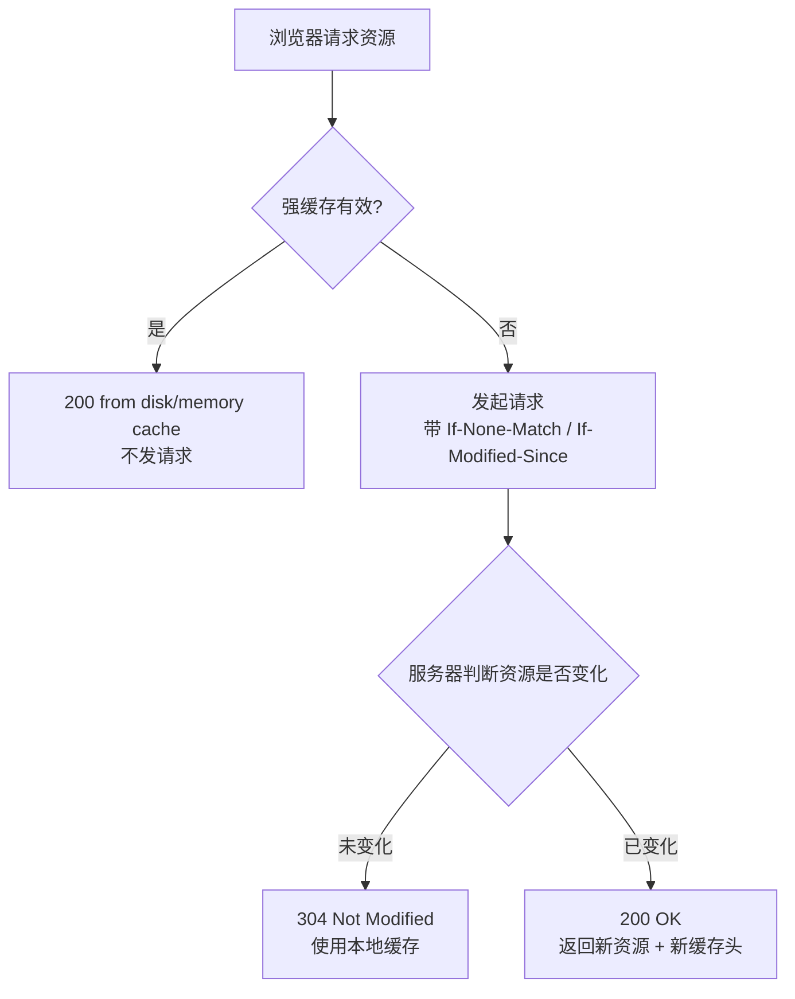

# HTTP 缓存

> ⭐⭐⭐⭐⭐｜难度：中级

## 一句话总结

**HTTP 缓存分两级——强缓存优先级更高（不发请求直接复用），协商缓存在强缓存过期后向服务器验证（304 = 继续用、200 = 重新下载）。Cache-Control 是 HTTP/1.1 的核心控制头，ETag 比 Last-Modified 更精确。**

## 核心机制

### 两级缓存决策流程



### 强缓存：不发请求，直接从本地拿

通过 `Cache-Control`（HTTP/1.1）或 `Expires`（HTTP/1.0）控制：

```http
# 响应头（服务端设置）
Cache-Control: max-age=31536000, immutable   # 一年内不过期，期间绝对不变
Cache-Control: max-age=3600                   # 一小时内有效
```

| 指令 | 含义 |
|------|------|
| `max-age=<秒>` | 缓存有效期，相对时间 |
| `s-maxage=<秒>` | 仅对 CDN 生效，优先级高于 max-age |
| `public` | 任何中间节点（CDN、代理）都可缓存 |
| `private` | 仅浏览器可缓存（中间节点不缓存） |
| `immutable` | 过期前资源绝对不会变——浏览器跳过条件验证 |
| `no-cache` | **可以使用缓存，但每次使用前必须验证**（走协商） |
| `no-store` | **完全不缓存**——每次重新请求 |
| `must-revalidate` | 过期后必须向服务器验证才能使用 |

> **`no-cache` ≠ 不缓存！** 这是面试中最常见的理解错误。`no-cache` 的意思是"可以用缓存但每次都要先问服务器"，本质上跳过了强缓存直接走协商。真正不缓存的是 `no-store`。

### 协商缓存：发请求，服务器说用就用

强缓存过期后，浏览器带验证头发请求：

```http
# 请求头（浏览器自动带）
If-None-Match: "abc123"              # ETag 验证
If-Modified-Since: Tue, 13 Jul 2026 10:00:00 GMT  # 时间验证
```

```http
# 响应（服务器判断）
HTTP/1.1 304 Not Modified            # 没变，用缓存
HTTP/1.1 200 OK                      # 变了，返回新内容
Cache-Control: max-age=31536000       # 同时下发新的缓存策略
ETag: "def456"
```

| 验证方式 | 浏览器发 | 服务器回 | 优缺点 |
|---------|---------|---------|--------|
| **ETag** | `If-None-Match` | `304` 或 `200` + 新 ETag | ✅ 精确（hash/版本号）❌ 需要服务端计算 |
| **Last-Modified** | `If-Modified-Since` | `304` 或 `200` + 新时间 | ✅ 简单 ❌ 秒级精度不够（1s 内多次修改）、文件内容不变但 mtime 变了会失效 |

**ETag 优先级高于 Last-Modified**——两者同时存在时，浏览器优先用 ETag。

## 深度拓展

### 实际项目策略

```nginx
# 1. HTML 文件：协商缓存（永远验证）
# 保证用户总是拿到最新页面
location ~* \.html$ {
    add_header Cache-Control "no-cache";   # 每次验证但不阻止缓存
}

# 2. 带 hash 的静态资源：强缓存（永久）
# 文件名变了就是新资源，旧缓存永不使用
location ~* \.[a-f0-9]{8,}\.(js|css|png|jpg|svg|woff2)$ {
    add_header Cache-Control "max-age=31536000, immutable";
}

# 3. 不带 hash 的资源：短期强缓存 + 验证
# 如 favicon、robots.txt
location ~* \.(json|xml|txt)$ {
    add_header Cache-Control "max-age=3600, must-revalidate";
}
```

**为什么 HTML 用 `no-cache` 而不是 `no-store`？** `no-store` 完全不缓存，每次必重新下载。`no-cache` 允许浏览器缓存 HTML，但每次用之前问服务器——304 响应体为空只有几百字节，比重新下载整个 HTML（可能几十 KB）快得多。**304 是优化，no-store 是放弃优化。**

### 浏览器行为补充

- **刷新（F5）**：跳过强缓存，所有请求带 `Cache-Control: max-age=0` 走协商
- **强制刷新（Ctrl+F5）**：跳过所有缓存，带 `Cache-Control: no-cache` 和 `Pragma: no-cache`
- **地址栏回车/链接跳转**：走正常两级缓存流程（强缓存优先）

### from disk cache vs from memory cache

这是浏览器内部的缓存分层，与 HTTP 缓存头无关：

| 缓存位置 | 速度 | 生命周期 |
|---------|:---:|---------|
| **memory cache** | 极快 | 标签页关闭即释放 |
| **disk cache** | 快（比网络快百倍） | 持久化，跨会话保留 |

浏览器优先从 memory 拿（更快），memory 没有才从 disk 拿。大文件通常进 disk cache。

## 面试信号表

| 面试官问 | 下一问大概率是 |
|----------|-------------|
| "强缓存和协商缓存的区别" | 追问 Cache-Control 各指令含义 |
| "no-cache 和 no-store 的区别" | 追问为什么 HTML 用 no-cache 而不是 no-store |
| "ETag 和 Last-Modified 哪个好" | 追问 ETag 的计算方式（hash vs mtime vs 版本号） |
| "项目里怎么配缓存" | 追问 hash 文件名策略 + 强缓存 max-age 设置 |

## 相关阅读

- [HTTP / HTTPS](./http-https.md) — HTTP 协议基础 + 状态码
- [浏览器缓存](../浏览器/cache.md) — 浏览器端的缓存机制（memory/disk/service worker）
- [DNS / CDN](./dns-cdn.md) — CDN 边缘缓存策略
- [面试题库：网络 Q9](../面试题库/网络.md) — HTTP 缓存真题

## 更新记录

- 2026-07-13：新建——从 http-https.md 独立，补全强缓存/协商缓存 + 项目策略 + 浏览器行为
