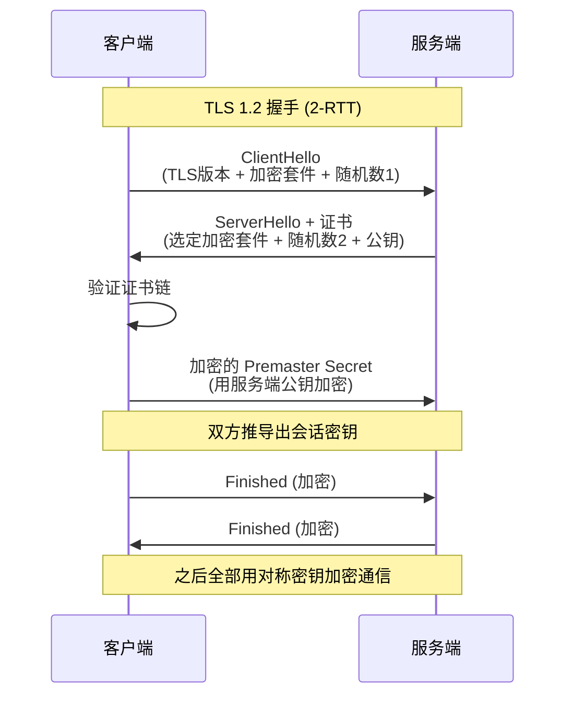

# HTTP / HTTPS

> 频率: 5/5 | 难度: 中级 | 项目相关: 核心

## 一句话总结

HTTP 是无状态的应用层协议，HTTPS 就是在 HTTP 和 TCP 之间加了一层 TLS 加密，保证数据的机密性（别人看不懂）、完整性（没被篡改）和身份认证（和你通信的确实是那个服务器）。

## 核心机制

### HTTP/1.1 的请求和响应格式

HTTP 报文分三块：起始行、头部、消息体。请求的起始行是 `GET /api/users HTTP/1.1`，响应的起始行是 `HTTP/1.1 200 OK`。头部就是一堆 `key: value`，常见的有 `Content-Type`、`Authorization`、`Cache-Control` 等等。消息体可以是 JSON、HTML、表单数据，由 `Content-Type` 决定。

一个典型的请求长这样：

```
POST /api/login HTTP/1.1
Host: admin.example.com
Content-Type: application/json
Authorization: Bearer eyJhbGciOi...

{"username":"admin","password":"***"}
```

### 状态码分类，面试最少背出这些

- **1xx 信息**：很少直接打交道。`101` 在 WebSocket 升级时用到，服务端说"我同意切换协议"。
- **2xx 成功**：`200 OK` 最常见；`201 Created` 新建资源成功（POST 创建用户返回这个）；`204 No Content` 删除成功，响应体为空。
- **3xx 重定向**：`301` 永久重定向（URL 变了，SEO 权重会转移）；`302` 临时重定向（SEO 权重不动）；`304 Not Modified` 配合缓存用的，告诉浏览器"你缓存的内容还能用，别重新下载了"。
- **4xx 客户端错误**：`400 Bad Request` 参数格式不对；`401 Unauthorized` 没登录或 token 过期；`403 Forbidden` 登录了但没权限；`404 Not Found` 路由或资源不存在；`429 Too Many Requests` 被限流了。
- **5xx 服务端错误**：`500 Internal Server Error` 服务器代码崩了；`502 Bad Gateway` 网关/反向代理收到上游无效响应；`503 Service Unavailable` 服务挂了或在维护；`504 Gateway Timeout` 上游响应超时。

### HTTPS 握手流程

HTTPS = HTTP over TLS。核心是用非对称加密协商出一把对称密钥，然后用这把对称密钥加密后续的 HTTP 数据。因为非对称加密太慢了，不适合加密大量数据，所以只用它来传递"会话密钥"。

TLS 1.2 握手（2-RTT）：

1. **ClientHello**：客户端发给服务端，包含自己支持的 TLS 版本、加密套件列表、一个随机数。
2. **ServerHello**：服务端回复选定的加密套件、自己的随机数、以及 **数字证书**（包含公钥）。
3. **客户端验证证书**：浏览器用内置的 CA 公钥验证证书签名，确认"对面确实是那个网站"。
4. **密钥交换**：客户端生成 premaster secret，用服务器公钥加密后发过去。双方用 client random + server random + premaster secret 推导出会话密钥。
5. **加密通信**：双方互相发送 Finished 消息，后续全部用会话密钥对称加密。

TLS 1.3 改进（1-RTT）：砍掉了非必要的步骤。ClientHello 直接带上密钥协商参数（DH 公钥），服务端在 ServerHello 里也能直接返回自己的 DH 参数，一轮就完成密钥交换。而且 TLS 1.3 去掉了所有不安全的加密算法（RSA 密钥交换、CBC 模式等），只保留前向安全的算法。



## 深度拓展

### 301 vs 302 的本质区别

面试官问这个，不只是让你背"永久和临时"——关键是 **SEO 和行为差异**。301 告诉搜索引擎"索引新 URL 吧，以后旧的别来了"，浏览器也会**缓存**这个重定向，下次直接跳。302 是临时的，SEO 权重保留在原 URL，浏览器每次都会重新请求。还有一个容易被忽略的：`307` 是临时的但不允许把 POST 改成 GET，`308` 是永久的也不允许改方法——301/302 历史上很多浏览器会默默把 POST 改成 GET。

### 401 vs 403 千万别搞混

`401 Unauthorized` 本质是 **"未认证"**——你是谁我都不知道，请先登录。`403 Forbidden` 是 **"已认证但没权限"**——我知道你是谁，但你不能干这事。举个例子：你没登录去访问 `/admin/dashboard`，返回 401；你登录了但 role 是普通用户，去访问 `/admin/users/delete`，返回 403。

### TLS 证书链验证机制

浏览器验证证书不是只看一张证书，而是一条链：你的证书 -> 中间 CA 证书 -> 根 CA 证书。根 CA 的公钥是预装在操作系统和浏览器里的，链上每一级都用上一级的私钥签名。任何一级被篡改或过期，整个链就断了，浏览器会报"不安全"。

### 中间人攻击（MITM）和 HTTPS 如何防御

攻击者在你和服务器之间拦截、转发流量，可以窃听甚至篡改内容。HTTPS 从三个层面防御：**机密性**靠加密，中间人拿到的是密文解不开；**完整性**靠 MAC 校验，消息被改一个字节收方立刻知道；**身份认证**靠证书——中间人没法伪造一个由受信任 CA 签发、且 CN 是你域名的证书。除非它拿到了 CA 的私钥，或者你点了"信任此证书"。

## 项目实战

### Axios 拦截器统一处理状态码

在 Vue3 后台管理系统中，我们封装了一个 request 工具，核心思路就是两个拦截器：

```ts
// 响应拦截器 —— 按状态码分流处理
axios.interceptors.response.use(
  (res) => {
    // 业务状态码判断
    if (res.data.code === 0) return res.data
    ElMessage.error(res.data.message || '请求失败')
    return Promise.reject(res.data)
  },
  (error) => {
    const status = error.response?.status
    if (status === 401) {
      // Token 过期，清掉登录态，跳转登录页
      store.dispatch('user/logout')
      router.push('/login')
      ElMessage.error('登录已过期，请重新登录')
    } else if (status === 403) {
      ElMessage.error('没有权限执行此操作')
    } else if (status >= 500) {
      ElMessage.error('服务器异常，请稍后重试')
      // 关键接口可以考虑重试，比如重试 1-2 次
    }
    return Promise.reject(error)
  }
)
```

这样做的好处是：每个页面组件不需要自己处理这些通用错误，拦截器一把梭。

### Nginx HTTPS 配置

生产环境部署时，HTTPS 是标配。Nginx 配置通常涉及证书路径、HTTP 自动跳转 HTTPS、安全头：

```nginx
server {
    listen 443 ssl http2;
    server_name admin.example.com;

    ssl_certificate     /etc/nginx/ssl/fullchain.pem;
    ssl_certificate_key /etc/nginx/ssl/privkey.pem;
    ssl_protocols       TLSv1.2 TLSv1.3;
    ssl_ciphers         HIGH:!aNULL:!MD5;

    # 安全头
    add_header Strict-Transport-Security "max-age=31536000; includeSubDomains" always;
    add_header X-Content-Type-Options "nosniff" always;

    location / {
        root /app/dist;
        try_files $uri $uri/ /index.html;  # SPA history 模式
    }
}

server {
    listen 80;
    server_name admin.example.com;
    return 301 https://$host$request_uri;  # HTTP 强制跳 HTTPS
}
```

### 接口版本管理

后台管理系统的 API 通常有版本前缀，比如 `/api/v1/users` 和 `/api/v2/users`。我们在 Axios 的 `baseURL` 里直接配好版本号，切换版本时改一个变量就行。Nginx 层也可以根据路径做请求转发：

```nginx
location /api/v1/ { proxy_pass http://backend-v1:3000; }
location /api/v2/ { proxy_pass http://backend-v2:3000; }
```

## 易错点

- **HTTPS 只防传输层，不防客户端安全**：如果你的浏览器被装了恶意插件，或者电脑被植入了恶意根证书，HTTPS 也保护不了你——中间人可以解密所有流量。
- **mixed content**：HTTPS 页面里引用了 HTTP 资源（图片、脚本），浏览器会拦截并报不安全。解决方案是全部资源走 HTTPS，或者用 `//` 协议相对 URL。
- **304 不是重定向**：面试常有人把 304 归类到 3xx 重定向里，实际上 304 是告诉浏览器用缓存，不会发生 URL 跳转。
- **TLS 握手不是"每次请求都做"**：HTTP/1.1 的 keep-alive 让同一个 TCP 连接可以承载多个请求，TLS 握手只在连接建立时发生一次。但 HTTP/1.1 的连接数有限制（一般是 6 个），多了还是要新握手。

## 相关阅读

- [MDN: HTTP overview](https://developer.mozilla.org/en-US/docs/Web/HTTP/Overview)
- [MDN: HTTPS](https://developer.mozilla.org/en-US/docs/Glossary/HTTPS)
- [Cloudflare: What is TLS?](https://www.cloudflare.com/learning/ssl/transport-layer-security-tls/)
- [http2-http3](./http2-http3.md) — HTTP/2 和 HTTP/3 的演进
- [tcp](./tcp.md) — HTTP 的底层传输协议
- [cors](./cors.md) — 跨域资源共享

## 更新记录

- 2026-07-05：完成 Phase 2 填充（reviewed）
