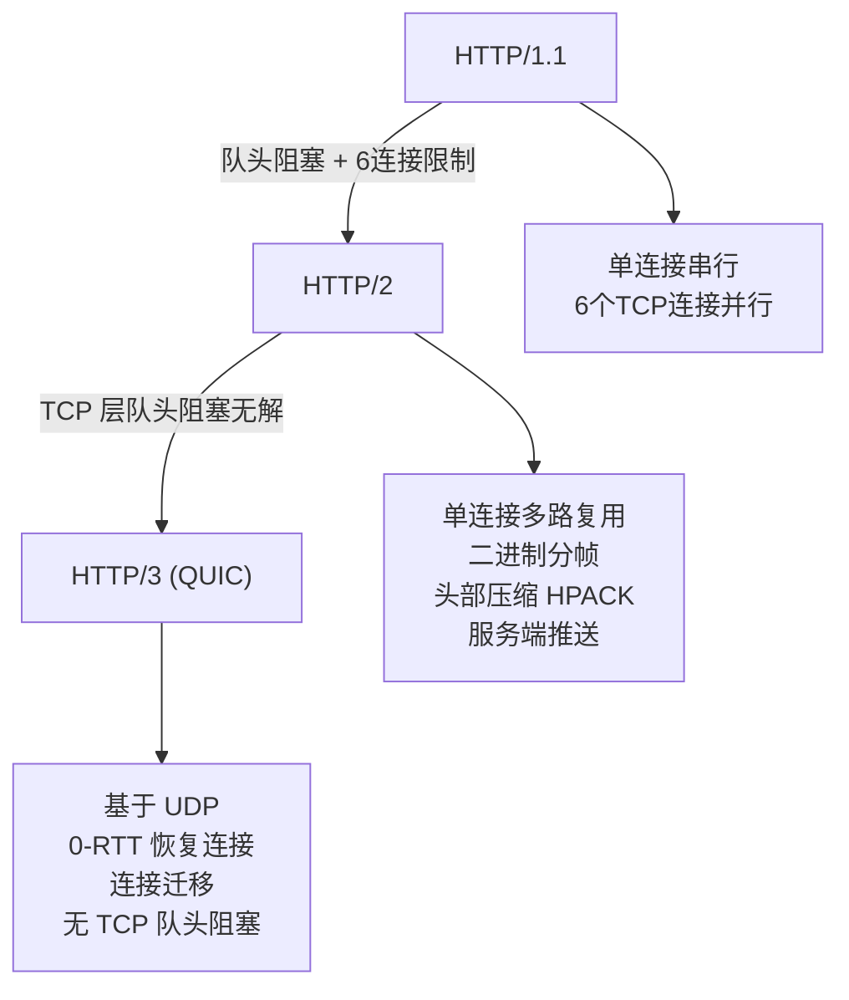

# HTTP2 / HTTP3

> 频率: 4/5 | 难度: 高级 | 项目相关: 核心

## 一句话总结

HTTP/2 在 HTTP/1.1 的基础上通过多路复用、头部压缩、服务端推送等机制大幅提升性能，但仍然跑在 TCP 上，所以存在 TCP 层面的队头阻塞；HTTP/3 直接抛弃 TCP，基于 QUIC（UDP）协议，从根源上解决队头阻塞问题，并且支持 0-RTT 连接恢复和连接迁移。



## 核心机制

### HTTP/2 的四大改进

**1. 二进制分帧层**

HTTP/1.1 是纯文本协议，空格、换行符都是协议的一部分，解析效率低。HTTP/2 引入了二进制分帧层：把 HTTP 报文拆成一个个帧（frame），分为 HEADERS 帧和 DATA 帧，所有帧都用二进制编码。解析器只需要读固定格式的帧头，不需要逐字节扫描文本，快很多。

**2. 多路复用（Multiplexing）——最核心的提升**

HTTP/1.1 一个 TCP 连接同一时间只能处理一个请求（队头阻塞），虽然可以用多个 TCP 连接（浏览器通常开 6 个），但连接开销大。HTTP/2 在一个 TCP 连接上同时发送多个请求，每个请求对应一个 stream（流），帧在连接上交错发送，接收方根据帧头的 stream ID 重新组装。相当于把单车道变成了多车道，所有车不用排队等。

**3. HPACK 头部压缩**

HTTP/1.1 每个请求都要带上完整的头部（Cookie、User-Agent 等），大量冗余。HTTP/2 用 HPACK 算法维护一张静态表和动态表：静态表预定义了 61 个常见头部（`:method`、`:status` 等），动态表记录实际通信中出现过的头部。后续请求只需要发送"引用表里第几个"的索引，而不是完整字符串。实际项目中头部流量可以减少 80% 以上。

**4. 服务端推送（Server Push）**

服务器可以主动推送客户端还没请求但即将需要的资源。比如你请求 `index.html`，服务器知道你接下来一定会请求 `app.js` 和 `style.css`，就直接把它们推过去——在客户端解析 HTML 发现需要这些资源之前，它们已经在浏览器缓存里了。不过这个特性在实践中问题很多（可能推送浏览器已有的资源造成浪费），Chrome 已经在 2022 年移除了 HTTP/2 Push，取而代之的是 **103 Early Hints**。

### HTTP/3 的核心：QUIC

HTTP/3 最大的变化就是把底层从 TCP 换成了 QUIC（Quick UDP Internet Connections）——一个运行在 UDP 之上的可靠传输协议。这听起来矛盾：UDP 是不可靠的，但 QUIC 在应用层自己实现了可靠性（重传、拥塞控制）。

关键特性：

- **0-RTT 连接恢复**：如果你之前和某个服务器建立过 QUIC 连接，第二次连接时可以直接在第一个包里带上加密的应用数据，不需要握手等待。对比 TCP + TLS 1.3 最快也要 1-RTT。
- **无队头阻塞**：QUIC 里每个请求有独立的 stream，丢包只影响这个 stream，不影响其他 stream。TCP 丢包则会让整个连接的所有请求都等重传。
- **连接迁移**：TCP 连接用（源 IP + 源端口 + 目的 IP + 目的端口）四元组标识，手机从 WiFi 切到 4G 时 IP 变了，TCP 连接就断了，必须重建。QUIC 用 Connection ID 标识连接，IP 变了你还是你，连接不中断。

## 深度拓展

### HTTP/2 的 TCP 队头阻塞问题——为什么还需要 HTTP/3

HTTP/2 的多路复用解决的是 HTTP 层面的队头阻塞（多个请求可以同时在一个连接上跑），但它没法解决 TCP 层面的队头阻塞。TCP 是一个有序字节流，底层的数据包必须按序到达。如果 stream 3 的一个 TCP 包丢了，TCP 协议栈会要求重传，期间 stream 5、stream 7 的数据已经到了也只能在缓冲区排队等那个丢包被重传——因为 TCP 不区分"这是哪个 stream 的包"，它只看字节序号。

HTTP/3 用 QUIC 从根本上规避了这个问题：QUIC 在 UDP 之上独立管理每个 stream 的可靠传输，stream 之间互不影响。一个 stream 丢包，其他 stream 照常交付。

### 为什么 HTTP/3 需要 TLS 1.3

QUIC 的设计是把传输层（QUIC 自己）和加密层（TLS 1.3）深度耦合的。不是"QUIC 上面跑 TLS"，而是 QUIC 协议本身就内置了 TLS 1.3 的握手机制。这样做的收益是：传输层握手和 TLS 握手合并，减少了单独的往返次数。这也意味着 HTTP/3 中不存在"明文 HTTP/3"，所有 QUIC 连接都是加密的。

### HTTP/2 Server Push 为什么被淘汰

核心问题：**服务器不知道浏览器已经缓存了什么**。服务器推送 `app.js`，但浏览器上一版本已经在磁盘缓存里有 `app.js` 了，这次推送纯属浪费带宽。`103 Early Hints` 的替代方案更优雅：服务器只告诉浏览器"你接下来可能需要这 3 个资源，用这些 URL 去拿"，浏览器自己决定要不要请求（浏览器知道自己有什么缓存）。主动权从服务端交回了客户端。

## 项目实战

### Vite dev server 默认开启 HTTP/2

Vite 开发服务器在 `https` 模式下自动启用 HTTP/2，这直接体现在 HMR（热模块替换）性能上——一个页面几百个模块同时需要更新时，HTTP/2 的多路复用让所有更新请求并发完成，不需要排队。这在大型后台管理项目（如我们基于 Ant Design Vue Pro 的项目）中效果明显，页面模块数量超过 200 时 HMR 延迟从 HTTP/1.1 的 2-3 秒能降到 300ms 以内：

```ts
// vite.config.ts
export default defineConfig({
  server: {
    https: true,  // 开启后自动启用 HTTP/2
  },
})
```

### CDN 支持 HTTP/3

生产环境中，我们的后台管理系统静态资源部署在阿里云 CDN 或 Cloudflare 上，这些 CDN 默认开启 HTTP/3。用户浏览器会在首次连接时通过 HTTPS 记录中的 Alt-Svc 头发现 HTTP/3 端点，后续连接升级到 QUIC。在网络不稳定时（比如移动端弱网场景），QUIC 的 0-RTT 和连接迁移带来的体验提升非常明显——页面加载时间从 3 秒以上降到 1 秒左右。

### Nginx 开启 HTTP/2

生产 Nginx 开启 HTTP/2 只需要在 `listen` 指令上加 `http2`：

```nginx
server {
    listen 443 ssl http2;
    server_name admin.example.com;
    # ... 证书配置
}
```

然后所有浏览器访问这个域名的连接自动用 HTTP/2，多路复用和头部压缩都是协议层面自动生效的，前端代码不需要任何改动。

## 易错点

- **HTTP/2 只支持 HTTPS**：虽然标准没有强制要求，但目前主流浏览器都**只在 HTTPS** 下启用 HTTP/2。如果你本地开发用 `http://`，即使服务器支持 HTTP/2，浏览器也会降级到 HTTP/1.1。Vite 在 http 模式下也不会启用 HTTP/2。
- **多路复用可能导致"请求优先级反转"**：所有请求同时发出，重要请求（比如首屏数据）可能被不重要的请求（比如埋点上报）挤占带宽。HTTP/2 有优先级机制，但实现复杂，实际靠浏览器自身调度。
- **HTTP/3 不是"未来"，是"现在"**：2024 年全球 Top 1000 网站超过 40% 已支持 HTTP/3，主流 CDN 全部支持。面试里如果只聊 HTTP/2 不提 HTTP/3，会给面试官"你落后了"的印象。

## 相关阅读

## 面试信号表

| 面试官问 | 下一问大概率是 |
|----------|-------------|
| "HTTP/2 有什么改进" | 追问多路复用和 HTTP/1.1 队头阻塞的区别 |
| "HTTP/3 为什么换 QUIC" | 追问 TCP 队头阻塞为什么无法在应用层解决 |
| "服务端推送和 WebSocket 区别" | 追问各自的适用场景和协议层级 |
| "HPACK 头部压缩怎么工作" | 追问静态表和动态表分别存什么 |

- [MDN: HTTP/2](https://developer.mozilla.org/en-US/docs/Glossary/HTTP_2)
- [Cloudflare: What is HTTP/3?](https://www.cloudflare.com/learning/performance/what-is-http3/)
- [Cloudflare: What is QUIC?](https://www.cloudflare.com/learning/ddos/glossary/quick-udp-internet-connection-quic/)
- [http-https](./http-https.md) — HTTP/1.1 和 HTTPS 基础
- [tcp](./tcp.md) — TCP 队头阻塞的根源
- [dns-cdn](./dns-cdn.md) — CDN 对 HTTP/3 的支持

## 更新记录

- 2026-07-05：完成 Phase 2 填充（reviewed）
