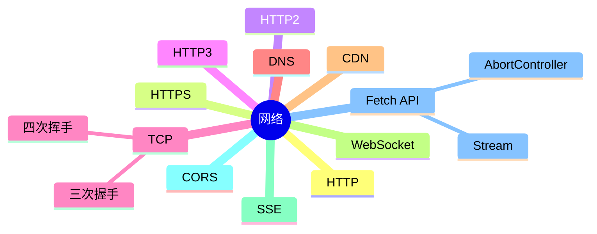

# 网络 知识地图

## 推荐学习顺序

1. ⭐⭐⭐⭐⭐ [HTTP / HTTPS](./http-https.md)
2. ⭐⭐⭐⭐⭐ [TCP](./tcp.md)
3. ⭐⭐⭐⭐⭐ [CORS](./cors.md)
4. ⭐⭐⭐⭐   [HTTP2 / HTTP3](./http2-http3.md)
5. ⭐⭐⭐⭐   [DNS / CDN](./dns-cdn.md)
6. ⭐⭐⭐⭐   [Fetch API 深度解析](./fetch-api.md)
7. ⭐⭐⭐     [WebSocket / SSE](./websocket-sse.md)

## 知识点索引

| 知识点 | 频率 | 难度 | 手写 | 状态 |
|--------|------|------|------|------|
| [HTTP / HTTPS](./http-https.md) | ⭐⭐⭐⭐⭐ | 中级 | — | draft |
| [HTTP2 / HTTP3](./http2-http3.md) | ⭐⭐⭐⭐ | 高级 | — | draft |
| [TCP](./tcp.md) | ⭐⭐⭐⭐⭐ | 高级 | — | draft |
| [DNS / CDN](./dns-cdn.md) | ⭐⭐⭐⭐ | 中级 | — | draft |
| [WebSocket / SSE](./websocket-sse.md) | ⭐⭐⭐ | 中级 | — | draft |
| [CORS](./cors.md) | ⭐⭐⭐⭐⭐ | 中级 | — | draft |
| [Fetch API 深度解析](./fetch-api.md) | ⭐⭐⭐⭐ | 中级 | — | draft |
