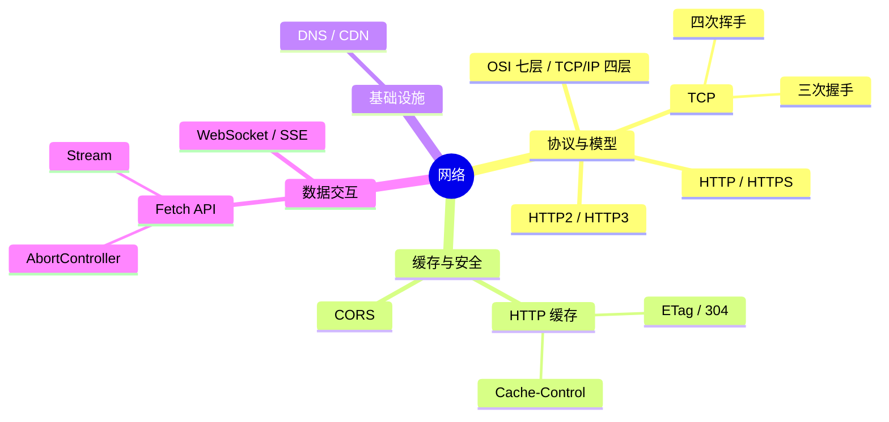

# 网络 知识地图

## 推荐学习顺序

### 一、协议与模型

1. ⭐⭐⭐⭐   [OSI 七层 / TCP/IP 四层](./osi-model.md)
2. ⭐⭐⭐⭐⭐ [TCP](./tcp.md)
3. ⭐⭐⭐⭐⭐ [HTTP / HTTPS](./http-https.md)
4. ⭐⭐⭐⭐   [HTTP2 / HTTP3](./http2-http3.md)

### 二、缓存与安全

5. ⭐⭐⭐⭐⭐ [HTTP 缓存](./http-cache.md)
6. ⭐⭐⭐⭐⭐ [CORS](./cors.md)

### 三、基础设施

7. ⭐⭐⭐⭐   [DNS / CDN](./dns-cdn.md)

### 四、数据交互

8. ⭐⭐       [HTTP 请求方法](./http-methods.md) — GET/POST/PUT/DELETE 基础
9. ⭐⭐⭐⭐   [Fetch API 深度解析](./fetch-api.md) — 浏览器端 HTTP 编程
10. ⭐⭐⭐     [WebSocket / SSE](./websocket-sse.md) — 实时通信进阶
11. ⭐⭐       [UDP 协议](./udp.md) — HTTP3/QUIC 底层
12. ⭐⭐       [代理/负载均衡](./proxy-lb.md) — 网络架构

> 说明：HTTP 方法在前（基础），Fetch API 会用 HTTP 方法，WebSocket 是进阶方向。UDP/代理/负载均衡 偏基础设施，理解概念即可。

## 知识点索引

| 知识点 | 频率 | 难度 | 手写 | 状态 |
|--------|------|------|------|------|
| [OSI 七层 / TCP/IP 四层](./osi-model.md) | ⭐⭐⭐⭐ | 中级 | — | draft |
| [TCP](./tcp.md) | ⭐⭐⭐⭐⭐ | 高级 | — | draft |
| [HTTP / HTTPS](./http-https.md) | ⭐⭐⭐⭐⭐ | 中级 | — | draft |
| [HTTP2 / HTTP3](./http2-http3.md) | ⭐⭐⭐⭐ | 高级 | — | draft |
| [HTTP 缓存](./http-cache.md) | ⭐⭐⭐⭐⭐ | 中级 | — | draft |
| [CORS](./cors.md) | ⭐⭐⭐⭐⭐ | 中级 | — | draft |
| [DNS / CDN](./dns-cdn.md) | ⭐⭐⭐⭐ | 中级 | — | draft |
| [WebSocket / SSE](./websocket-sse.md) | ⭐⭐⭐ | 中级 | — | draft |
| [Fetch API 深度解析](./fetch-api.md) | ⭐⭐⭐⭐ | 中级 | — | draft |

## 相关阅读

- [面试题库：网络](../面试题库/网络.md) — 17 道网络高频真题
- [面试回答：网络](../面试回答/网络/http-https.md) — 4 篇网络逐字回答稿
- [浏览器知识地图](../浏览器/index.md) — 浏览器缓存、渲染流程、安全

## 更新记录

- 2026-07-13：新增 osi-model.md + http-cache.md；mindmap 四组分类 + 学习顺序分组
- 2026-07-05：初始创建
