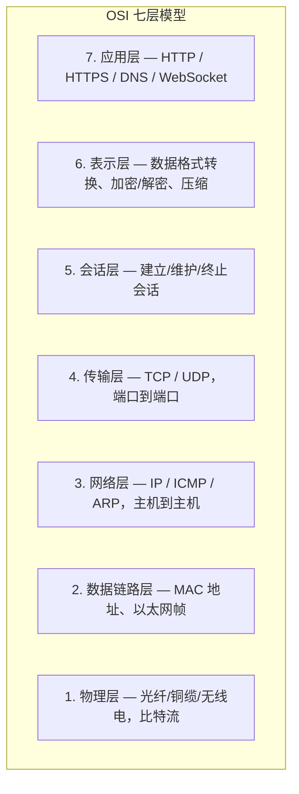

# OSI 七层模型 / TCP/IP 四层模型

> ⭐⭐⭐⭐｜难度：中级｜项目：★★

## 一句话总结

**OSI 七层是理论框架（"应表会传网数物"），TCP/IP 四层是工程实现。面试中把每层干什么、跑什么协议说出来就够了——从下往上每一层都在为上一层提供服务。**

## 核心机制

### 七层速记 + 关键协议



| 层 | 名称 | 核心职责 | 关键协议/设备 | 数据单位 |
|---|------|---------|-------------|---------|
| 7 | 应用层 | 为应用提供网络服务接口 | HTTP、HTTPS、DNS、FTP、SMTP、WebSocket | 报文 |
| 6 | 表示层 | 数据格式转换、加密解密、压缩 | TLS/SSL、JPEG、ASCII | — |
| 5 | 会话层 | 建立/管理/终止会话 | NetBIOS、RPC | — |
| 4 | 传输层 | **端到端**可靠传输、差错控制 | **TCP**、**UDP** | 段（Segment） |
| 3 | 网络层 | **路由选择**、逻辑寻址（IP） | **IP**、ICMP、ARP、路由器 | 包（Packet） |
| 2 | 数据链路层 | 相邻节点间可靠传输、MAC 寻址 | 以太网、交换机、MAC | 帧（Frame） |
| 1 | 物理层 | 传输原始比特流 | 光纤、铜缆、无线电、集线器 | 比特（Bit） |

### TCP/IP 四层模型

OSI 是 ISO 制定的理论模型（7 层），TCP/IP 是实际互联网使用的模型（4 层）。对应关系：

| TCP/IP 四层 | 对应 OSI | 核心协议 |
|------------|---------|---------|
| 应用层 | 7 + 6 + 5 | HTTP、HTTPS、DNS、FTP、SMTP |
| 传输层 | 4 | **TCP**、**UDP** |
| 网络层 | 3 | **IP**、ICMP、ARP |
| 网络接口层 | 2 + 1 | 以太网、Wi-Fi |

> 面试技巧：OSI 七层记不住全名？记住口诀 **"应表会传网数物"**（从 7 到 1），然后重点说出传输层和网络层即可——面试官只关心这两层。

## 深度拓展

### 追问1：TCP 和 UDP 的本质区别

| 维度 | TCP | UDP |
|------|-----|-----|
| 连接 | 面向连接（三次握手） | 无连接 |
| 可靠性 | 可靠（确认重传、序号、校验） | 不可靠（尽最大努力交付） |
| 顺序 | 保证有序 | 不保证 |
| 速度 | 慢（握手+确认开销） | 快（无连接开销） |
| 头部大小 | 20-60 字节 | 8 字节 |
| 适用场景 | HTTP、文件传输、邮件 | 视频直播、DNS、VoIP、在线游戏 |
| 流量/拥塞控制 | 有（滑动窗口+慢启动+拥塞避免） | 无 |

> 详见：[TCP](./tcp.md) — 三次握手/四次挥手 + 拥塞控制详解

### 追问2：为什么 OSI 七层没有被实际采用？

1. **设计过于理论化**：OSI 在协议成熟之前就定义了完整模型，导致部分层（5、6）在实际中几乎看不到独立实现
2. **TCP/IP 先发优势**：互联网早期就基于 TCP/IP 跑起来了，OSI 落地太晚
3. **复杂度高**：七层划分太细，实现成本高；TCP/IP 四层更简洁实用
4. **表示层和会话层在现代协议栈中由应用层和 TLS 承担**——TLS 位于传输层之上、应用层之下，加密（表示层）和会话管理（会话层）都在 TLS 里解决了

### 追问3：数据在各层之间的封装过程

```
应用层数据
  ↓ TCP 层加上 TCP 头（源端口/目标端口/序号）
TCP 段
  ↓ IP 层加上 IP 头（源 IP/目标 IP）
IP 包
  ↓ 数据链路层加上 MAC 头（源 MAC/目标 MAC）+ 尾部校验
以太网帧
  ↓ 物理层转成比特流发送
```

每一层只关心自己那层的头——路由器只看 IP 头做转发，交换机只看 MAC 头做转发，应用层只看应用数据。这就是分层的精髓：**每层独立工作，上下层解耦**。

## 面试信号表

| 面试官问 | 下一问大概率是 |
|----------|-------------|
| "说一下 OSI 七层模型" | 追问 TCP 和 UDP 的区别 |
| "TCP 在哪一层" | 追问 TCP 和 UDP 为什么一个可靠一个不可靠 |
| "HTTPS 作用在哪几层" | 追问 TLS 在 OSI 中算哪一层 |
| "路由器工作在哪一层" | 追问路由器和交换机的区别 |

## 相关阅读

- [TCP](./tcp.md) — 三次握手/四次挥手 + 拥塞控制
- [HTTP / HTTPS](./http-https.md) — 应用层协议详解 + TLS 握手
- [HTTP2 / HTTP3](./http2-http3.md) — 协议演进与 QUIC
- [DNS / CDN](./dns-cdn.md) — 应用层基础设施

## 更新记录

- 2026-07-13：新建——OSI 七层与 TCP/IP 四层对比 + TCP/UDP 对比 + 数据封装流程
