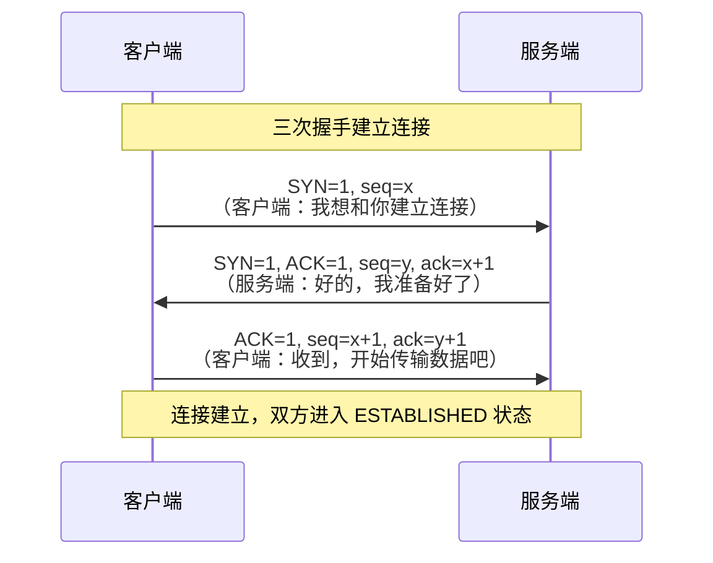
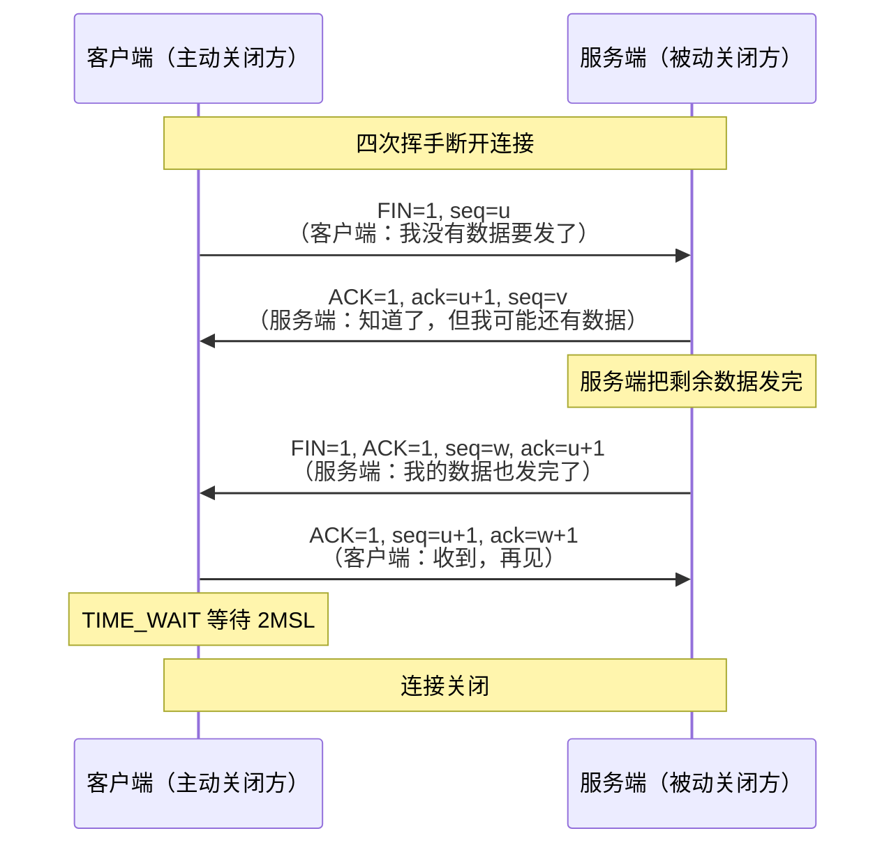

# TCP

> 频率: 5/5 | 难度: 高级 | 项目相关: 核心

## 一句话总结

TCP 是面向连接的、可靠的、基于字节流的传输层协议。通过三次握手建立连接，四次挥手断开连接，配合拥塞控制、流量控制和重传机制保证数据可靠到达。

## 核心机制

### 三次握手 — 建立连接

面试时需要能画出这个时序图，并解释为什么需要三次。



每一步的含义：
1. 客户端发送 SYN，带上初始序号 x，状态变为 SYN_SENT。
2. 服务端回复 SYN + ACK，带上自己的初始序号 y，确认号为 x+1，状态变为 SYN_RCVD。服务端为这个连接分配资源。
3. 客户端回复 ACK，确认号为 y+1，状态变为 ESTABLISHED。服务端收到后也变为 ESTABLISHED。

### 四次挥手 — 断开连接

TCP 是全双工的，双方都要独立关闭自己的发送方向，所以需要四次。



关键点：**TIME_WAIT** 状态在主动关闭方持续 2MSL（Maximum Segment Lifetime，通常 2 分钟）。为什么需要它？后面深度拓展里细说。

### 拥塞控制 — 防止网络被撑爆

TCP 不只关心"对方能不能收到"，还关心"网络能不能承受"。拥塞控制就是根据网络状况动态调整发送速率。四个核心机制：

- **慢启动**：连接建立后，拥塞窗口（cwnd）从 1 个 MSS 开始，每收到一个 ACK 就指数增长（翻倍），快速探测网络带宽。
- **拥塞避免**：cwnd 达到慢启动阈值（ssthresh）后，增长降为线性（每 RTT +1），谨慎逼近瓶颈。
- **快重传**：收到 3 个重复 ACK（说明有包丢了但后续包还在到达），不等超时就立即重传丢包。
- **快恢复**：触发快重传后，ssthresh 减半，cwnd 设为 ssthresh，直接进入拥塞避免阶段（不重新慢启动）。

### 滑动窗口 — 流量控制

接收方通过窗口大小告诉发送方"我的缓冲区还剩多少空间"。如果接收方处理不过来（窗口变小），发送方就降速；如果接收方的窗口变成 0，发送方停止发送，定期发"窗口探测"包询问。

## 深度拓展

### 为什么是三次握手，不是两次？

面试最经典的追问。**一句话：为了防止已经失效的连接请求到达服务端，导致服务端错误地建立连接。**

想象只用两次握手：客户端发了 SYN 但网络延迟，客户端以为丢了于是又发了一次。第二次的 SYN 成功建立了连接，传输完毕关闭。这时第一次发出的那个"迷路的"SYN 终于到达服务端，服务端以为客户端又请求连接，回复 SYN+ACK 就进入 ESTABLISHED 状态，白白分配资源。有了第三次握手，客户端收到这个"不该来的"SYN+ACK 后不会回复 ACK，服务端等不到确认就知道这个连接无效。

### 为什么 TIME_WAIT 要等 2MSL？

两个原因：
1. **确保最后一个 ACK 能到达服务端**。如果这个 ACK 丢了，服务端会重发 FIN，客户端需要在 TIME_WAIT 期间能够接收并重新回复 ACK。如果客户端直接关闭了，服务端就会一直处于 LAST_ACK 状态收不到回应。
2. **让本次连接中所有在网络中"游荡"的旧报文消失**。等待 2MSL 后，这个连接产生的所有报文都在网络中消亡了，不会影响下一个使用相同端口的新连接。

### TCP keep-alive vs HTTP keep-alive

这两个名字很像，但完全是两码事。**TCP keep-alive** 是 TCP 协议栈自带的心跳机制（默认 2 小时发一次探测包），检测的是"对端还活着吗"——如果对端已经挂了但没发 FIN，TCP 连接会一直占着资源。**HTTP keep-alive**（也叫 HTTP 持久连接）是 HTTP/1.1 的默认行为：完成一个请求/响应后，TCP 连接不立即关闭，复用给下一个请求。前者是底层存活性检测，后者是高层连接复用，面试千万别搞混。

### SYN Flood 攻击和防御

攻击者发送大量 SYN 包，但收到服务端的 SYN+ACK 后故意不回复 ACK——也就是只完成两次握手。服务端为每个半连接分配资源并等待 ACK，当这种"半开连接"塞满 SYN 队列时，正常用户的 SYN 请求就会被丢弃，服务不可用。

防御手段：
- **SYN Cookie**：服务端不在收到 SYN 时就分配资源，而是把连接信息编码到一个特殊的 seq 值（Cookie）里发回去。只有收到合法的第三次握手 ACK 时才真正分配资源。
- **增大 SYN 队列 + 缩短超时时间**：让攻击者更难塞满队列。
- **防火墙/负载均衡层过滤**：在 Nginx 或云 WAF 层面识别和拦截。

## 项目实战

### 长连接优化 — 减少 TCP 握手开销

在 Vue3 后台管理系统中，所有 API 请求通过同一个 Axios 实例发送。Axios 默认使用 HTTP keep-alive，这意味着页面初始化后建立的那几个 TCP 连接会一直复用，不会每次请求都重新握手。对于仪表盘这种每 3 秒轮询一次的页面，省掉了海量的握手开销：

```ts
// Axios 默认复用连接，但注意设置超时
const http = axios.create({
  baseURL: import.meta.env.VITE_API_BASE,
  timeout: 10000, // 10s 超时
})
```

### 接口超时配置 — connect timeout vs read timeout

这是一个容易被忽略的项目实战点。HTTP 请求分为"建立 TCP 连接"和"发送请求/等待响应"两个阶段。
- **连接超时**：TCP 三次握手过程中的超时，通常很短（3-5 秒）。如果 3 秒连不上基本可以断定网络不通或服务挂了。
- **读取超时**：连接建立后等待服务器响应数据的超时，取决于业务逻辑。导出报表可能需要 30 秒，普通查询 10 秒足够。

Axios 的 `timeout` 是**整体的读写超时**，如果需要在连接阶段就快速失败，可以考虑用 `signal` 或者自定义适配器。Nginx 反向代理也有 `proxy_connect_timeout` 和 `proxy_read_timeout` 需要配套配置，否则 Nginx 先超时了后端还在处理就是浪费。

### 负载均衡健康检查

在生产环境的 Nginx 负载均衡配置中，健康检查的本质就是定期发送 TCP SYN 包或 HTTP 请求确认后端服务还活着：

```nginx
upstream backend {
    server 10.0.1.1:3000 max_fails=3 fail_timeout=30s;
    server 10.0.1.2:3000 max_fails=3 fail_timeout=30s;
}
```

`max_fails=3 fail_timeout=30s` 意味着 30 秒内失败 3 次就认为节点挂了，不再转发流量给它——这就是在应用层利用 TCP 连接的成败做故障转移。

## 易错点

- **四次挥手不总是四次**：如果服务端没有数据要发，FIN+ACK 可以合并到一个包里，变成三次（FIN + FIN+ACK + ACK）。但面试时按四次讲就行。
- **主动关闭方是 TIME_WAIT，被动关闭方是 CLOSE_WAIT**：线上常见 CLOSE_WAIT 堆积的问题，通常是因为服务端代码没调用 `close()`，收到客户端的 FIN 后没发自己的 FIN。
- **TCP 是字节流不是消息边界**：TCP 不保证一次 `send` 对应一次 `recv`，粘包和拆包是应用层的事。这就是为什么 HTTP 要用 `Content-Length` 或 `Transfer-Encoding: chunked` 来界定消息边界。

## 相关阅读

- [MDN: TCP](https://developer.mozilla.org/en-US/docs/Glossary/TCP)
- [Cloudflare: What is TCP?](https://www.cloudflare.com/learning/ddos/glossary/tcp-ip/)
- [http-https](./http-https.md) — TCP 上层的 HTTP 协议
- [http2-http3](./http2-http3.md) — TCP 队头阻塞和 HTTP/3 的替代方案
- [dns-cdn](./dns-cdn.md) — TCP 连接前的 DNS 解析

## 更新记录

- 2026-07-05：完成 Phase 2 填充（reviewed）
