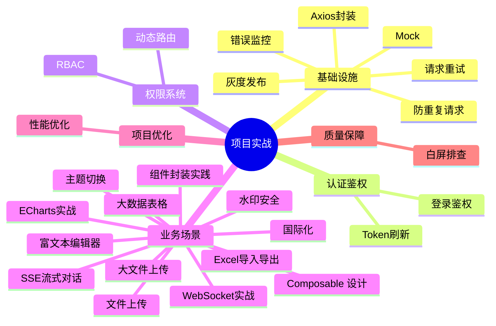

# 项目实战 知识地图

## 关于本文档中的"项目"

以下所有项目实战文章引用的是同一套或多套参考项目。文章中的"在我们的项目中"或"后台管理系统里"指以下场景，**不再每篇重复介绍背景**。

### 参考项目 A：Vue3 后台管理系统

| 维度 | 说明 |
|------|------|
| **类型** | toB 企业级后台管理系统 |
| **规模** | 50+ 页面、20+ 模块、5 人前端团队 |
| **技术栈** | Vue3 + TypeScript + Vite + Pinia + Element Plus + Vue Router |
| **核心模块** | 用户管理、角色管理、权限管理、文件管理、数据报表、系统配置 |
| **特点** | RBAC 权限模型、动态路由、Token 认证、大数据表格、文件上传/导出 |

### 参考项目 B：C 端活动/内容站点

| 维度 | 说明 |
|------|------|
| **类型** | toC 内容展示 + 用户交互 |
| **技术栈** | VitePress / Nuxt（SSG）、或 Vue3 SPA + SSR |
| **特点** | SEO 敏感、移动端优先、首屏性能要求高、第三方 SDK 集成多 |

> 每篇项目实战文章会在开头标注参考的项目类型。文章中的场景和代码来自真实项目经验的提炼，不是虚构的 demo 项目。

| 子模块 | 文件数 | 说明 |
|--------|--------|------|
| [基础设施](./基础设施/axios-encapsulation.md) | 6 | Axios、请求重试、防重复请求、Mock、错误监控、灰度发布 |
| [认证鉴权](./认证鉴权/login-auth.md) | 2 | 登录、Token 刷新 |
| [权限系统](./权限系统/dynamic-route.md) | 2 | 动态路由、RBAC |
| [业务场景](./业务场景/file-upload.md) | 13 | 上传、Excel、大数据表格、Composable 设计、国际化、主题切换、组件封装、WebSocket、ECharts、大文件上传、SSE、水印、富文本 |
| [项目优化](./项目优化/project-optimization.md) | 1 | 项目层面性能优化 |
| [质量保障](./质量保障/white-screen-troubleshoot.md) | 1 | 白屏排查方法论 |

---

## 推荐学习顺序

### 一、基础设施（5 篇）—— 先搭地基

1. [Axios 封装](./基础设施/axios-encapsulation.md) — 拦截器/错误处理/baseURL/超时
2. [请求重试](./基础设施/request-retry.md) — 指数退避/重试条件/幂等键——Axios 封装的自然延伸
3. [防重复请求](./基础设施/request-dedup.md) — loading/防重复/并发请求优化
4. [Mock](./基础设施/mock.md) — MockJS/vite-plugin-mock 前后端并行开发
5. [错误处理 / 前端监控体系](./基础设施/error-monitoring.md) — 错误捕获/Sentry/埋点/CI/CD
6. [灰度发布](./基础设施/gray-release.md) — Nginx cookie 分流/用户哈希/CDN 多版本

### 二、认证鉴权 + 权限系统（4 篇）—— 然后通权限

7. [登录鉴权](./认证鉴权/login-auth.md) — Token 认证/OAuth2/多端登录
8. [Token 刷新](./认证鉴权/token-refresh.md) — 无感刷新/401 拦截/并发处理
9. [动态路由](./权限系统/dynamic-route.md) — addRoute/菜单生成/路由重置
10. [权限 RBAC](./权限系统/permission-rbac.md) — 模型设计/指令/按钮级权限

### 三、业务场景（13 篇）—— 再铺业务

11. [文件上传](./业务场景/file-upload.md) — 基础文件上传方案，理解 FormData + Axios 模式
12. [Excel 导入导出](./业务场景/excel-import-export.md) — 表格数据的批量处理
13. [大数据表格](./业务场景/big-data-table.md) — 虚拟滚动与大数据渲染优化
14. [Composable 设计](./业务场景/composable-design.md) — useRequest/useTable/usePermission 逻辑复用封装
15. [国际化](./业务场景/i18n.md) — vue-i18n v9+ 中英文切换，语言包模块化组织
16. [主题切换](./业务场景/theme-switch.md) — CSS 变量 + Element Plus 暗黑模式 + FOUC 避免
17. [组件封装实践](./业务场景/component-encapsulation.md) — Props/Events/Slots/Expose 四维度设计
18. [WebSocket 实战](./业务场景/websocket.md) — 心跳/重连/ACK 完整封装
19. [ECharts 实战](./业务场景/echarts.md) — 图表封装、响应式更新、内存管理
20. [大文件上传](./业务场景/big-file-upload.md) — 分片/秒传/断点/并发控制 四维一体
21. [SSE 流式对话](./业务场景/sse-streaming.md) — AI 聊天场景的实时推送方案
22. [水印安全](./业务场景/watermark-security.md) — Canvas 水印/MutationObserver 防删除/盲水印
23. [富文本编辑器](./业务场景/rich-text-editor.md) — Tiptap/Quill 选型 + XSS 防护 + 图片粘贴

### 四、项目优化 + 质量保障（2 篇）—— 最后收尾

24. [项目优化](./项目优化/project-optimization.md) — 项目层面性能优化
25. [白屏排查方法论](./质量保障/white-screen-troubleshoot.md) — 五步排查定位线上问题
