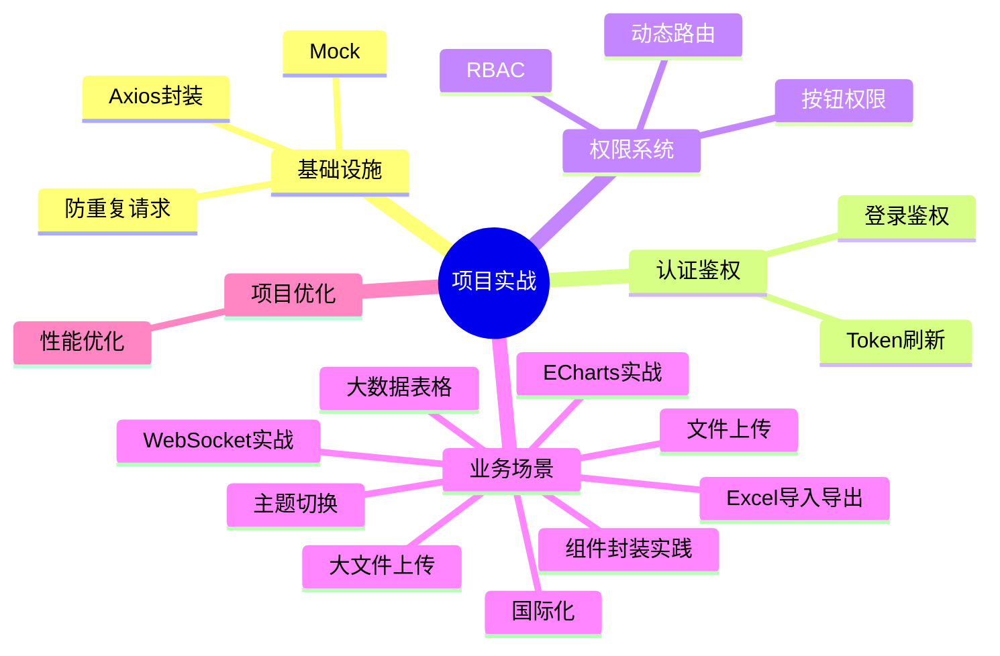

# 项目实战 知识地图

## 子模块

| 子模块 | 文件数 | 说明 |
|--------|--------|------|
| [基础设施](./基础设施/axios-encapsulation.md) | 3 | Axios、防重复请求、Mock |
| [认证鉴权](./认证鉴权/login-auth.md) | 2 | 登录、Token 刷新 |
| [权限系统](./权限系统/dynamic-route.md) | 2 | 动态路由、RBAC |
| [业务场景](./业务场景/file-upload.md) | 9 | 上传、Excel、大数据表格、国际化、主题切换、组件封装、WebSocket、ECharts、大文件上传 |
| [项目优化](./项目优化/project-optimization.md) | 1 | 项目层面性能优化 |

---

## 推荐学习顺序

### 业务场景模块（9 篇）

1. [文件上传](./业务场景/file-upload.md) — 基础文件上传方案，理解 FormData + Axios 模式
2. [Excel 导入导出](./业务场景/excel-import-export.md) — 表格数据的批量处理
3. [大数据表格](./业务场景/big-data-table.md) — 虚拟滚动与大数据渲染优化
4. [国际化](./业务场景/i18n.md) — vue-i18n v9+ 中英文切换，语言包模块化组织
5. [主题切换](./业务场景/theme-switch.md) — CSS 变量 + Element Plus 暗黑模式 + FOUC 避免
6. [组件封装实践](./业务场景/component-encapsulation.md) — Props/Events/Slots/Expose 四维度设计
7. [WebSocket 实战](./业务场景/websocket.md) — 心跳/重连/ACK 完整封装
8. [ECharts 实战](./业务场景/echarts.md) — 图表封装、响应式更新、内存管理
9. [大文件上传](./业务场景/big-file-upload.md) — 分片/秒传/断点/并发控制 四维一体
