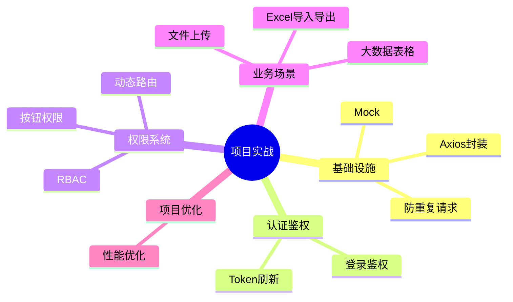

# 项目实战 知识地图

## 子模块

| 子模块 | 文件数 | 说明 |
|--------|--------|------|
| [基础设施](./基础设施/axios-encapsulation.md) | 3 | Axios、防重复请求、Mock |
| [认证鉴权](./认证鉴权/login-auth.md) | 2 | 登录、Token 刷新 |
| [权限系统](./权限系统/dynamic-route.md) | 2 | 动态路由、RBAC |
| [业务场景](./业务场景/file-upload.md) | 3 | 上传、Excel、大数据表格 |
| [项目优化](./项目优化/project-optimization.md) | 1 | 项目层面性能优化 |
