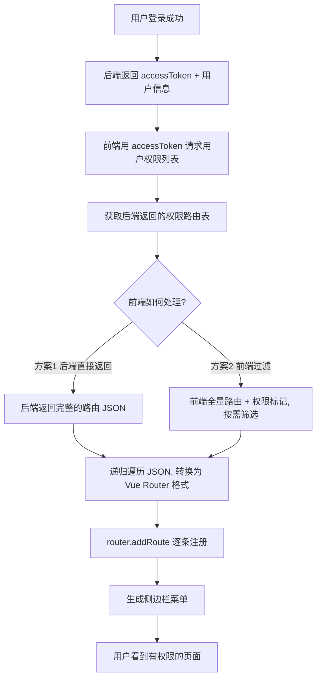

# 动态路由

> "面试官：如果管理员看到'用户管理'菜单，普通用户看不到，你的路由是怎么处理的？——不是 v-if 隐藏，而是路由表中根本不注册那条路由。"

---

## 一句话总结

动态路由是前端根据用户权限**在运行时调用 `router.addRoute()` 动态注册路由**的机制，实现不同角色看到不同的菜单和页面——页面级权限不是前端"隐藏"出来的，而是路由层面"不存在"。

---

## 核心机制

### 1. 整体流程



### 2. 方案对比：后端返回路由表 vs 前端过滤

| 方案 | 实现方式 | 优点 | 缺点 |
|------|---------|------|------|
| **后端返回** | 后端直接返回路由 JSON（路径、组件名、meta 等） | 真正的动态权限，修改权限不需要前端发版 | 后端维护路由结构，组件名需前后端约定 |
| **前端过滤** | 前端定义全量路由 + `meta.roles`，按权限筛选 | 前端完全掌控，类型安全 | 新增路由需前端发版 |

**后台管理系统推荐"前端过滤"**：路由数量有限（几十条），前端维护成本不高；且 TypeScript 类型安全，避免组件名拼写错误。

### 3. 动态路由生成（核心代码）

```typescript
// src/router/dynamic-routes.ts    ——— 前端全量路由定义 + 权限过滤
import type { RouteRecordRaw } from 'vue-router'

// 定义所有需要权限的动态路由（平铺，不含 layout）
export const asyncRoutes: RouteRecordRaw[] = [
  {
    path: '/dashboard',
    name: 'Dashboard',
    component: () => import('@/views/dashboard/index.vue'),
    meta: { title: '仪表盘', icon: 'dashboard', permission: 'dashboard:view' },
  },
  {
    path: '/user',
    name: 'User',
    redirect: '/user/list',
    meta: { title: '用户管理', icon: 'user', permission: 'user:view' },
    children: [
      {
        path: 'list',
        name: 'UserList',
        component: () => import('@/views/user/list.vue'),
        meta: { title: '用户列表', permission: 'user:list:view' },
      },
      {
        path: 'create',
        name: 'UserCreate',
        component: () => import('@/views/user/create.vue'),
        meta: { title: '新增用户', permission: 'user:create' },
      },
    ],
  },
  {
    path: '/settings',
    name: 'Settings',
    component: () => import('@/views/settings/index.vue'),
    meta: { title: '系统设置', icon: 'setting', permission: 'settings:view', roles: ['admin'] },
  },
]

// 根据用户权限过滤路由
export function filterRoutes(
  routes: RouteRecordRaw[],
  permissions: string[]     // 如 ['dashboard:view', 'user:view', 'user:list:view']
): RouteRecordRaw[] {
  return routes
    .filter((route) => {
      // 有 permission 字段：检查用户是否有此权限
      if (route.meta?.permission) {
        return permissions.includes(route.meta.permission as string)
      }
      // 有 roles 字段：检查用户角色是否在允许列表中
      if (route.meta?.roles) {
        const userRoles = permissions.filter((p) => p.startsWith('role:'))
        return (route.meta.roles as string[]).some((r) => userRoles.includes(`role:${r}`))
      }
      return true  // 无权限标记的路由默认可见
    })
    .map((route) => ({
      ...route,
      children: route.children ? filterRoutes(route.children, permissions) : undefined,
    }))
}
```

### 4. 路由注册 + 侧边栏生成

```typescript
// src/stores/permission.ts
import { defineStore } from 'pinia'
import { ref } from 'vue'
import type { RouteRecordRaw } from 'vue-router'
import { asyncRoutes, filterRoutes } from '@/router/dynamic-routes'
import Layout from '@/layout/index.vue'

export const usePermissionStore = defineStore('permission', () => {
  const isRoutesLoaded = ref(false)
  const menuRoutes = ref<RouteRecordRaw[]>([])   // 用于渲染侧边栏

  async function generateRoutes() {
    // 1. 获取用户权限标识列表
    const permissions = await getUserPermissions()  // e.g. ['dashboard:view', 'user:view', ...]

    // 2. 过滤出用户有权限的路由
    const accessedRoutes = filterRoutes(asyncRoutes, permissions)

    // 3. 将过滤后的路由作为 Layout 的 children
    const layoutRoute: RouteRecordRaw = {
      path: '/',
      component: Layout,
      redirect: accessedRoutes[0]?.path || '/dashboard',
      children: accessedRoutes,
    }

    // 4. 用于菜单渲染（排除 hidden 路由）
    menuRoutes.value = accessedRoutes.filter(
      (r) => !r.meta?.hidden && r.meta?.title
    )
    isRoutesLoaded.value = true

    return [layoutRoute]   // 返回给路由守卫 addRoute
  }

  return { isRoutesLoaded, menuRoutes, generateRoutes }
})
```

### 5. 刷新恢复

```typescript
// 刷新页面后 Pinia 丢失，通过持久化重新获取
// src/stores/permission.ts  —— pinia-plugin-persistedstate
persist: {
  key: 'permission',
  storage: localStorage,
  pick: ['menuRoutes'],    // 只持久化菜单数据，路由本身重新注册
}

// 路由守卫中的恢复逻辑
// 如果 isRoutesLoaded === false 但 localStorage 中有 Token → 重新 generateRoutes
```

**重要**：路由表本身（`RouteRecordRaw[]`）不能持久化（因为包含函数/lazy import），只持久化菜单元数据 + 权限列表。重新加载时用权限列表再次过滤 + addRoute。

---

## 深度拓展

### 追问 1：404 路由在动态路由中怎么处理？

动态路由的 404 必须放在所有动态路由注册完成后最后添加：

```typescript
// 在所有 addRoute 完成后
router.addRoute({
  path: '/:pathMatch(.*)*',
  name: 'NotFound',
  component: () => import('@/views/error/404.vue'),
})
```

如果 404 在动态路由前注册，所有未匹配的路由都会被 404 拦截，导致 `addRoute` 后新增的路由无法匹配。

### 追问 2：路由切换时需要重新校验权限吗？

不需要每次切换都校验，但需要在以下时机重新校验：
1. **权限变更**（管理员修改了角色权限）→ 后端推送通知 → 前端重新获取权限列表 → `router.removeRoute()` 旧路由 → `addRoute()` 新路由
2. **刷新页面** → 从持久化存储恢复权限 → 重新生成路由

### 追问 3：如何确保用户不能通过地址栏访问无权限页面？

```typescript
// 路由守卫中检查 —— addRoute 后路由匹配上了不代表有权限
router.beforeEach((to, from, next) => {
  if (to.matched.length === 0) {
    // 没有匹配到任何路由 → 说明用户访问了未注册的路径
    next('/404')
  } else if (to.meta.permission && !userPermissions.includes(to.meta.permission as string)) {
    // 匹配到了但权限被修改 → 兜底校验
    next('/401')
  } else {
    next()
  }
})
```

`to.matched.length === 0` 是动态路由场景下判断用户是否"越权访问"的最简单方式——没有通过 `addRoute` 注册的路由压根匹配不上。

---

## 项目实战

### 侧边栏组件使用动态菜单

```vue
<!-- src/layout/Sidebar.vue -->
<template>
  <el-menu :default-active="activeMenu" router>
    <template v-for="route in permissionStore.menuRoutes" :key="route.path">
      <!-- 单级菜单 -->
      <el-menu-item v-if="!route.children?.length" :index="route.path">
        <el-icon><component :is="route.meta.icon" /></el-icon>
        <span>{{ route.meta.title }}</span>
      </el-menu-item>
      <!-- 多级菜单 -->
      <el-sub-menu v-else :index="route.path">
        <template #title>
          <el-icon><component :is="route.meta.icon" /></el-icon>
          <span>{{ route.meta.title }}</span>
        </template>
        <el-menu-item
          v-for="child in route.children"
          :key="child.path"
          :index="route.path + '/' + child.path"
        >
          {{ child.meta.title }}
        </el-menu-item>
      </el-sub-menu>
    </template>
  </el-menu>
</template>
```

---

## 易错点

1. **`router.addRoute` 后路由不生效**：`addRoute` 添加后不会自动重定向。如果用户当前在 `/login`，`addRoute` 后需要 `next({ ...to, replace: true })` 重新触发匹配。

2. **动态路由重复注册**：热更新或多次登录时 `addRoute` 可能添加重复路由。解决：使用 `router.hasRoute('routeName')` 检查或每次生成前 `removeRoute`。

3. **`component: () => import(...)` 中的路径写错**：TypeScript 不会检查动态 import 路径是否存在。建议把路由定义中的 component 统一用枚举/常量，并配上单元测试遍历。

4. **忘记加 Layout 包裹**：后端返回或前端过滤得到的路由是"页面路由"，注册时必须作为 Layout 组件的 children，否则页面没有侧边栏和 Header。

---

## 相关阅读

- [权限 RBAC](./permission-rbac.md) — 权限模型与按钮级控制
- [登录鉴权](../认证鉴权/login-auth.md) — 登录成功后触发动态路由生成
- [Token 刷新](../认证鉴权/token-refresh.md) — 刷新后恢复路由状态

---

## 更新记录

- 2026-07-05：完成内容填充（Phase 2），新增完整 dynamic-routes 代码、Mermaid 流程图、404 处理和侧边栏生成
