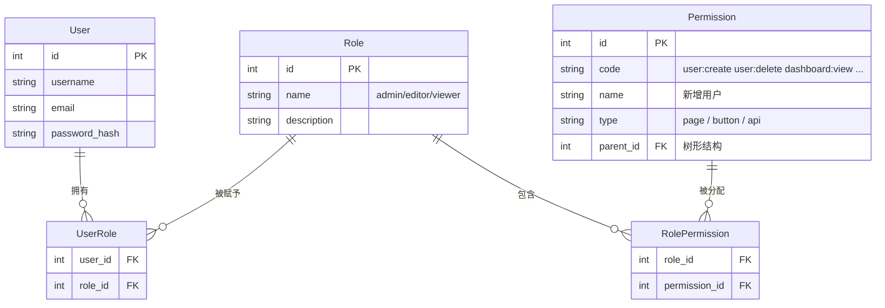

# 权限 RBAC

> "当你面试时说'我做了按钮级权限控制'，面试官最想听的不是指令怎么用，而是你的 RBAC 数据模型怎么设计、权限粒度怎么分层、变更后怎么同步。"

---

## 一句话总结

RBAC（Role-Based Access Control）通过**用户表 → 角色表（中间表） → 权限表**的三层关联模型，实现"用户拥有角色、角色拥有权限"，在前端落地为**路由级权限**（动态路由 + 路由守卫）和**按钮级权限**（`v-permission` 自定义指令 + 权限检查函数）。

---

## 核心机制

### 1. RBAC 数据模型



**关键字段 `permission.type`**：区分权限的粒度。
- `page`：页面级（控制路由是否注册）
- `button`：按钮级（控制 v-permission 指令显隐）
- `api`：接口级（后端使用，前端不感知）

### 2. 前端权限检查函数

```typescript
// src/utils/permission.ts
import { useUserStore } from '@/stores/user'

/**
 * 检查当前用户是否拥有指定权限
 * @param permission 权限标识，如 'user:delete'
 * @returns boolean
 */
export function hasPermission(permission: string): boolean {
  const userStore = useUserStore()
  const permissions = userStore.permissions as string[]

  // super admin 拥有所有权限
  if (permissions.includes('*:*:*')) return true
  return permissions.includes(permission)
}

/**
 * 检查用户是否拥有指定角色
 */
export function hasRole(role: string): boolean {
  const userStore = useUserStore()
  return userStore.roles.includes(role)
}

/**
 * 检查权限列表中任意一个（OR 逻辑）
 */
export function hasAnyPermission(...perms: string[]): boolean {
  return perms.some((p) => hasPermission(p))
}

/**
 * 检查权限列表中全部（AND 逻辑）
 */
export function hasAllPermissions(...perms: string[]): boolean {
  return perms.every((p) => hasPermission(p))
}
```

### 3. v-permission 自定义指令（按钮级控制）

```typescript
// src/directives/permission.ts
import type { Directive, DirectiveBinding } from 'vue'
import { hasPermission, hasRole } from '@/utils/permission'

interface PermissionBinding {
  permission?: string | string[]   // 单个权限或权限数组
  role?: string | string[]         // 单个角色或角色数组
  mode?: 'and' | 'or'              // 数组判断模式，默认 or
}

const vPermission: Directive<HTMLElement, PermissionBinding> = {
  mounted(el: HTMLElement, binding: DirectiveBinding<PermissionBinding>) {
    const { permission, role, mode = 'or' } = binding.value || {}

    let hasAccess = true

    if (permission) {
      const perms = Array.isArray(permission) ? permission : [permission]
      hasAccess = mode === 'and'
        ? perms.every((p) => hasPermission(p))
        : perms.some((p) => hasPermission(p))
    }

    if (hasAccess && role) {
      const roles = Array.isArray(role) ? role : [role]
      hasAccess = mode === 'and'
        ? roles.every((r) => hasRole(r))
        : roles.some((r) => hasRole(r))
    }

    if (!hasAccess) {
      el.parentNode?.removeChild(el)   // 没有权限 → 直接移除 DOM
    }
  },
}

export default vPermission

// main.ts 中全局注册
// app.directive('permission', vPermission)
```

使用示例：

```vue
<template>
  <!-- 单个权限 -->
  <el-button v-permission="{ permission: 'user:delete' }" type="danger">
    删除
  </el-button>

  <!-- 多个权限（OR 逻辑） -->
  <el-button v-permission="{ permission: ['user:edit', 'user:update'] }">
    编辑
  </el-button>

  <!-- 多个权限（AND 逻辑） -->
  <el-button v-permission="{ permission: ['user:edit', 'user:approve'], mode: 'and' }">
    审批编辑
  </el-button>

  <!-- 按角色 -->
  <el-button v-permission="{ role: 'admin' }">
    系统设置
  </el-button>
</template>
```

---

## 深度拓展

### 追问 1：RBAC vs ABAC，怎么选择？

| 维度 | RBAC | ABAC (Attribute-Based) |
|------|------|----------------------|
| 控制粒度 | 角色→权限，相对粗 | 用户属性+资源属性+环境属性，可极细 |
| 模型复杂度 | 简单、直观 | 复杂，策略写起来像代码 |
| 适用场景 | 角色边界清晰的管理系统 | 多租户 SaaS、需要动态数据权限的场景 |
| 维护成本 | 低（增删角色即可） | 高（属性组合爆炸） |

**后台管理系统选 RBAC** 足够。如果未来需要"同角色不同部门看不同数据"，可以在 RBAC 基础上增加"数据权限"层（如 `dept_id` 过滤），不需要引入完整 ABAC。

### 追问 2：超级管理员和权限边界

超级管理员的权限应该是一个**约定**而非一条数据库记录：

```typescript
// 约定：角色 code 为 'super_admin' 的用户拥有所有权限
const SUPER_ADMIN_ROLE = 'super_admin'

export function hasPermission(permission: string): boolean {
  if (userStore.roles.includes(SUPER_ADMIN_ROLE)) return true
  return userStore.permissions.includes(permission)
}
```

这样做的好处：超级管理员的权限集永远不需要跟着业务权限增长而维护，`*:*:*` 通配。

### 追问 3：权限变更后的实时同步

管理员修改了某个角色的权限，已登录用户如何感知？

```typescript
// 方案1：WebSocket 推送（推荐）
const ws = useWebSocket()
ws.on('permission:changed', (payload: { userId: number }) => {
  if (payload.userId === userStore.userId) {
    // 1. 重新获取权限列表
    userStore.fetchPermissions()
    // 2. 重新生成动态路由
    permissionStore.generateRoutes()
    // 3. 弹窗提示用户刷新
    ElMessage.warning('您的权限已更新，请刷新页面')
  }
})

// 方案2：轮询（次选，每 5 分钟检查一次）
setInterval(async () => {
  const newPerms = await authApi.getPermissions()
  if (!isEqual(newPerms, userStore.permissions)) {
    // 权限变更，更新
  }
}, 5 * 60 * 1000)

// 方案3：关键操作前校验（兜底）
async function deleteUser(id: number) {
  // 即使按钮显示了，提交前也再校验一次（防止权限被撤销但页面未更新）
  if (!hasPermission('user:delete')) {
    ElMessage.error('权限不足')
    return
  }
  await userApi.delete(id)
}
```

---

## 项目实战

### Pinia 权限 Store（完整版）

```typescript
// src/stores/permission.ts
import { defineStore } from 'pinia'
import { ref, computed } from 'vue'
import { authApi } from '@/api/auth'
import type { RouteRecordRaw } from 'vue-router'
import { asyncRoutes, filterRoutes } from '@/router/dynamic-routes'
import Layout from '@/layout/index.vue'

export const usePermissionStore = defineStore('permission', () => {
  // ---------- 状态 ----------
  const permissions = ref<string[]>([])         // 权限标识列表
  const roles = ref<string[]>([])               // 角色列表
  const isRoutesLoaded = ref(false)             // 路由是否已加载
  const menuRoutes = ref<RouteRecordRaw[]>([])  // 用于侧边栏渲染

  // ---------- 计算属性 ----------
  const isAdmin = computed(() => roles.value.includes('super_admin'))

  // ---------- 方法 ----------
  async function fetchPermissions() {
    const data = await authApi.getPermissions()
    permissions.value = data.permissions       // ['user:view', 'user:create', ...]
    roles.value = data.roles                   // ['admin']
  }

  async function generateRoutes() {
    const accessedRoutes = isAdmin.value
      ? asyncRoutes                            // 管理员直接拿全量
      : filterRoutes(asyncRoutes, permissions.value)

    const layoutRoute: RouteRecordRaw = {
      path: '/',
      component: Layout,
      redirect: accessedRoutes[0]?.path || '/',
      children: accessedRoutes,
    }

    menuRoutes.value = accessedRoutes.filter(
      (r) => !r.meta?.hidden
    )
    isRoutesLoaded.value = true
    return [layoutRoute]
  }

  function resetPermission() {
    permissions.value = []
    roles.value = []
    isRoutesLoaded.value = false
    menuRoutes.value = []
  }

  // ---------- 持久化配置 ----------
  // pinia-plugin-persistedstate 配置
  const persistConfig = {
    key: 'permission-store',
    storage: localStorage,
    pick: ['permissions', 'roles'],
    // 注意：不持久化 menuRoutes（含函数引用），只持久化权限数据
  }

  return {
    permissions, roles, isRoutesLoaded, menuRoutes, isAdmin,
    fetchPermissions, generateRoutes, resetPermission,
  }
})
```

### 登录后初始化权限（串行调用链）

```typescript
// src/stores/user.ts — login action
async function login(form: LoginForm) {
  const { accessToken, refreshToken } = await authApi.login(form)
  setToken(accessToken, refreshToken)
  // 串行：先拿权限，再生成路由
  await permissionStore.fetchPermissions()    // 获取权限列表
  await permissionStore.generateRoutes()      // 生成动态路由
}
```

面试中强调这个**串行链**：登录 → Token 存储 → 请求权限列表 → 过滤路由 → addRoute → 跳转首页。每一步都必须在前一步成功后执行，不能并行。

---

## 易错点

1. **只用指令隐藏按钮但接口没有校验**：v-permission 只是**前端展示层**的防护，真正的安全在后端。面试时一定要说："前端的权限控制是用户体验层的优化，真正的权限校验在后端中间件"。

2. **v-permission 用 `v-if` 的写法**：直接用 `v-permission` 指令操作 DOM 而非 `v-if`，因为指令在 `mounted` 钩子中 `removeChild`，不会留下空的占位节点。

3. **权限标识命名不规范**：`user:create`、`userCreate`、`create-user`、`USER_CREATE` 混用会导致维护灾难。在项目初期和后端约定命名规则：`资源:操作`（如 `user:delete`），所有权限标识用 `kebab-case` 或 `snake_case`，全程一致。

4. **权限列表过大导致 localStorage 溢出**：一般系统的权限标识不会超过 200 条，但如果后端权限滥用（如动态生成列级权限），需要注意 `localStorage` 的 5MB 上限。

---

## 相关阅读

- [动态路由](./dynamic-route.md) — 权限在路由层面的落地方案
- [登录鉴权](../认证鉴权/login-auth.md) — 登录后触发权限初始化的完整流程
- [Token 刷新](../认证鉴权/token-refresh.md) — Token 过期刷新时保持权限状态

---

## 更新记录

- 2026-07-05：完成内容填充（Phase 2），新增 Mermaid ER 图、v-permission 完整指令实现、RBAC vs ABAC 对比、权限变更同步方案
