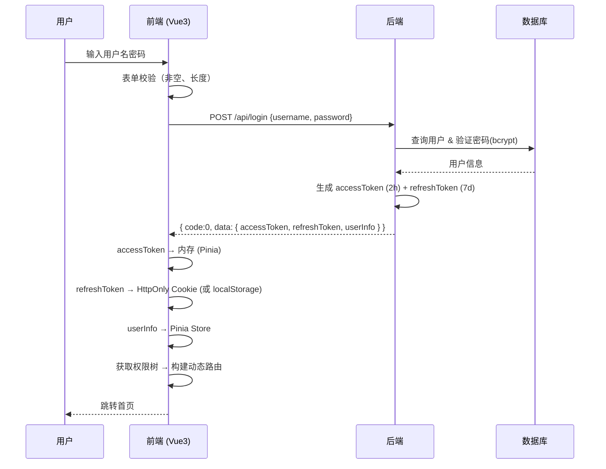

# 登录鉴权

> "登录鉴权是后台管理系统的'大门'。门没做好，后面做的所有权限控制都是摆设。"

---

## 一句话总结

登录鉴权是前端通过**表单收集凭证 → API 验证 → 服务端签发 JWT Token → 前端存储 Token → 后续请求携带 Token**的完整链路，配合路由守卫实现页面级鉴权、配合 Pinia 实现全局状态同步。

---

## 核心机制

### 1. JWT Token 结构（面试高频）

```
eyJhbGciOiJIUzI1NiJ9.eyJzdWIiOiIxIiwiaWF0IjoxNjA5NDAwMzUyfQ.xxx
|------- Header --------|--- Payload ---|-------- Signature --------|

- Header:  { alg: "HS256", typ: "JWT" }
- Payload: { sub: "1" (用户ID), iat: 1609400352 (签发时间), exp: 1609486752 (过期时间) }
- Signature: HMAC-SHA256(base64(header) + "." + base64(payload), secret)
```

核心特性：**无状态**——服务端不存 Session，凭 Token 本身验证身份。因此天然适合分布式和微服务架构。

### 2. 登录全流程



### 3. 路由守卫中的鉴权逻辑

```typescript
// src/router/guards.ts
import type { Router } from 'vue-router'
import { useUserStore } from '@/stores/user'
import { usePermissionStore } from '@/stores/permission'

const whiteList = ['/login', '/404', '/401']  // 无需登录的白名单

export function setupAuthGuard(router: Router) {
  router.beforeEach(async (to, from, next) => {
    const userStore = useUserStore()
    const permissionStore = usePermissionStore()

    if (userStore.token) {
      // 已登录
      if (to.path === '/login') {
        // 已登录用户访问登录页 → 重定向到首页
        next({ path: '/' })
      } else {
        // 检查是否已加载动态路由
        if (!permissionStore.isRoutesLoaded) {
          try {
            // 获取用户信息和权限
            await userStore.getUserInfo()
            // 根据权限生成动态路由
            const routes = await permissionStore.generateRoutes()
            routes.forEach((route) => router.addRoute(route))
            // 重要：动态路由必须在路由表中，replace 重新触发匹配
            next({ ...to, replace: true })
          } catch {
            // 获取失败（Token 过期等） → 重置状态 → 跳转登录
            await userStore.resetToken()
            next(`/login?redirect=${to.path}`)
          }
        } else {
          next()
        }
      }
    } else {
      // 未登录
      if (whiteList.includes(to.path)) {
        next()
      } else {
        next(`/login?redirect=${to.path}`)    // 记录来源路径，登录后回跳
      }
    }
  })
}
```

### 4. Token 存储策略

| 存储位置 | 优点 | 缺点 | 适用 Token |
|----------|------|------|-----------|
| **内存 (Pinia)** | XSS 不可读、页面关闭即销毁 | 刷新后丢失 | accessToken |
| **localStorage** | 持久存储、简单 | XSS 可读（风险） | 低安全场景 |
| **HttpOnly Cookie** | JS 不可读、XSS 免疫 | CSRF 需要额外防护 | refreshToken 最佳 |

**推荐组合**：`accessToken` 存 Pinia + 持久化插件按需恢复到内存，`refreshToken` 存 HttpOnly Cookie（由后端 Set-Cookie）。

---

## 深度拓展

### 追问 1：JWT vs Session，选哪个？

| 维度 | JWT | Session |
|------|-----|---------|
| 状态 | 无状态（Token 自包含） | 有状态（服务端存储） |
| 扩展性 | 天然支持分布式 | 需要共享 Session（Redis） |
| 主动失效 | 困难（需黑名单） | 简单（删 Session） |
| Payload 大小 | 受限于 Header 大小（~4KB） | 无限制 |
| 适用场景 | 微服务、移动端、跨域 API | 单体应用、对安全性极高场景 |

**后台管理系统建议**：JWT + refreshToken 双 Token 策略，兼顾"无状态"的好处和"可主动失效"的需求。

### 追问 2：OAuth 2.0 授权码流程（第三方登录）

```
1. 用户点击"GitHub 登录" → 前端跳转 GitHub 授权页（携带 client_id、redirect_uri）
2. 用户在 GitHub 授权 → GitHub 回调 redirect_uri 并附带 code
3. 前端拿到 code → 发送给后端 POST /api/oauth/github {code}
4. 后端用 code 向 GitHub 换 access_token → 用 access_token 获取用户信息 → 生成自己系统的 JWT
5. 后端返回 { accessToken, refreshToken, userInfo } → 后续流程同普通登录
```

核心：**code 只在服务端交换**，前端不接触第三方的 access_token，保证安全性。

### 追问 3：多 Tab 登录状态同步

```typescript
// 方案：BroadcastChannel API
const channel = new BroadcastChannel('auth')
channel.onmessage = (event) => {
  if (event.data.type === 'logout') {
    userStore.resetToken()
    router.push('/login')
  }
}

// 用户在一个 Tab 退出登录时广播
function logout() {
  userStore.resetToken()
  channel.postMessage({ type: 'logout' })
  router.push('/login')
}
```

---

## 项目实战

### 完整登录组件

```vue
<!-- src/views/login/index.vue -->
<script setup lang="ts">
import { ref, reactive } from 'vue'
import { useRouter, useRoute } from 'vue-router'
import { ElMessage } from 'element-plus'
import { useUserStore } from '@/stores/user'

const router = useRouter()
const route = useRoute()
const userStore = useUserStore()

const loginForm = reactive({ username: '', password: '' })
const loading = ref(false)

async function handleLogin() {
  loading.value = true
  try {
    await userStore.login(loginForm)
    ElMessage.success('登录成功')
    // 回跳来源页或首页
    const redirect = (route.query.redirect as string) || '/'
    router.push(redirect)
  } catch (e: any) {
    ElMessage.error(e.message || '登录失败')
  } finally {
    loading.value = false
  }
}
</script>
```

### Pinia 用户 Store

```typescript
// src/stores/user.ts
import { defineStore } from 'pinia'
import { ref } from 'vue'
import { authApi } from '@/api/auth'
import type { UserInfo } from '@/types'
import { removeToken, setToken } from '@/utils/auth'

export const useUserStore = defineStore('user', () => {
  const token = ref<string>('')
  const userInfo = ref<UserInfo | null>(null)

  async function login(form: { username: string; password: string }) {
    const data = await authApi.login(form)
    token.value = data.accessToken
    setToken(data.accessToken, data.refreshToken)   // 持久化 refreshToken
  }

  async function getUserInfo() {
    userInfo.value = await authApi.getUserInfo()
  }

  async function resetToken() {
    token.value = ''
    userInfo.value = null
    removeToken()
    router.push('/login')
  }

  return { token, userInfo, login, getUserInfo, resetToken }
})
```

---

## 易错点

1. **`/login?redirect=xxx` 的开放重定向漏洞**：回跳 URL 必须校验，只允许站内路径。否则攻击者构造 `/login?redirect=https://evil.com` 可引导用户进入钓鱼页。解决：白名单校验或只接受相对路径。

2. **登录成功后的路由跳转时机**：必须在 `generateRoutes()` 完成之后才跳转，否则守卫会再次拦截到 login 页。关键代码：`next({ ...to, replace: true })` ——重新触发路由匹配。

3. **Token 在多个地方存储导致不一致**：Pinia 有一个值、localStorage 有一个值、cookie 有一个值。解决方案：**Pinia 是唯一真相来源**，持久化插件只做恢复，不做写入；写入由 Pinia actions 统一管理。

---

## 相关阅读

- [Token 刷新](./token-refresh.md) — 双 Token 无感刷新的完整实现
- [动态路由](../权限系统/dynamic-route.md) — 登录后如何根据权限生成路由
- [权限 RBAC](../权限系统/permission-rbac.md) — 权限模型与按钮级控制
- [Axios 封装](../基础设施/axios-encapsulation.md) — Token 如何在请求中携带

---

## 更新记录

- 2026-07-05：完成内容填充（Phase 2），新增完整登录流程、路由守卫、Mermaid 时序图、多 Tab 同步
