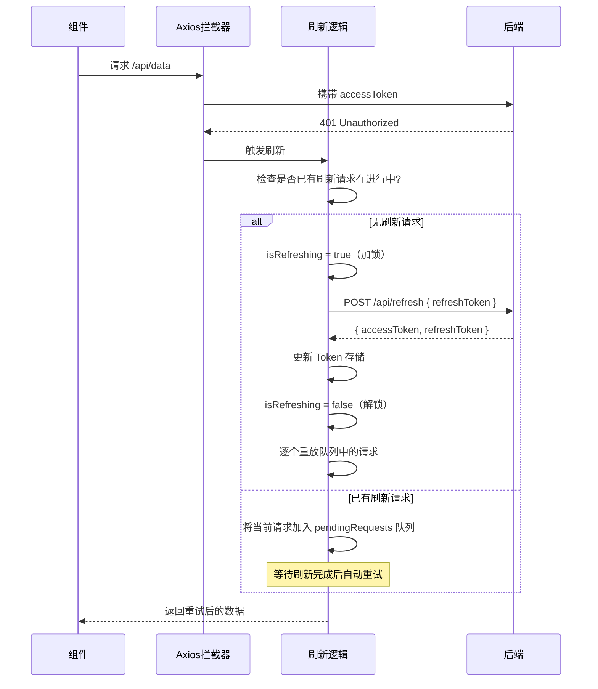

# Token 刷新

> "面试官问：accessToken 15 分钟过期，用户在表单页面停了 16 分钟再提交，会发生什么？——你的回答应该是一套无感刷新机制。"

---

## 一句话总结

Token 刷新是通过**双 Token 策略（短期 accessToken + 长期 refreshToken）+ 401 拦截检测 + 并发请求锁 + 请求队列重放**，在用户无感知的情况下自动续期 Token，避免打断用户操作的机制。

---

## 核心机制

### 1. 双 Token 策略

| Token | 有效期 | 存储位置 | 用途 |
|-------|--------|---------|------|
| accessToken | 15min ~ 2h | 内存（Pinia） | 每次请求携带，真实鉴权 |
| refreshToken | 7d ~ 30d | HttpOnly Cookie | 换取新 accessToken |

**为什么需要两个 Token？**
- 如果只有一个 Token 且设置较长的有效期 → 泄露后攻击窗口大
- 如果只有一个 Token 且设置较短的有效期 → 用户频繁登录，体验差
- 双 Token：accessToken 短时效（即使泄露影响小），refreshToken 长时效（但只用于刷新接口，暴露面小）

### 2. 核心流程



### 3. 并发请求的 Token 刷新（核心难点）

**问题场景**：页面初始化时同时发出 5 个请求，但 accessToken 已过期。5 个请求全部返回 401，如果没有并发控制，会触发 5 次刷新请求——浪费资源且可能导致 Token 冲突。

**解决方案：刷新锁 + 请求队列**

```typescript
// src/utils/http/token-refresh.ts
import axios, { type AxiosInstance } from 'axios'

// ---------- 状态管理 ----------
let isRefreshing = false                    // 刷新锁：同一时间只有一个刷新请求
let pendingRequests: Array<(token: string) => void> = []  // 等待重试的请求队列

// ---------- 刷新 Token ----------
async function refreshTokenApi(): Promise<{ accessToken: string; refreshToken: string }> {
  // refreshToken 在 HttpOnly Cookie 中，无需手动传递
  const res = await axios.post('/api/auth/refresh')
  return res.data.data
}

// ---------- 核心：订阅/发布模式的队列管理 ----------
function addPendingRequest(callback: (token: string) => void) {
  pendingRequests.push(callback)
}

function resolvePendingRequests(token: string) {
  pendingRequests.forEach((cb) => cb(token))
  pendingRequests = []
}

function rejectPendingRequests(error: any) {
  pendingRequests.forEach((cb) => cb(error as any))
  pendingRequests = []
}

// ---------- 安装到 Axios 实例 ----------
export function setupTokenRefresh(http: AxiosInstance) {
  http.interceptors.response.use(
    (response) => response,
    async (error) => {
      const { config, response } = error

      // 不是 401 或 已经是刷新接口自身的错误 → 直接抛出
      if (response?.status !== 401 || config.url === '/api/auth/refresh') {
        return Promise.reject(error)
      }

      // 已经在刷新中 → 将当前请求加入等待队列
      if (isRefreshing) {
        return new Promise((resolve) => {
          addPendingRequest((newToken: string) => {
            config.headers.Authorization = `Bearer ${newToken}`
            resolve(http(config))   // 用新 Token 重试原请求
          })
        })
      }

      // 首次 401 → 加锁并刷新
      isRefreshing = true

      try {
        const { accessToken } = await refreshTokenApi()

        // 更新内存中的 Token（Pinia）
        localStorage.setItem('accessToken', accessToken)

        // 更新当前请求的 Authorization 头
        config.headers.Authorization = `Bearer ${accessToken}`

        // 重放等待队列中的所有请求
        resolvePendingRequests(accessToken)

        // 重试当前请求
        return http(config)
      } catch (refreshError) {
        // 刷新也失败 → 强制退出登录
        rejectPendingRequests(refreshError)
        localStorage.removeItem('accessToken')
        window.dispatchEvent(new CustomEvent('auth:unauthorized'))
        return Promise.reject(refreshError)
      } finally {
        isRefreshing = false
      }
    }
  )
}
```

**面试金句**：当并发请求都遇到 401 时，第一个请求触发刷新（加锁），后续请求不发送新请求，而是把自己的回调注册到队列中，等刷新完成后用新 Token 统一重放——整个过程对用户零感知。

---

## 深度拓展

### 追问 1：refreshToken 也过期了怎么办？

`refreshToken` 过期意味着用户长期未使用系统（如超过 7 天）。处理方式：

```typescript
// 刷新 Token 接口返回 401 时
// 1. 清除所有 Token 存储
// 2. 派发全局事件，路由守卫或 App.vue 监听后跳转登录
// 3. 记录当前页面路径，登录后回跳

window.dispatchEvent(new CustomEvent('auth:unauthorized'))
// App.vue 中监听
window.addEventListener('auth:unauthorized', () => {
  userStore.resetToken()
  router.push(`/login?redirect=${router.currentRoute.value.fullPath}`)
})
```

### 追问 2：accessToken 存内存，刷新后怎么办？

刷新页面后内存清空，accessToken 丢失。解决方案：

```typescript
// Pinia 持久化插件 —— 仅持久化 accessToken 到 localStorage
// 刷新后从 localStorage 恢复到 Pinia store，请求拦截器从 Pinia 读取
// 风险：localStorage 有 XSS 风险
// 缓解：accessToken 短期有效，即使泄露影响窗口有限

// 更安全方案：不做持久化，刷新后走 refreshToken
// 在 App.vue onMounted 时尝试 refreshToken 拿回 accessToken
// 好处：accessToken 永不落地，坏处：刷新后多一次网络请求
```

### 追问 3：为什么 refreshToken 适合 HttpOnly Cookie？

| 攻击类型 | localStorage | HttpOnly Cookie |
|----------|-------------|-----------------|
| XSS（注入脚本读取） | **可读**（风险） | **不可读**（免疫） |
| CSRF（跨站请求伪造） | 免疫 | 需要防护（SameSite=Strict） |
| 子域名共享 | 不同源 | 可设 Domain |

`refreshToken` 是长期凭证，泄露后果严重，所以放在 XSS 不可读的 HttpOnly Cookie 更安全。配合 `SameSite=Strict` 和 CSRF Token / Referer 校验防御 CSRF。

---

## 项目实战

### 集成到现有 Axios 封装

在创建 Axios 实例后调用 `setupTokenRefresh`：

```typescript
// src/utils/http/index.ts
import { setupTokenRefresh } from './token-refresh'

const http = createAxiosInstance(import.meta.env.VITE_API_BASE_URL)
setupTokenRefresh(http)   // 安装 Token 刷新拦截器

export { http }
```

这个设计的亮点：**Token 刷新逻辑与主拦截器解耦**——`axios-encapsulation.md` 中的拦截器负责 Token 注入和通用错误处理；本模块的拦截器只负责检测 401 + 刷新 + 重放。各司其职，易于测试和维护。

---

## 易错点

1. **刷新锁忘记释放**：`isRefreshing = false` 必须在 `finally` 中执行，否则刷新成功但抛异常时锁永远持有，后续请求全挂。

2. **刷新接口也用同一个 Axios 实例**：刷新接口需要用**不带 Token 刷新拦截器的实例**或原生 `axios`，否则刷新接口返回 401 → 触发刷新拦截器 → 死循环。上面代码中直接用了 `axios.post` 而非 `http.post`。

3. **队列中存储的是异步回调**：`pendingRequests` 不是存请求数据，而是存 `(token: string) => void` 函数。函数体内用 `new Promise` 包裹，重放时带上新 Token 实际执行请求——这和发布-订阅模式是一个道理。

4. **忽略 refreshToken 的过期前置判断**：可以在请求发出前用 JWT 的 `exp` 字段判断是否即将过期，提前刷新而不是等 401 再处理——减少一次失败请求的损耗。

---

## 相关阅读

- [登录鉴权](./login-auth.md) — 双 Token 的生成和首次存储
- [Axios 封装](../基础设施/axios-encapsulation.md) — 拦截器基座
- [Token 存储安全](../../安全/token-storage.md) — XSS/CSRF 攻防

---

## 更新记录

- 2026-07-05：完成内容填充（Phase 2），新增完整双 Token 刷新代码、并发请求队列、Mermaid 时序图
