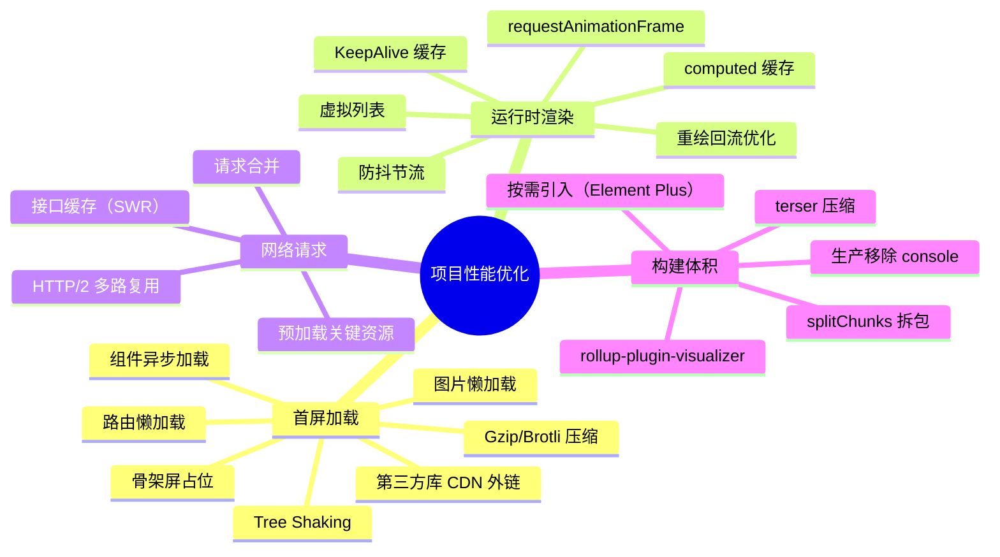

# 项目性能优化

> "你的项目做过哪些性能优化？—— 这是面试必问题。回答不要散点式，要用'维度-问题-方案-效果'的结构化思路，最好配上有数据的对比。"

---

## 一句话总结

项目性能优化从**首屏加载（资源体积 + 加载策略）、运行时渲染（渲染效率 + 缓存策略）、网络请求（传输效率 + 缓存策略）** 三个维度系统性地降低 LCP、FID、CLS 等核心指标，最终目标是让用户感觉"快"。

---

## 核心机制

### 性能优化全景图



### 优化清单（按优先级）

| 优先级 | 优化项 | 预期收益 | 实现成本 |
|--------|--------|---------|---------|
| P0 | 路由懒加载 | 首屏 JS 体积减少 40-60% | 1 行代码 |
| P0 | Gzip 压缩 | 传输体积减少 60-80% | Nginx 配置 |
| P0 | Element Plus 按需引入 | 包体积减少 300KB+ | 配置 |
| P1 | 第三方库 CDN | 减少打包体积 + 利用缓存 | 配置 |
| P1 | 虚拟列表 | 大列表渲染从卡死到流畅 | 组件替换 |
| P1 | KeepAlive 缓存 | 页面切换秒开 | 缓存页面 |
| P2 | 骨架屏 | 感知性能提升 30%+ | 编写骨架组件 |
| P2 | 图片懒加载 | 首屏图片加载延迟 | 指令/属性 |
| P2 | Bundle 分析 + 拆包 | 主包体积可控 | 分析 + 配置 |

**面试黄金法则**：优先级不是凭感觉排的，P0 是"投入产出比最高"的优化——花几分钟改配置，收益是整个项目范围的体积下降。

---

## 项目实战

### 1. 路由懒加载（P0）

```typescript
// src/router/index.ts
const router = createRouter({
  routes: [
    // 差：同步加载 —— 所有页面打包进一个 chunk
    // { path: '/dashboard', component: Dashboard },

    // 好：懒加载 —— 每个页面独立 chunk，按需加载
    {
      path: '/dashboard',
      name: 'Dashboard',
      component: () => import('@/views/dashboard/index.vue'),
    },
    {
      path: '/user',
      name: 'User',
      component: () => import(/* webpackChunkName: "user" */ '@/views/user/index.vue'),
    },
  ],
})
```

**效果**：首屏 JS 文件从 2MB+ 降到 500KB 左右（只加载首页需要的代码）。

### 2. Vite 构建优化配置

```typescript
// vite.config.ts
import { defineConfig } from 'vite'
import vue from '@vitejs/plugin-vue'
import { visualizer } from 'rollup-plugin-visualizer'
import viteCompression from 'vite-plugin-compression'
import AutoImport from 'unplugin-auto-import/vite'
import Components from 'unplugin-vue-components/vite'
import { ElementPlusResolver } from 'unplugin-vue-components/resolvers'

export default defineConfig({
  plugins: [
    vue(),
    // Element Plus 按需引入 —— icon 和组件都不需要全量注册
    AutoImport({
      resolvers: [ElementPlusResolver()],
    }),
    Components({
      resolvers: [ElementPlusResolver()],
    }),
    // Gzip 压缩 —— 打包时生成 .gz 文件，Nginx 直接返回
    viteCompression({
      algorithm: 'gzip',
      threshold: 10240,     // 大于 10KB 才压缩
      deleteOriginFile: false,
    }),
    // Bundle 体积分析 —— 可视化查看哪个包最大
    visualizer({
      open: true,
      gzipSize: true,
      brotliSize: true,
    }),
  ],

  build: {
    // target: 'es2015',     // 减少 polyfill 体积
    cssCodeSplit: true,     // CSS 也拆分成 chunk
    rollupOptions: {
      output: {
        // 手动拆包策略
        manualChunks: {
          // Vue 全家桶单独打包（框架几乎不变，充分利用浏览器缓存）
          'vue-vendor': ['vue', 'vue-router', 'pinia'],
          // Element Plus 单独打包
          'element-plus': ['element-plus'],
          // 工具库单独打包
          'lib-vendor': ['axios', 'dayjs', 'xlsx'],
        },
      },
    },
    // 生产环境移除 console 和 debugger
    minify: 'terser',
    terserOptions: {
      compress: {
        drop_console: true,
        drop_debugger: true,
      },
    },
    // 分块大小警告上限
    chunkSizeWarningLimit: 500,
  },

  // CDN 加速（生产环境）
  // ...配合 vite-plugin-cdn-import 使用
})
```

### 3. KeepAlive 多标签页缓存

```vue
<!-- src/layout/MainContent.vue -->
<template>
  <div class="main-content">
    <el-tabs v-model="activeTab" type="card" closable @tab-remove="closeTab">
      <el-tab-pane
        v-for="tab in visitedTabs"
        :key="tab.path"
        :label="tab.title"
        :name="tab.path"
      />
    </el-tabs>

    <router-view v-slot="{ Component }">
      <keep-alive :include="cachedViewNames">
        <component :is="Component" :key="$route.fullPath" />
      </keep-alive>
    </router-view>
  </div>
</template>

<script setup lang="ts">
import { computed } from 'vue'
import { useTagsViewStore } from '@/stores/tags-view'

const tagsViewStore = useTagsViewStore()
const visitedTabs = computed(() => tagsViewStore.visitedViews)

// 只有标记了 keepAlive: true 的组件才缓存
const cachedViewNames = computed(() =>
  visitedTabs.value
    .filter((tab) => tab.meta?.keepAlive !== false)
    .map((tab) => tab.name)
)
</script>
```

**效果**：用户在列表页和详情页之间切换，列表页不重新渲染、不重新请求数据，体验和原生 App 一样快。

### 4. 首屏骨架屏

```vue
<!-- src/components/SkeletonTable.vue -->
<template>
  <div class="skeleton-table">
    <el-skeleton :rows="8" animated :loading="true">
      <!-- 骨架屏占位 -->
    </el-skeleton>
  </div>
</template>

<!-- 在页面组件中 -->
<template>
  <SkeletonTable v-if="loading" />
  <RealContent v-else />
</template>
```

骨架屏比 Loading 转圈更有"快"的感觉——**感知性能比实际性能更重要**。

### 5. 图片懒加载

```vue
<!-- 使用 Vue 指令或原生 loading="lazy" -->


<!-- Element Plus 图片组件 -->
<el-image :src="img.url" lazy :preview-src-list="[img.url]" />
```

### 6. 性能监控（Web Vitals 采集）

```typescript
// src/utils/performance.ts
import { onLCP, onFID, onCLS, onINP, onTTFB } from 'web-vitals'

export function initPerformanceMonitor() {
  // LCP（Largest Contentful Paint）：最大内容绘制
  onLCP((metric) => {
    if (metric.value > 2500) {
      reportToAnalytics('lcp', metric.value, { route: location.pathname })
    }
  })

  // CLS（Cumulative Layout Shift）：累计布局偏移
  onCLS((metric) => {
    if (metric.value > 0.1) {
      reportToAnalytics('cls', metric.value, { route: location.pathname })
    }
  })

  // FID / INP：交互延迟
  onINP((metric) => {
    if (metric.value > 200) {
      reportToAnalytics('inp', metric.value, { route: location.pathname })
    }
  })
}

function reportToAnalytics(name: string, value: number, meta: Record<string, string>) {
  // 发送到公司内部的监控平台
  navigator.sendBeacon('/api/metrics', JSON.stringify({
    name, value, ...meta, timestamp: Date.now(),
  }))
}
```

---

## 深度拓展

### 追问 1：优化前后 LCP 对比，怎么量化？

```
优化前（Lighthouse 评分）：              优化后：
LCP:  4.2s  (红色)                      LCP:  1.8s  (绿色)
FCP:  1.8s                              FCP:  0.9s
Speed Index: 3.5s                       Speed Index: 1.6s
Bundle Size: 2.4MB (gzip: 680KB)        Bundle Size: 1.2MB (gzip: 240KB)
                                        CDN: jsdelivr → 命中浏览器缓存
Gzip: 未开启                            Gzip: 传输体积减少 65%
```

### 追问 2：优化优先级排序的方法论

1. **先量后优**：用 Lighthouse + `rollup-plugin-visualizer` 找到瓶颈
2. **先大后小**：先砍最大的 chunk（`chart.js` 600KB → CDN），再微调小模块
3. **先易后难**：路由懒加载改一行，收益秒杀花两天重构虚拟列表
4. **先感知后实际**：骨架屏 + 乐观更新让用户感觉快，比实际减 200ms 更重要

### 追问 3：构建产物体积分析

```bash
# 生成可视化报告
npm run build    # 配置了 rollup-plugin-visualizer 后自动打开
```

报告会展示每个模块占用的大小，快速定位体积异常的依赖：
- `echarts` 500KB → 按需引入图表类型
- `moment` 300KB → 替换为 `dayjs`（2KB）
- `xlsx` 500KB → 仅在需要时动态 `import()`

---

## 易错点

1. **开启 Gzip 但 Nginx 未配置**：前端打包生成了 `.gz` 文件，但 Nginx 没有 `gzip_static on;`，等于白做。

2. **KeepAlive 无差别缓存所有页面**：缓存详情页可能导致数据不刷新。需配合 `onActivated` 钩子，或在合适时机 `exclude`。

3. **Element Plus 全量引入**：直接 `import ElementPlus from 'element-plus'; app.use(ElementPlus)` 会导致打包体积增加 500KB+。必须用 `unplugin-vue-components` 按需引入。

4. **`drop_console: true` 误伤开发环境**：只在 `build` 模式开启，`serve` 时不要开，否则开发时无法用 `console.log`。

5. **手动拆包过度**：`manualChunks` 中每个三方库单独拆包，可能导致 50+ 个小 HTTP 请求。HTTP/2 下小请求多不是大问题，但也不能过度。建议按"框架/Vue 生态/UI 库/工具库"分 3-4 个包即可。

---

## 相关阅读

- [性能优化 - 首屏](../../性能优化/first-screen.md) — 首屏加载的专项优化
- [性能优化 - 打包](../../性能优化/bundle-optimization.md) — Vite/Webpack 构建优化
- [大数据表格](../业务场景/big-data-table.md) — 运行时渲染优化的典型案例
- [防重复请求](../基础设施/request-dedup.md) — 网络请求优化
- [KeepAlive 缓存](../../Vue3/keepalive.md) — 页面缓存的正确姿势

---

## 更新记录

- 2026-07-18：一致性审计——Gzip 压缩幅度统一为 60-80% 口径（与 bundle-optimization.md/docker.md 对齐）
- 2026-07-05：完成内容填充（Phase 2），新增完整优化清单、Vite 配置代码、KeepAlive 多标签缓存、Web Vitals 监控
